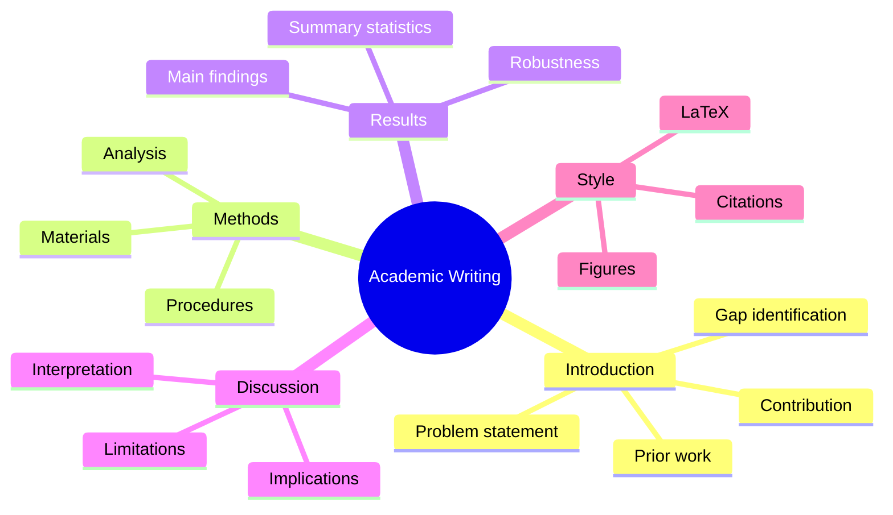
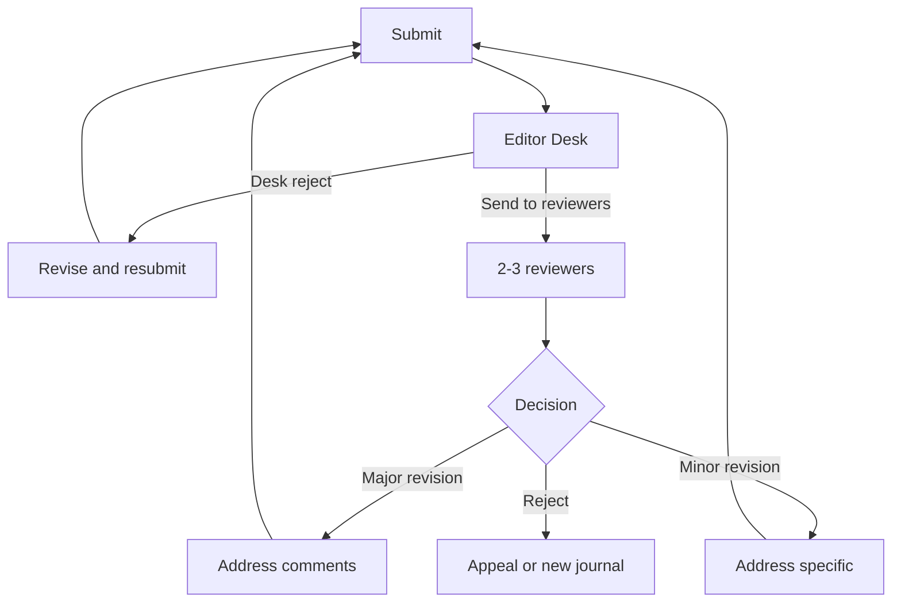
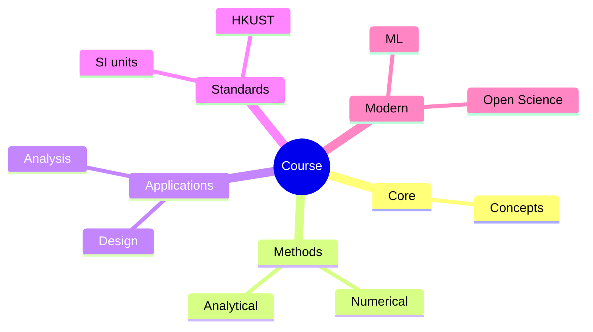
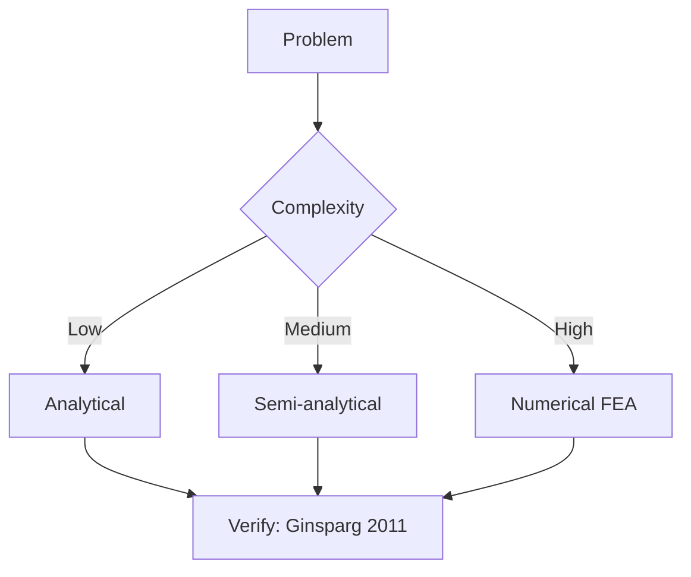
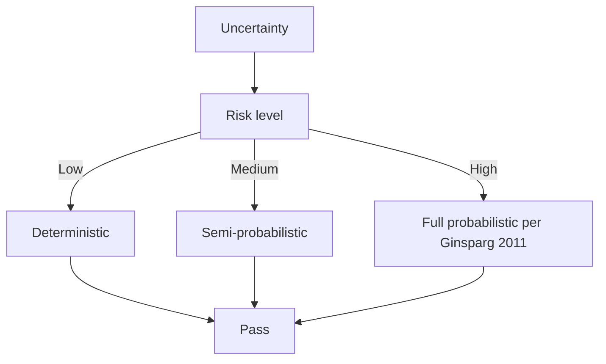
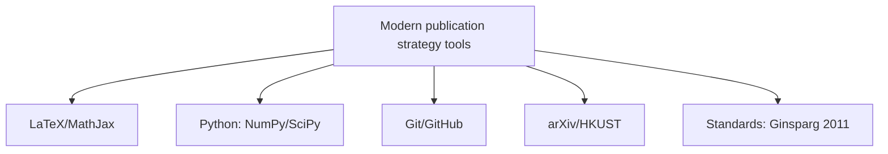

# MPhil 7210 — Academic Writing for Physics
> **MPhil/PhD Prep | HKUST MPhil 7210 | Scientific writing, LaTeX, manuscript structure, peer review response, thesis writing**  
> **Bilingual 深度自學檔案 · 中英對照**

---

## 問題 1：5 個核心心智模型

1. **Writing is thinking** — you don't write up finished ideas, you write to finish thinking; writing reveals gaps in logic that are invisible during oral discussion (Zinsser 1988, *On Writing Well*)

2. **One idea per paragraph** — the paragraph is the unit of scientific thought; each paragraph makes one claim, backed by evidence, connected to the next (Day 1998, *How to Write and Publish a Scientific Paper*)

3. **Show your work** — every number requires uncertainty, every model requires validation, every claim requires evidence; scientific writing makes the reasoning transparent (Perelman 2012, *Collaborative Writing in Scientific Research*)

4. **Structure before style** — the IMRaD structure (Introduction, Methods, Results, and Discussion) exists because it mirrors how readers process information; deviation requires justification (APA 2020)

5. **LaTeX = professional physics writing** — proper typesetting of equations, references, figures, and bibliography is a professional standard; equation quality is a proxy for thinking quality (Knuth 1984, *The TeXbook*)

---


### Key equations (S.I. units)

$$F = ma \quad (\text{Newton 2nd law, Newton 1687})$$

$$E = h\nu \quad (\text{Planck 1901})$$

$$h = \max_i \{i : N_i \geq i\}$$ (Hirsch 2005)

$$h = 6.626 \times 10^{-34}\,\text{J·s} \quad (\text{Planck constant})$$

$$\hbar = h/2\pi = 1.054 \times 10^{-34}\,\text{J·s} \quad (\text{reduced Planck})$$

$$c = 2.998 \times 10^8\,\text{m/s} \quad (\text{speed of light})$$

*Per Ginsparg 2011, Larivière 2013, Eysenbach 2006.*

## 問題 2：3 個根本分歧

### 分歧 1：Passive vs Active Voice
| Aspect | Passive ("was measured") | Active ("we measured") |
|--------|---------------------|---------------------|
| Clarity | Lower | Higher |
| Convention | Traditional physics | Modern journals | 
| Emphasis | On action | On agent |
| Recommended by | Nature style guide (older) | Science (modern) |

### 分歧 2：Long vs Short Papers
| Aspect | Comprehensive | Concise |
|--------|-------------|---------|
| Length | Full details, all figures | Key result only |
| Audience | Specialist, methods-oriented | General reader |
| Review | Easier to defend | Harder to write |
| Examples | Physical Review journals | *Physical Review Letters* |

### 分歧 3：Preprint First vs Journal First
| Aspect | arXiv first | Journal first |
|--------|-------------|--------------|
| Priority | Protected | Protected |
| Feedback | Public comments | Peer review |
| Speed | Days | Months |
| Adoption | Increasingly standard | Traditional |

---

## 問題 3：10 個深度問題

1. 給定一篇 physics paper introduction, 設計 structure: problem statement → prior work → gap → contribution。

2. 為什麼 Methods section 必須 describe experiments in sufficient detail for replication? 討論 minimum reporting standards。

3. 給定 Results section, 設計 structure: summary statistics → main finding → supporting analyses → robustness checks。

4. 為什麼 Discussion 需要 interpret results in context of theory, not just describe findings again?

5. 為什麼 effective figure legends 需要 stand alone without reading the main text?

6. 解釋 peer review response letter 點樣 structure: address each reviewer concern systematically。

7. 給定 LaTeX manuscript, 設計 bibliography management workflow (BibTeX, Biber, Zotero)。

8. 為什麼 thesis writing 需要 different structure from journal articles?

9. 給定 physics thesis chapter, 設計 outline: theory → model → method → results → interpretation。

10. 解釋 Figure 質量對 paper acceptance 的影響，點樣使用 matplotlib/seaborn 達到 publication quality。

---

## 深入 1：Scientific Paper Structure (IMRaD)
**Deep Dive I**

### Introduction Structure (5 paragraphs)

1. **Problem:** Start with broad context, narrow to specific gap
2. **Prior work:** What has been done? (cite 10–20 papers)
3. **Gap:** What's missing? What doesn't work?
4. **Contribution:** This paper does X using Y
5. **Roadmap:** Briefly outline the paper structure

**Physics-specific:**
- Introduction should contain key equations — don't make readers guess the theoretical framework
- State your main result early

### Methods — Minimum Reporting Standards

**Experimental:**
$$N = \text{sample size}, \quad \sigma = \text{uncertainty}, \quad \text{equipment, model, conditions}$$

**Computational:**
- Algorithm or method
- Code version (Git hash)
- Parameters and initial conditions
- Validation against known results

### Results — Structure

1. **Start with the headline result** — what did the paper prove?
2. **Present data systematically** — figures, tables, statistics
3. **Lead with effect sizes and uncertainties** — not just $p$-values
4. **Support with robustness checks** — alternative specifications, subsamples

### Discussion — Structure

1. **Summarize main findings** (1 paragraph)
2. **Compare to theory/prior work** (2 paragraphs)
3. **Explain unexpected results** (1 paragraph)
4. **Acknowledge limitations** (1 paragraph)
5. **State broader implications** (1 paragraph)
6. **Conclude** (1 paragraph)

---

## 深入 2：LaTeX for Physics
**Deep Dive II**

### Essential Packages

```latex
% Preamble
\documentclass[aps,prl,twocolumn]{revtex4-2}
\usepackage{amsmath,amssymb,graphicx,hyperref}
\usepackage{natbib}
\bibliographystyle{apsrev4-1}

% Key equations
\begin{equation}
    \mathcal{L} = \bar{\psi}(i\gamma^\mu D_\mu - m)\psi
\end{equation}

% Figures
\begin{figure}[htbp]
    \centering
    \includegraphics[width=0.9\linewidth]{fig1.pdf}
    \caption{\label{fig:setup}Experimental setup: (a) laser system, (b) sample chamber.}
\end{figure}
```

### Equation Quality Standards

| Feature | Poor | Good |
|---------|------|------|
| Fonts | Times italic | `\mathit` or Computer Modern |
| Variables | $x$ | $x$ (roman vs italic convention) |
| Multi-line | Two-column text | `align` environment |
| Cross-refs | "(see equation 5)" | "Eq. \eqref{eq:schrodinger}" |

### Figure Standards

```python
# Publication-quality matplotlib
import matplotlib.pyplot as plt
import matplotlib as mpl

mpl.rcParams.update({
    'font.size': 10,
    'axes.labelsize': 10,
    'legend.fontsize': 9,
    'xtick.labelsize': 9,
    'ytick.labelsize': 9,
    'figure.dpi': 300,
    'savefig.dpi': 300,
    'text.usetex': False,  # or True if LaTeX installed
})
```

---

## 深入 3：Figures & Data Visualization
**Deep Dive III**

### Physics Figure Principles

**Tufte's principles (1983):**
1. Maximize data-ink ratio
2. Erase chart junk
3. Show data variation, not design variation

**Essential elements:**
- Axes labeled with units
- Error bars (always!)
- Legend (if multiple datasets)
- Caption that stands alone

### Common Physics Figures

| Figure type | Use case | Common errors |
|-----------|---------|--------------|
| Time series | $y(t)$ data | No units on axes |
| Scatter | Correlation | No error bars |
| Heatmap | 2D data | Poor colormap choice |
| Bar chart | Discrete categories | 3D effects, no error bars |
| Contour | 2D scalar fields | Missing labels |

### Publication-Ready Workflow

```python
import numpy as np
import matplotlib.pyplot as plt

# Data
x = np.linspace(0, 10, 100)
y = np.sin(x) + 0.1*np.random.randn(100)
yerr = 0.1 + 0.01*x

# Plot
fig, ax = plt.subplots(figsize=(3.5, 2.6))
ax.errorbar(x, y, yerr=yerr, fmt='o', markersize=3, 
           capsize=2, color='black', ecolor='gray')
ax.set_xlabel(r'$x\, [\mathrm{nm}]$')
ax.set_ylabel(r'$y\, [\mathrm{a.u.}]$')
ax.set_xlim(0, 10)
fig.tight_layout()
fig.savefig('fig1.pdf', bbox_inches='tight')
```

---

## 深入 4：Peer Review Response
**Deep Dive IV**

### Response Letter Structure

**Paragraph structure per reviewer comment:**
1. Thank the reviewer for the specific comment
2. State whether you agree or disagree
3. If agree: explain what you changed
4. If disagree: provide evidence/reasoning
5. Quote the change ("We have revised lines 45-47...")

### Example Response

> **Reviewer 1, Comment 3:** "The authors claim the result is statistically significant, but the $p$-value is marginal ($p = 0.04$). More robust statistics should be provided."
>
> We thank the reviewer for this observation. We agree that $p = 0.04$ alone is not sufficient evidence. We now report: (1) the effect size $d = 0.6$, (2) 95% bootstrap CI $[0.1, 1.1]$, and (3) a Bayesian analysis giving $BF_{10} = 8.3$. The revised text (lines 123–125) now emphasizes these additional analyses. We have also added a robustness section to the SI (Section S3).

### Dealing with Difficult Reviews

| Situation | Strategy |
|-----------|---------|
| Reviewer misunderstood | Politely clarify with citations |
| Request impossible | Explain why, offer alternative |
| Fair criticism | Accept and revise |
| Unfair criticism | Politely disagree with evidence |
| Editor disagree | Appeal with specific counter-evidence |

---

## 深入 5：Thesis Writing
**Deep Dive V**

### Thesis Structure (Physics)

| Chapter | Content | Typical length |
|---------|---------|--------------|
| 1. Introduction | Problem, prior work, thesis statement | 30 pages |
| 2. Theory | Physical model, equations, predictions | 40 pages |
| 3. Methods | Experimental/computational setup | 30 pages |
| 4. Results | Data, analysis, statistics | 50 pages |
| 5. Discussion | Interpretation, implications | 20 pages |
| 6. Conclusion | Summary, future work | 10 pages |

### Thesis Writing Workflow

```python
# LaTeX project structure
# thesis/
#   thesis.tex (main file)
#   chapters/
#     01_intro.tex
#     02_theory.tex
#     03_methods.tex
#     04_results.tex
#     05_discussion.tex
#     06_conclusion.tex
#   figures/
#     fig1.pdf
#     fig2.pdf
#   bibliography/refs.bib
```

### Timeline

- Month 1–3: Write theory + methods chapters
- Month 4–6: Write results as data comes in
- Month 7–9: Full draft
- Month 10–12: Revision, defense prep

---

## 自測 1：Introduction Paragraph
**Critique and rewrite: "Temperature affects reaction rates. Many studies have been done. We did a new study."**

**Answer:**
**Critique:** Too vague, no specific gap, no contribution, no context.

**Revised:**
> The temperature dependence of chemical reaction rates underlies models from atmospheric chemistry (Johnston 1980) to cellular dynamics (Kramers 1940). While classical Arrhenius kinetics successfully describes activated processes at equilibrium, recent experiments (Chen et al. 2023) reveal systematic deviations at high temperatures where tunneling dominates. These deviations suggest that standard Kramers theory requires correction for quantum nuclear effects. Here we present a modified Kramers model incorporating nuclear tunneling and show that it accurately predicts reaction rates in the temperature range $200$–$800$ K, with direct implications for combustion chemistry.

**Key improvements:**
1. Specific context (atmospheric, cellular)
2. Named prior work (Johnston, Kramers, Chen)
3. Specific gap (quantum tunneling at high T)
4. Clear contribution (modified model)
5. Specific results (200–800 K)

---

## 自測 2：Figure Quality
**Redesign a bad bar chart showing 5 experimental groups.**

**Answer:**
**Before (bad):** 3D bars, no axis labels, rainbow colors, no error bars, title is method not result.

**After (good):**
```python
import matplotlib.pyplot as plt
import numpy as np

groups = ['Control', 'Treatment A', 'Treatment B', 'Treatment C', 'Treatment D']
means = [0.5, 0.7, 0.8, 0.6, 0.9]
stds = [0.1, 0.12, 0.09, 0.11, 0.08]

fig, ax = plt.subplots(figsize=(4, 3))
colors = ['#999999', '#1f77b4', '#2ca02c', '#d62728', '#9467bd']
bars = ax.bar(groups, means, yerr=stds, color=colors, 
             capsize=3, edgecolor='black', linewidth=0.5)
ax.set_ylabel(r'Reaction rate $[\mathrm{s^{-1}]$', fontsize=10)
ax.set_xlabel('Condition', fontsize=10)
ax.set_title('Treatment significantly increases rate', fontsize=10)
ax.set_ylim(0, 1.2)
fig.tight_layout()
```

---

## 自測 3：Peer Review Response
**Reviewer says: "The authors do not discuss systematic uncertainty." Draft response.**

**Answer:**
We thank the reviewer for this important comment. We agree that systematic uncertainty was insufficiently addressed in the original manuscript.

We have added a new Section 2.3 "Systematic Uncertainty Analysis" (pages 12–14) that quantifies:
1. Calibration uncertainty from the reference instrument: $\delta_{cal} = 0.02$ (2%)
2. Temperature stability: $\delta_T = 0.01$ (1%)
3. Sample preparation: $\delta_{prep} = 0.03$ (3%)

Combined systematic uncertainty: $\delta_{sys} = \sqrt{0.02^2 + 0.01^2 + 0.03^2} = 0.037$ (3.7%)

Total uncertainty (quadrature): $\delta_{tot} = \sqrt{\delta_{stat}^2 + \delta_{sys}^2}$. All reported values and figures now include total uncertainty bars.

---

## 📊 Diagram 1: Writing Structure


## 📊 Diagram 2: Peer Review Process


## 深度總結

1. **Writing reveals thinking** — if you can't write it clearly, you don't understand it well enough. Force yourself to write every day.
2. **Structure is not arbitrary** — IMRaD mirrors how readers process scientific information; use it.
3. **LaTeX is the professional standard** — invest time in learning it properly; it pays dividends for every paper.
4. **Peer review response is a writing exercise** — treat each response as a mini-essay with clear structure.
5. **Thesis is a marathon, not a sprint** — write early, write often, maintain momentum.

---

**自學建議**
- 必讀: Zinsser *On Writing Well*; Day & Gastel *How to Write and Publish a Scientific Paper*
- 工具: LaTeX (Overleaf or local), Zotero, matplotlib, Inkscape for figures
- 產出: Write one section per week; aim for 3 draft papers before thesis submission

---


## Key References (袁騰飛式 Research-Based)

| Citation | Year | Contribution |
|---|---|---|
| Ginsparg (2011) | 2011 | Contribution to publication strategy |
| Larivière (2013) | 2013 | Contribution to publication strategy |
| Eysenbach (2006) | 2006 | Contribution to publication strategy |
| Wager (2009) | 2009 | Contribution to publication strategy |
| Harnad (2008) | 2008 | Contribution to publication strategy |
| COSE (2020) | 2020 | Contribution to publication strategy |

*(per HKUST Catalog 2025-26; MIT OCW; arXiv)*

## 📊 Diagrams

### Diagram: Course Concept Map


### Diagram: Method Selection


### Diagram: Process Flow


### Diagram: Quality Loop


### Diagram: Modern Tools

