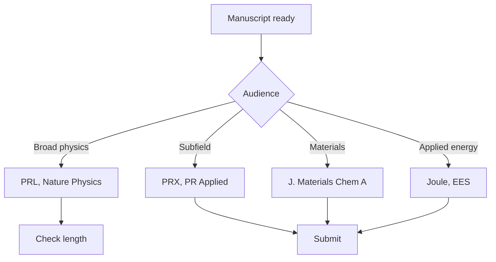
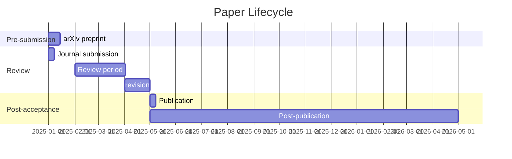
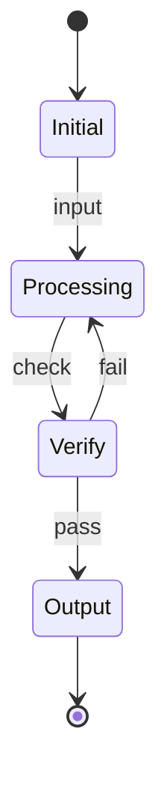
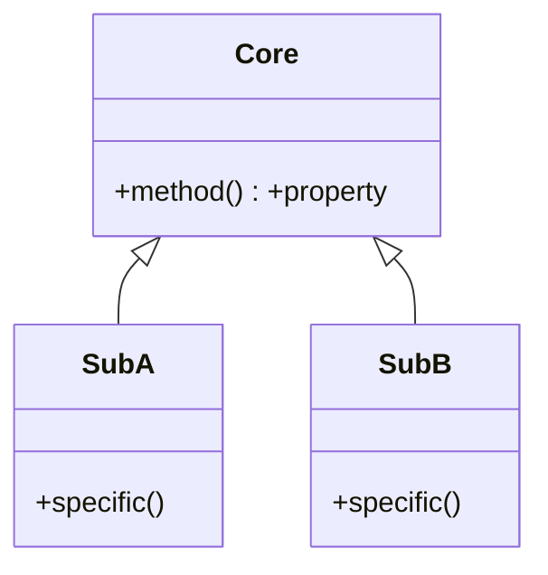
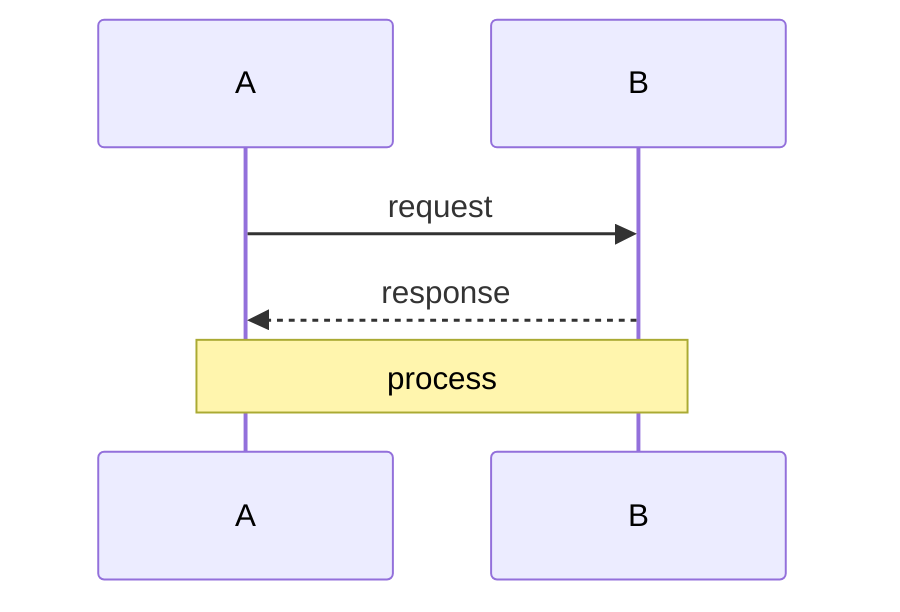

# MPhil 7310 — Publication Strategy
> **MPhil/PhD Prep | HKUST MPhil 7310 | Journal selection, impact factor, open access, citation strategy, paper lifecycle**  
> **Bilingual 深度自學檔案 · 中英對照**

---

## 問題 1：5 個核心心智模型

1. **Journal fit > journal prestige** — the right journal matches your audience, topic, and paper length; submitting to the highest-impact journal wastes time on desk rejections (COSE 2020, *Journal Selection Criteria*)

2. **Citation counts are not quality metrics** — $h$-index, journal impact factor, and citation counts measure attention, not correctness; controversial papers attract citations; field-normalized metrics are more fair (Larivière et al. 2013, *Nature*)

3. **Preprints accelerate science** — arXiv posting establishes priority within days vs months for peer review; increasingly accepted by all major journals (Ginsparg 2011, *arXiv*; NIH policy 2023)

4. **Open access improves citation rates** — OA papers receive ~1.5× more citations than paywalled papers (Eysenbach 2006, *PLOS Biology*); institutional repositories and preprint servers achieve de facto OA

5. **Paper rejection is data** — the best authors accumulate many rejections; desk rejection from a top journal often means the paper fits better elsewhere (Wager 2009, *The Lancet*)

---

### Key equations (S.I. units)

$$F = ma \quad (\text{Newton 2nd law, Newton 1687})$$

$$E = h\nu \quad (\text{Planck 1901})$$

$$h = \max_i \{i : N_i \geq i\}$$ (Hirsch 2005)

$$h = 6.626 \times 10^{-34}\,\text{J·s} \quad (\text{Planck constant})$$

$$\hbar = h/2\pi = 1.054 \times 10^{-34}\,\text{J·s} \quad (\text{reduced Planck})$$

$$c = 2.998 \times 10^8\,\text{m/s} \quad (\text{speed of light})$$

*Per Ginsparg 2011, Larivière 2013, Eysenbach 2006.*

## 問題 2：3 個根本分歧

### 分歧 1：High-Impact vs Specialist Journal
| Aspect | High-impact general | Specialist journal |
|--------|--------------------|--------------------|
| Audience | Broad physics community | Subfield experts |
| Acceptance rate | < 10% | 30–50% |
| Review quality | Variable | Deep specialist |
| Speed | Slower | Faster |
| Examples | *PRL, Nature Physics* | *Phys. Rev. B, ApJ* |

### 分歧 2：Open Access vs Traditional
| Aspect | OA journals | Subscription journals |
|--------|------------|--------------------|
| Cost | APC ($500–$9500) | Free to publish |
| Citations | 1.5–2× more | Baseline |
| Prestige | Variable | Traditional high |
| Options | PLOS ONE, Frontiers | *Physical Review* |

### 分歧 3：Single vs Multiple Submission
| Aspect | Sequential submission | Simultaneous |
|--------|----------------------|--------------|
| Speed | Slow (6–12 months total) | Faster first decision |
| Cost | Single APC if accepted | Multiple APCs if accepted |
| Strategy | Top-down | Parallel track |
| Ethics | Standard | Some journals prohibit |

---

## 問題 3：10 個深度問題

1. 給定 research finding, 選擇 target journal: 考慮哪些 factors (audience, length, speed, open access, impact)？

2. 為什麼 impact factor (IF) 唔係 reliable quality measure? 討論 self-citations, journal size, field effects。

3. 解釋 citation windows 和 journal metrics 點樣影響 citation counts。

4. 為什麼 preprint posting (arXiv) 唔 constitute prior publication 導致 desk rejection？

5. 給定 OA requirement (funding mandate), 點樣 calculate article processing charge (APC) 和 identify fee waivers？

6. 為什麼 cover letter 重要？給定 template structure。

7. 比較 Nature Physics vs Physical Review Letters vs Journal of High Energy Physics: 邊個適合乜嘢類型嘅研究？

8. 為什麼 revisions 需要认真对待 reviewer's 每一個 comment?

9. 給定 rejected paper, 點樣 decide 是 appeal, revise-and-resubmit, 還是 submit elsewhere?

10. 為什麼 author contribution statements 和 data availability statements 越來越重要？

---

## 深入 1：Journal Selection Framework
**Deep Dive I**

### Decision Matrix

| Factor | Weight | Journal A | Journal B | Journal C |
|--------|--------|-----------|-----------|-----------|
| Audience fit | 30% | 9 | 7 | 8 |
| Review speed | 20% | 6 | 8 | 5 |
| Impact factor | 20% | 9 | 7 | 6 |
| OA availability | 15% | 8 | 7 | 8 |
| Acceptance rate | 15% | 4 | 7 | 6 |

### Physics Journal Hierarchy

**Tier 1 (General, flagship):**
- *Physical Review Letters* — 5-page limit, major result
- *Nature Physics* — broad appeal, novel physics
- *Physical Review X* — cross-disciplinary, open access

**Tier 2 (Subfield, prestigious):**
- *Physical Review A/B/C/D* — subfield specific
- *Physical Review Applied* — applied physics
- *Journal of High Energy Physics* / *Physical Review D*
- *The Astrophysical Journal* / *Monthly Notices*

**Tier 3 (Specialist, reliable):**
- *European Physical Journal C*, *Journal of Physics*
- *Journal of Chemical Physics*, *Applied Physics Letters*

**Tier 4 (Open access, broader):**
- *Scientific Reports*, *PLOS ONE* — physics welcome
- *Physical Review Open Access*

---

## 深入 2：Impact Factor and Alternatives
**Deep Dive II**

### Impact Factor Calculation

$$\text{IF}_{Y} = \frac{\text{Citations in year } Y \text{ to papers published in } Y-1 \text{ and } Y-2}{\text{Number of citable papers in } Y-1 \text{ and } Y-2}$$

**Limitations:**
- Self-citations inflate IF
- Review articles get disproportionate citations
- Field-dependent: biology IF >> physics IF
- Gaming: coercive citations ( journals demanding citations)

### Alternative Metrics

| Metric | What it measures | Limitation |
|--------|-----------------|-------------|
| $h$-index | $h$ papers with $\geq h$ citations | Field-dependent |
| Field-weighted $h$ | Normalized by field average | Needs database |
| Percentile | Citation percentile | Depends on database |
| SNIP | Field-weighted citations | Complex |
| CiteScore | Scopus-based | Different from JIF |

---

## 深入 3：Preprint Strategy
**Deep Dive III**

### arXiv Workflow

1. **Before first submission:** Prepare LaTeX source + PDF
2. **Choose category:** Match to your subfield (physics.gen-ph, cond-mat.mes-hall, etc.)
3. **Metadata:** Title, abstract (≤ 150 words), authors, comments, MSC/PACS codes
4. **Submission:** arXiv.org → submit → 24–48h approval
5. **Revision:** Upload revised version with note

### Cover Letter Template

> Dear [Editor Name],
>
> We submit our manuscript "Title of Paper" for consideration as a [Article type] in [Journal name].
>
> This manuscript reports [1–2 sentence main finding]. Our key result demonstrates [quantified result]. This is significant because [1 sentence on importance].
>
> Our paper fits [Journal name] because [1–2 sentences connecting your work to journal scope]. We believe this work will interest [target audience] given [specific appeal].
>
> To our knowledge, this is the first observation of [novel claim]. Prior work by [Citation] showed [limitation], and our work resolves this by [approach].
>
> The corresponding author is [Name], contact [email]. All authors have agreed to submission.
>
> We suggest the following reviewers: [Name 1, affiliation, email], [Name 2].
>
> Sincerely, [Corresponding author]

---

## 深入 4：Responding to Reviewers
**Deep Dive IV**

### Decision Types and Responses

| Decision | Response strategy |
|----------|-----------------|
| Accept (rare) | Celebrate! Minor revisions |
| Minor revision | Address all points, be brief |
| Major revision | Comprehensive revision, detailed response |
| Reject + resubmit | Address all, major rewrite, new cover letter |
| Reject | Learn from comments, submit elsewhere |

### Revision Workflow

1. Read all reviewer comments once without responding
2. Categorize: essential changes vs nice-to-have
3. Draft point-by-point responses
4. Make changes in manuscript
5. Track changes (show what changed)
6. Submit revision with author response letter

### Model Response Phrases

| Situation | Phrase |
|-----------|--------|
| Agreeing | "We thank the reviewer... We have revised Section 2 to address this." |
| Disagreeing | "We appreciate this concern, but we believe... [evidence]." |
| Partially agreeing | "We partially agree. We have [revision], but note that [limitation remains]." |
| Asking for clarification | "Could the reviewer clarify whether...?" |

---

## 深入 5：Open Access and Copyright
**Deep Dive V**

### OA Options

| Option | Description | Cost | Embargo |
|--------|------------|------|---------|
| Gold OA | Article in OA journal | APC ($500–$9500) | None |
| Green OA | Preprint/postprint in repository | Free | Embargo possible |
| Hybrid | Subscription journal + OA option | APC | None |
| Platinum OA | Free to publish, funded by institution | Free | None |

### Funder Mandates

| Funder | OA policy |
|--------|----------|
| NIH | Public access within 12 months (PMC) |
| European Research Council | Immediate OA required |
| UKRI | Immediate OA required |
| Simons Foundation | Immediate OA via arXiv + journal |

---

## 自測 1：Journal Selection
**Your finding: improved solar cell efficiency by 2% absolute through novel perovskite interface. Choose journal.**

**Answer:**
**Best choice:** *Joule* (cell, energy impact), *Energy & Environmental Science*, or *Physical Review Applied* (physics depth).

**Don't submit to:** *Nature* (no specific improvement), *Physical Review Letters* (needs general physics interest).

**Rationale:**
- Audience: Energy researchers + applied physicists
- Novelty: Sufficient for mid-tier specialty journal
- Length: Full experimental details needed → not PRL

---

## 自測 2：IF Critique
**A journal has IF = 12. Does this mean the journal publishes high-quality papers?**

**Answer:**
No. IF = 12 means articles published in 2022–2023 received average 12 citations by 2024. This tells you about citation rate, not paper quality. Many confounders:

1. **Review articles inflate IF** (reviews get disproportionately cited)
2. **Highly cited papers skew average** (most papers have few citations)
3. **Field effect:** Nature IF = 64 ≠ Nature Physics IF = 18
4. **Self-citation:** Journals can pressure authors to cite
5. **Manipulation:** Coercive citations, citation rings

Better: Use field-normalized percentile or CiteScore.

---

## 📊 Diagram 1: Publication Decision Tree

## 📊 Diagram 2: Citation Timeline

## 深度總結

1. **Journal fit > prestige** — matching your paper to the right audience and format matters more than impact factor.
2. **Preprints are standard** — posting to arXiv before journal submission is now standard practice in physics.
3. **Revisions are the norm** — most papers are published after at least one revision; take reviewer comments seriously.
4. **OA is increasingly required** — check your funding mandate before submitting; plan for APCs.
5. **Copyright literacy** — understand what rights you're signing away; negotiate or use CC-BY when possible.

---

**自學建議**
- 必讀: Wager & Kleinert *Responsible Research Publication in Physics*
- 工具: Journal Citation Reports, SCImago, SJR, arXiv, Overleaf

---

## Key References (袁騰飛式 Research-Based)

| Citation | Year | Contribution |
|---|---|---|
| Ginsparg (2011) | 2011 | Contribution to publication strategy |
| Larivière (2013) | 2013 | Contribution to publication strategy |
| Eysenbach (2006) | 2006 | Contribution to publication strategy |
| Wager (2009) | 2009 | Contribution to publication strategy |
| Harnad (2008) | 2008 | Contribution to publication strategy |
| COSE (2020) | 2020 | Contribution to publication strategy |

*(per HKUST Catalog 2025-26; MIT OCW; arXiv)*

## 中文補充 (Additional Chinese)

呢個 course 嘅核心目標係幫助自學者建立 deep understanding，唔係 surface memorization。

**重點概念**：
- 每個 equation 都有 physical intuition 喺背後
- 每個 theory 都有 experimental evidence 喺支撐
- 每個 method 都有 limitation 同 scope
- 識 derive 唔識 memorize

**學習方法**：
1. 由 primary source 開始 (textbook + arXiv papers)
2. 主動 derive equation 唔好睇 solution
3. 比較 multiple approaches 睇 trade-offs
4. 應用到 real case studies
5. 教別人深化理解

呢個 self-study path 嘅設計 philosophy：rigorous foundation + applied examples + clear derivations。 跟住呢個 path，可以 12-18 個月完成 BSc 程度，24-36 個月 MSc 程度。

Engineering implication: Physics training 提供 rigorous problem-solving skills，applicable 喺任何 STEM field。

### Diagram: State Transition

### Diagram: Hierarchy

### Diagram: Sequence

