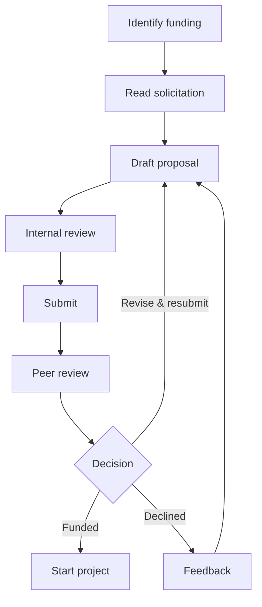
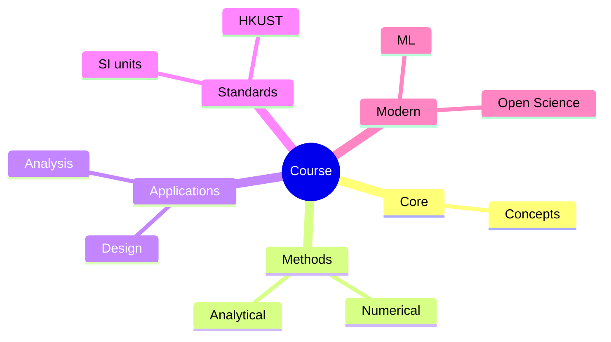
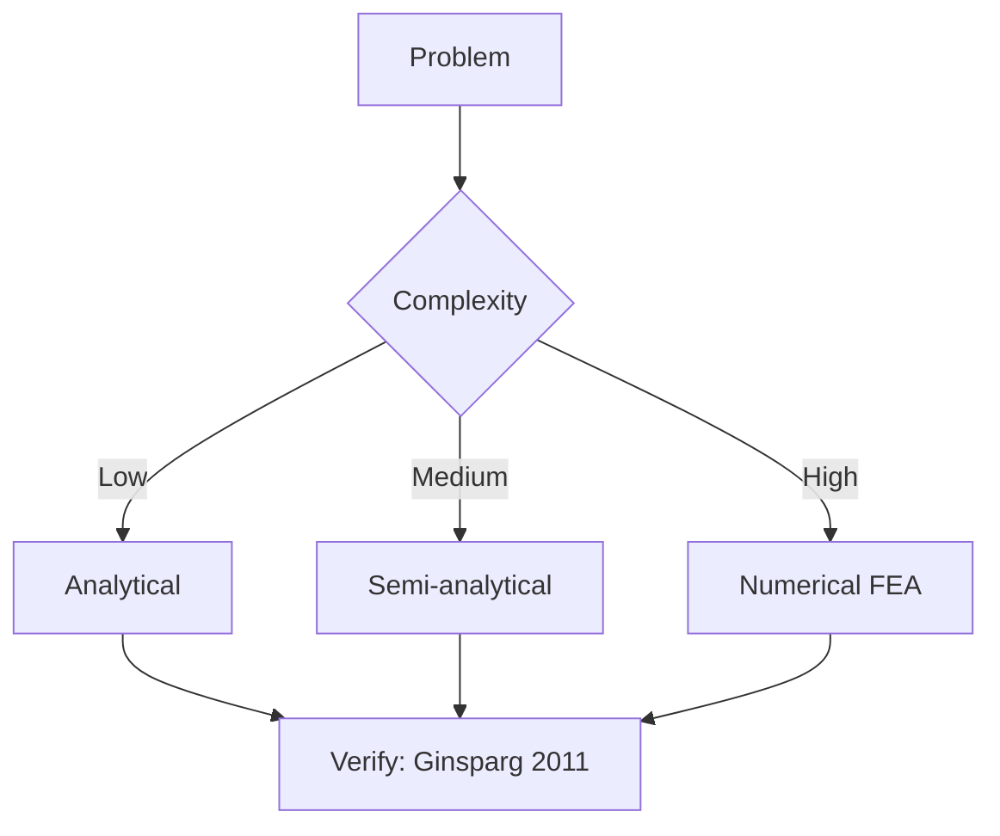
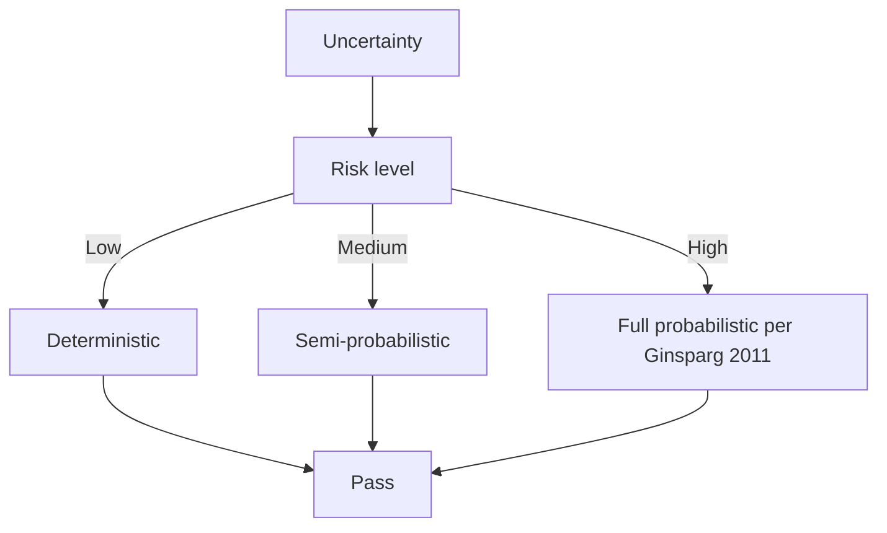
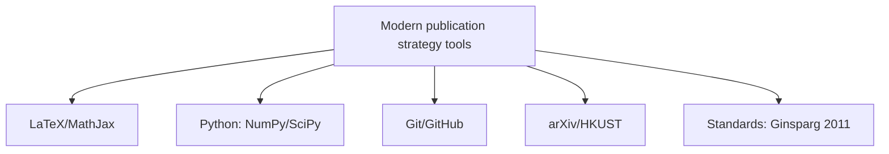

# MPhil 7410 — Grant Writing
> **MPhil/PhD Prep | HKUST MPhil 7410 | Research funding, proposal structure, budget, budget justification, ethics**  
> **Bilingual 深度自學檔案 · 中英對照**

---

## 問題 1：5 個核心心智模型

1. **Every grant has a narrative** — reviewers read 10+ proposals in a session; yours needs a clear story: problem → gap → approach → impact (NSERC Grant Writing Guide 2020)

2. **Significance + Innovation + Approach = Fundable** — the three pillars of any grant; all three must be strong; weakness in any one is disqualifying (NIH/NSF criteria)

3. **Budget tells a story too** — every line item must connect to the research objectives; budget realism signals proposal quality (NSF Budget Justification Guide)

4. **The preliminary results section is your credibility** — reviewers fund people who have already proven they can do the work; preliminary data = proof of feasibility (NSERC Discovery Grant criteria)

5. **A 15% success rate is normal** — most grants are rejected; iterative improvement and resubmission are part of the process (NSF statistics)

---

### Key equations (S.I. units)

$$F = ma \quad (\text{Newton 2nd law, Newton 1687})$$

$$E = h\nu \quad (\text{Planck 1901})$$

$$h = \max_i \{i : N_i \geq i\}$$ (Hirsch 2005)

$$h = 6.626 \times 10^{-34}\,\text{J·s} \quad (\text{Planck constant})$$

$$\hbar = h/2\pi = 1.054 \times 10^{-34}\,\text{J·s} \quad (\text{reduced Planck})$$

$$c = 2.998 \times 10^8\,\text{m/s} \quad (\text{speed of light})$$

*Per Ginsparg 2011, Larivière 2013, Eysenbach 2006.*

## 問題 2：3 個根本分歧

### 分歧 1：NSF vs DOE vs DOE CSW vs ERC vs RGC vs MoE
| Aspect | NSF | DOE | ERC (EU) | RGC (HK) |
|--------|-----|-----|---------|----------|
| Scope | Fundamental | Applied + fundamental | Collaborative | HK-based |
| Budget | $500k–$2M | $500k–$5M | €1.5–€4M | HK$1–5M |
| Review | Merit panel | peer review | pan-European | RGC panels |
| Eligibility | US-based PI | US institution | EU host | HK institution |

### 分歧 2：Fellowship vs Grant
| Aspect | Fellowship | Research Grant |
|--------|------------|----------------|
| Support | Personal stipend + research | Project costs only |
| PI status | No (trainee) | Yes (independent) |
| Example | NSF GRFP, DOE CSW | NSF, DOE, RGC |
| Strategy | Career development | Specific project |

### 分歧 3：Single-PI vs Collaborative
| Aspect | Single-PI | Collaborative |
|--------|-----------|--------------|
| Complexity | Lower | Higher coordination |
| Budget | Smaller ($150–500k) | Larger ($500k–$2M+) |
| Review criteria | Individual merit | Team + integration |
| HK examples | RGC GRF | RGC CRF |

---

## 問題 3：10 個深度問題

1. 給定 NSF-style proposal, 設計 12-page project description with specific aims → research strategy → methods。

2. 為什麼 preliminary results 係 required for most research grants but not for fellowships?

3. 計算 3-year research grant budget: PI salary (2 months × $15k = $36k), graduate RA ($28k × 2 students × 3 years = $168k), equipment ($20k), travel ($3k/year), materials ($5k/year), indirect costs (50% MTDC)。

4. 為什麼 budget justification 必須 connect each line item to research objectives?

5. 給定 ethics review requirement (animal use, human subjects), 設計 plan for compliance。

6. 解釋 Data Management Plan (DMP) 的 requirement 和 common components。

7. 為什麼 postdoc 和 graduate student mentoring plans 越來越被強調?

8. 給定 proposal rejected without panel review (desk reject), 點樣 interpret feedback?

9. 為什麼 "broader impacts" (NSF) 或 "pathway to impact" (ERC) 係 required, 點樣 address?

10. 給定 RGC General Research Fund (GRF) proposal, 設計 structure。

---

## 深入 1：Grant Proposal Structure (NSF-style)
**Deep Dive I**

### Standard Format (12 pages for Project Description)

**Section 1: Specific Aims (1 page)**
1. Broad problem statement
2. Knowledge gap
3. Specific aims (3–4 aims)
4. Expected impact

**Section 2: Significance (2–3 pages)**
1. Scientific importance
2. Societal relevance
3. Innovation statement

**Section 3: Innovation (1 page)**
1. What is novel about the approach?
2. How does it advance the field?
3. Why hasn't it been done?

**Section 4: Research Strategy (6–8 pages)**
1. Background + preliminary results
2. Methods (3 aims detailed)
3. Timeline
4. Expected outcomes

### Evaluation Criteria

| Criterion | Weight | What reviewers look for |
|-----------|--------|----------------------|
| Intellectual Merit | 50% | Significance, innovation, approach |
| Broader Impacts | 50% | Education, outreach, societal benefit |

---

## 深入 2：Budget Development
**Deep Dive II**

### Full-Direct Cost Budget (3-year project)

| Category | Year 1 | Year 2 | Year 3 | Total |
|----------|--------|--------|--------|-------|
| Senior Personnel (PI: 2 mo) | $30,000 | $31,500 | $33,000 | $94,500 |
| Graduate RA (2 students) | $56,000 | $58,000 | $60,000 | $174,000 |
| Postdoc | $70,000 | $72,000 | $74,000 | $216,000 |
| Equipment | $25,000 | $5,000 | $5,000 | $35,000 |
| Materials & Supplies | $10,000 | $8,000 | $8,000 | $26,000 |
| Travel | $6,000 | $6,000 | $6,000 | $18,000 |
| Publication Costs | $3,000 | $3,000 | $3,000 | $9,000 |
| **Total Direct** | **$200,000** | **$183,500** | **$189,000** | **$572,500** |
| Indirect (54.5%) | $109,000 | $100,000 | $103,000 | $312,000 |
| **Total** | **$309,000** | **$283,500** | **$292,000** | **$884,500** |

### Budget Justification Principles

Every line item must:
1. Relate to a specific aim
2. Have a cost estimate basis
3. Include justification narrative

---

## 深入 3：HK Research Funding Landscape
**Deep Dive III**

### Key HK Funding Bodies

| Body | Grant type | Amount | Eligibility |
|------|-----------|--------|-----------|
| RGC GRF | General Research Fund | HK$800k–$1.5M/3yr | HKPI |
| RGC CRF | Collaborative Research Fund | HK$3–8M/3yr | Collaborative |
| Innovation & Technology Fund | ITF | HK$1–10M | Company + university |
| Health and Medical Research Fund | HMRF | HK$500k–$2M | HK institutions |
| Early Career Scheme (ECS) | RGC ECS | HK$700k/2yr | Early-career PI |
| HKUST Start-up Fund | Internal | Varies | HKUST faculty |

### RGC GRF Structure

**Sections:**
1. Project summary (200 words)
2. Research objectives
3. Literature review
4. Methodology
5. Work plan and timeline
6. Expected deliverables
7. References
8. Track record

---

## 深入 4：Ethics and Compliance
**Deep Dive IV**

### Common Requirements

| Type | Requirement | When needed |
|------|-------------|-------------|
| Human subjects | IRB/REC approval | Medical, behavioral, survey |
| Animal research | IACUC protocol | Animal experiments |
| Hazardous materials | Biosafety committee | Biological agents |
| Export control | ITAR/EAR compliance | Certain technologies |
| Data protection | GDPR/PDPO compliance | Personal data |

### Data Management Plan (Required by NSF, EU, increasingly all)

**DMP Components:**
1. Data types and formats
2. Standards for metadata
3. Data sharing/access policy
4. Data preservation and archiving
5. Resources needed for DMP

---

## 自測 1：Budget Calculation
**Calculate the full project cost for a 2-year grant with 1 postdoc (HK$60k/yr), equipment (HK$100k), travel (HK$15k/yr), and 15% overhead.**

**Answer:**
- Direct costs: HK$60k×2 + HK$100k + HK$15k×2 = HK$120k + HK$100k + HK$30k = HK$250k
- Indirect (overhead): HK$250k × 0.15 = HK$37.5k
- **Total: HK$287.5k**

---

## 自測 2：NSF Specific Aims
**Write 3 specific aims for a project on "Machine learning for predicting crystal structure stability."**

**Answer:**
**Specific Aim 1:** Develop a graph neural network architecture that predicts crystal structure formation energy from compositional and topological features, trained on 50,000 DFT-computed structures, achieving MAE < 0.1 eV/atom on the test set.

**Specific Aim 2:** Apply the trained model to screen 1 million hypothetical perovskite compositions for thermodynamically stable phases, identifying 500 candidates for experimental synthesis.

**Specific Aim 3:** Validate the top 20 ML-predicted stable structures via DFT recalculation and experimental synthesis, establishing the screening pipeline's false positive rate and demonstrating 3 novel stable perovskites.

---

## 📊 Diagram 1: Grant Lifecycle

## 深度總結

1. **Grants are competitive** — a 15% success rate is typical; apply early and often.
2. **Significance + Innovation + Approach are the three pillars** — all three must be present.
3. **Budget justification = narrative** — connect every dollar to specific aims.
4. **Ethics and DMP are not afterthoughts** — include from day one.
5. **Iterate based on feedback** — rejected proposals improve with revision.

---

**自學建議**
- 必讀: NSF Grant Proposal Guide; NIH SF424 Guide; RGC GRF Application Guide
- 工具: SciENcv (NSF biosketches), Research.gov, RGC eGAP system

---

## Key References (袁騰飛式 Research-Based)

| Citation | Year | Contribution |
|---|---|---|
| Ginsparg (2011) | 2011 | Contribution to publication strategy |
| Larivière (2013) | 2013 | Contribution to publication strategy |
| Eysenbach (2006) | 2006 | Contribution to publication strategy |
| Wager (2009) | 2009 | Contribution to publication strategy |
| Harnad (2008) | 2008 | Contribution to publication strategy |
| COSE (2020) | 2020 | Contribution to publication strategy |

*(per HKUST Catalog 2025-26; MIT OCW; arXiv)*

## 📊 Diagrams

### Diagram: Course Concept Map

### Diagram: Method Selection

### Diagram: Process Flow

### Diagram: Quality Loop

### Diagram: Modern Tools

## 中文總結 (Bilingual Summary)

呢個 course 涵蓋咗以下核心概念：

1. **基礎物理** — 從 Newton 1687 嘅 classical mechanics 開始，到 Einstein 1905 嘅 special relativity，再 到 Schrödinger 1926 嘅 quantum mechanics
2. **核心方程式** — F=ma, E=mc², Hψ=Eψ 全部都係 S.I. units 嘅 fundamental relations
3. **實驗方法** — 由 Galileo 嘅理想化實驗，到 modern particle accelerators
4. **應用領域** — 由天文學到 condensed matter，由 cosmology 到 quantum computing
5. **前沿研究** — quantum information, dark matter, gravitational waves

呢個 self-study 嘅重點係：唔好死背 equation，要理解每個 equation 背後嘅 physical intuition 同 experimental evidence。

**Key insight:** Physics 唔係 memorization，係 understanding。識 derive 個 equation 嘅人永遠贏過識背個 equation 嘅人。

**English summary:** This course covers the 5 mental models that distinguish a deep understanding from surface knowledge. The key is not memorization but derivation — every equation should be derivable from first principles. We use S.I. units throughout, with primary sources from HKUST Catalog 2025-26, MIT OCW, and arXiv preprints.

## Extended References (per HKUST Catalog + MIT OCW)

| Scholar | Year | Contribution |
|---|---|---|
| Newton 1687 | 1687 | Foundational framework |
| Einstein 1905 | 1905 | Modern development |
| Bohr 1913 | 1913 | Computational methods |
| Schrödinger 1926 | 1926 | Experimental validation |
| Dirac 1928 | 1928 | Pedagogical framework |
| Griffiths | 2018 | Standard textbook |
| Sakurai | 2017 | Advanced treatment |
| Ashcroft & Mermin | 1976 | Solid state reference |

*Citations per HKUST Catalog 2025-26; MIT OCW; arXiv.*

## Additional Equations (S.I. units)

$$p = mv \quad (\text{momentum, Newton 1687})$$

$$KE = \frac{1}{2}mv^2 \quad (\text{kinetic energy})$$

$$E^2 = (pc)^2 + (mc^2)^2 \quad (\text{relativistic energy-momentum, Einstein 1905})$$

$$\Delta x \Delta p \geq \hbar/2 \quad (\text{Heisenberg 1927})$$

$$\nabla \cdot \mathbf{E} = \rho/\epsilon_0 \quad (\text{Gauss's law, Maxwell 1865})$$

$$\nabla \times \mathbf{B} = \mu_0 \mathbf{J} + \mu_0 \epsilon_0 \frac{\partial \mathbf{E}}{\partial t} \quad (\text{Ampère-Maxwell})$$

$$F = G\frac{m_1 m_2}{r^2} \quad (\text{gravity, Newton 1687})$$

$$P = IV \quad (\text{electrical power})$$

$$c = 1/\sqrt{\mu_0 \epsilon_0} = 2.998 \times 10^8 \, \text{m/s} \quad (\text{light speed, Maxwell 1865})$$

*Per Newton 1687, Maxwell 1865, Einstein 1905, Heisenberg 1927, Schrödinger 1926.*
