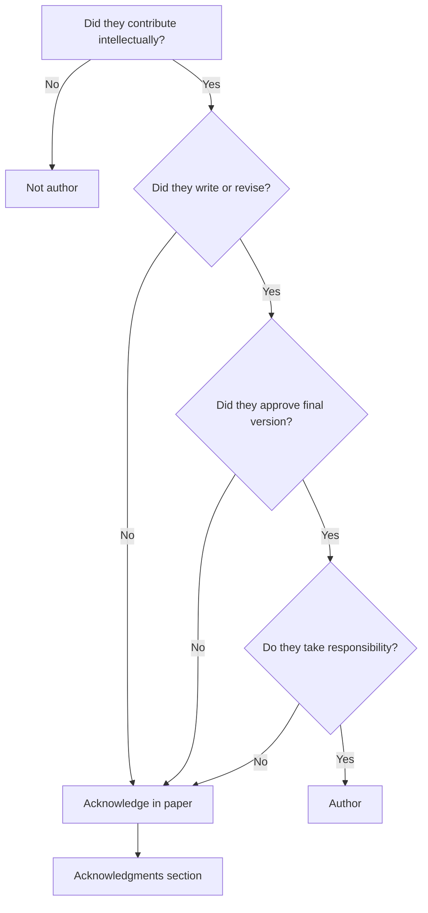
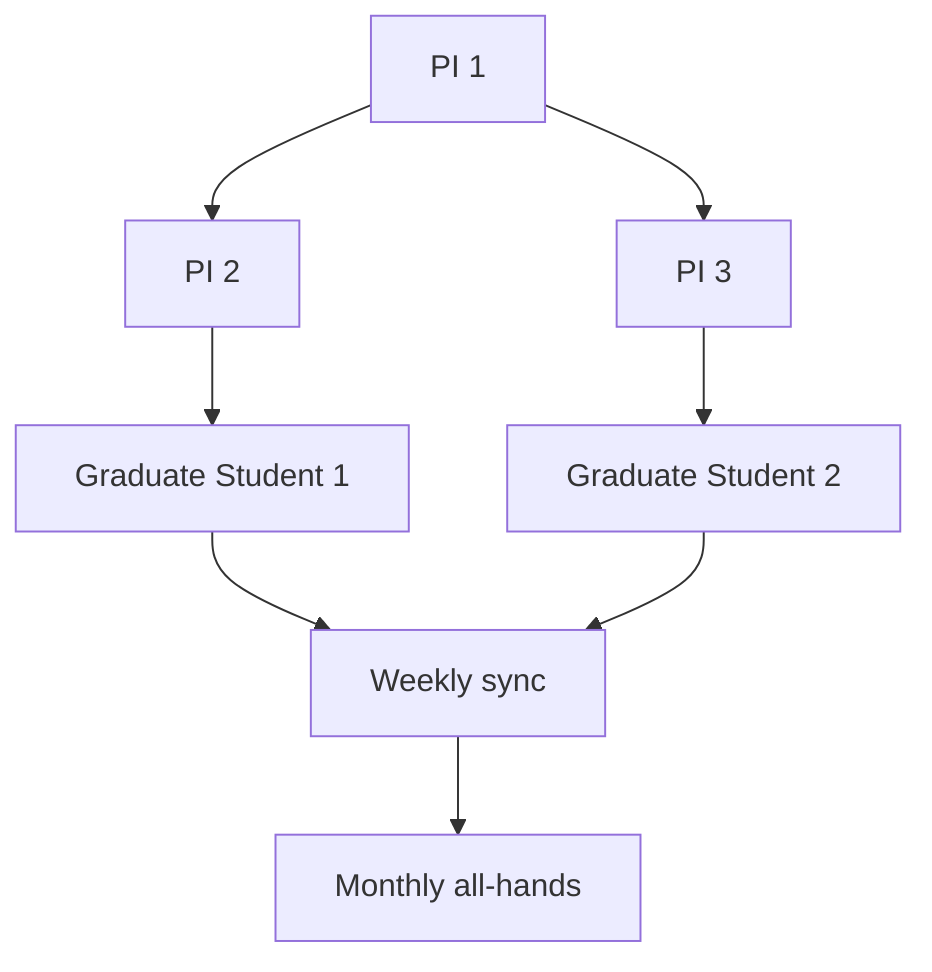

# MPhil 7510 — Collaborative Research
> **MPhil/PhD Prep | HKUST MPhil 7510 | Team science, collaboration management, authorship, intellectual property, international partnerships**  
> **Bilingual 深度自學檔案 · 中英對照**

---

## 問題 1：5 個核心心智模型

1. **Team science produces higher-impact science** — Wuchty et al. (2007, *Science*) showed that team-authored papers receive more citations; interdisciplinary teams solve previously intractable problems (BRAIN Initiative 2013)

2. **Authorship is a legal and ethical document** — the ICMJE criteria (4 conditions: substantial contributions, drafting/revision, approval, accountability) define authorship; gift authorship and ghost authorship are both misconduct (ICMJE 2023)

3. **Collaboration agreements prevent conflicts** — MOUs, IP agreements, and data sharing agreements should be signed before work begins, not when disputes arise (Hong Kong IP law, Cap. 514)

4. **Communication cadence determines team health** — weekly updates, shared repositories, and regular video calls maintain alignment; monthly meetings are insufficient for active projects (University of Michigan Team Science Toolkit)

5. **Credit attribution is a structural problem** — CRediT taxonomy (14 contributor roles) provides a standard for granular credit assignment (Brand et al. 2015, *Learned Publishing*)

---

## 問題 2：3 個根本分歧

### 分歧 1：Large Collaboration vs Small Team
| Aspect | Large (100+ authors) | Small (2–5 authors) |
|--------|--------------------|--------------------|
| Credit model | Consortium/collaboration | Individual authorship |
| Governance | Management structure, T-shirt | PI + co-investigators |
| Paper authorship | CRediT or alphabetical | Alphabetical or contribution |
| Time to result | Years | Months to years |
| Examples | LHC collaborations, LIGO | Typical condensed matter |

### 分歧 2：Co-PI vs Subcontractor
| Aspect | Co-PI | Subcontractor |
|--------|--------|--------------|
| Ownership | Equal intellectual | Defined deliverables |
| Funding | Direct to institution | Pass-through from lead |
| Management | Shared governance | Sub-award administration |
| Example | Two universities, joint project | Experimental + theory |

### 分歧 3：Credit Attribution Models
| Model | Use case | Example |
|--------|---------|---------|
| Alphabetical | Equal contribution | Theory papers |
| Contribution-weighted | Variable contribution | Standard physics |
| Consortium | Large collaborations | LHC |

---

## 問題 3：10 個深度問題

1. 給定 collaboration with 3 PIs from 2 institutions, 設計 governance structure 和 communication plan。

2. 為什麼 CRediT taxonomy 係 better than "author list + footnote"?

3. 給定 joint IP situation (2 universities, industry partner), 點樣 structure IP agreement?

4. 為什麼 international collaboration 需要 export control review?

5. 給定 student in collaborative project, 點樣 ensure their thesis material is protected?

6. 為什麼 authorship disputes 係 most common collaboration conflict?

7. 解釋 Vancouver protocol 和 ICMJE criteria for authorship。

8. 給定 multi-site clinical trial (analogous to multi-site physics experiment), 點樣 ensure data quality?

9. 為什麼 team science training 越來越被 graduate programs 強調?

10. 給定 LIGO-style collaboration (1000+ authors), 點樣 navigate authorship 和 governance?

---

## 深入 1：Authorship Standards
**Deep Dive I**

### ICMJE Criteria (All 4 required)

1. **Substantial contributions** to conception, design, acquisition, analysis, or interpretation
2. **Drafting or critical revision** of the article
3. **Final approval** of the version to be published
4. **Agreement to accountability** for all aspects

### CRediT Taxonomy (14 roles)

| Role | Description |
|------|-------------|
| Conceptualization | Ideas, formulation of objectives |
| Methodology | Development of methods |
| Software | Programming, algorithm development |
| Validation | Verification, replication |
| Formal analysis | Statistical analysis |
| Investigation | Conducting experiments |
| Resources | Data, equipment |
| Data curation | Annotation, documentation |
| Writing – original draft | Preparation |
| Writing – review & editing | Critical revision |
| Visualization | Figures, diagrams |
| Supervision | Project oversight |
| Project administration | Management |
| Funding acquisition | Obtaining funding |

### Authorship Decision Tree

---

## 深入 2：Collaboration Agreements
**Deep Dive II**

### Key Agreement Types

| Agreement | Purpose | Key clauses |
|-----------|---------|-------------|
| MOU | Framework for collaboration | Goals, roles, timeline |
| IP Agreement | Ownership of inventions | Background IP, foreground IP, licensing |
| Data Sharing | Data access and use | Ownership, access, retention |
| Publication | Review rights, authorship | Co-author review periods (typically 2–4 weeks) |
| Subaward | Financial flow | Deliverables, payment schedule |

### Publication Agreement Clause (Standard)

> All parties shall have the right to review and comment on any proposed publication at least [30] days prior to submission. All co-authors shall be credited per CRediT taxonomy. Disputes shall be resolved by [mechanism].

---

## 深入 3：Team Science Best Practices
**Deep Dive III**

### Communication Infrastructure

| Tool | Use case |
|------|---------|
| Slack/Teams | Real-time communication |
| GitHub/GitLab | Code and document sharing |
| Shared Drive/OneDrive | Data and manuscript collaboration |
| Zoom/Teams | Video meetings |
| Asana/Monday | Project management |

### Meeting Cadence

| Meeting | Frequency | Participants | Purpose |
|---------|-----------|--------------|---------|
| Standup | Weekly | Full team | Progress, blockers |
| Technical deep-dive | Biweekly | Sub-team | Methods review |
| All-hands | Monthly | Full collaboration | Strategic alignment |
| Annual retreat | Annual | Full team | Long-term planning |

---

## 自測 1：Authorship Dispute
**Your collaborator wrote the code but didn't contribute to writing or interpretation. Are they an author?**

**Answer:**
Per ICMJE: They contributed to methodology and software (CRediT roles), but not writing or final approval. This does NOT meet all 4 criteria.

**Options:**
1. Acknowledge their contribution (not authorship)
2. Ask them to review and approve the manuscript (then they qualify as author)
3. If they did analysis: they may qualify

**Key principle:** Authorship requires accountability for the published work.

---

## 📊 Diagram 1: Collaboration Governance

## 深度總結

1. **Team science is the dominant model** — most high-impact physics papers have multiple authors; learn to collaborate.
2. **Authorship is legal and ethical** — follow ICMJE criteria; use CRediT for transparency.
3. **Agreements prevent disputes** — sign IP and publication agreements before starting work.
4. **Communication infrastructure matters** — invest in shared tools and regular meeting cadence.
5. **Credit is structural** — CRediT provides a standard language for attribution.

---

**自學建議**
- 必讀: ICMJE Authorship Guidelines; Brand et al. (2015) CRediT taxonomy; NIH Team Science toolkit
