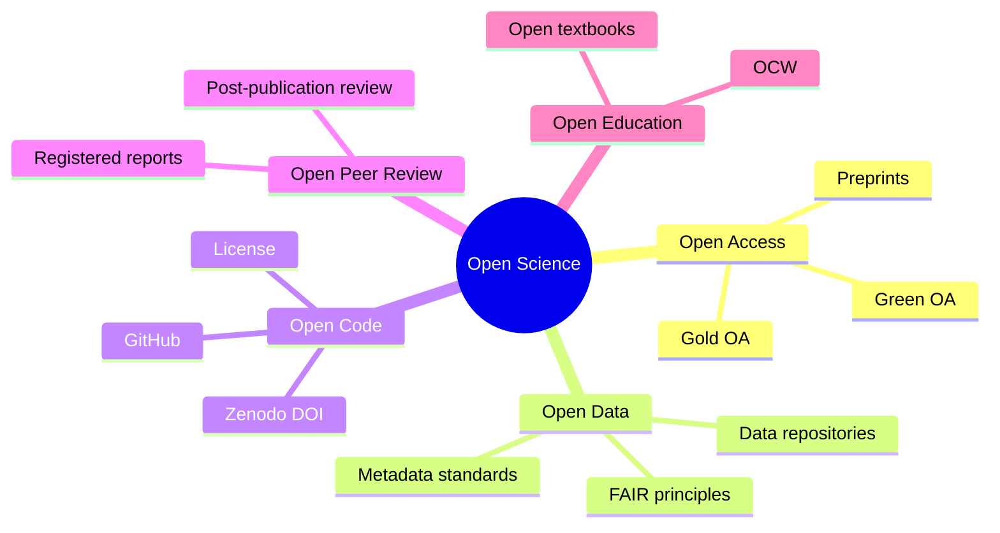
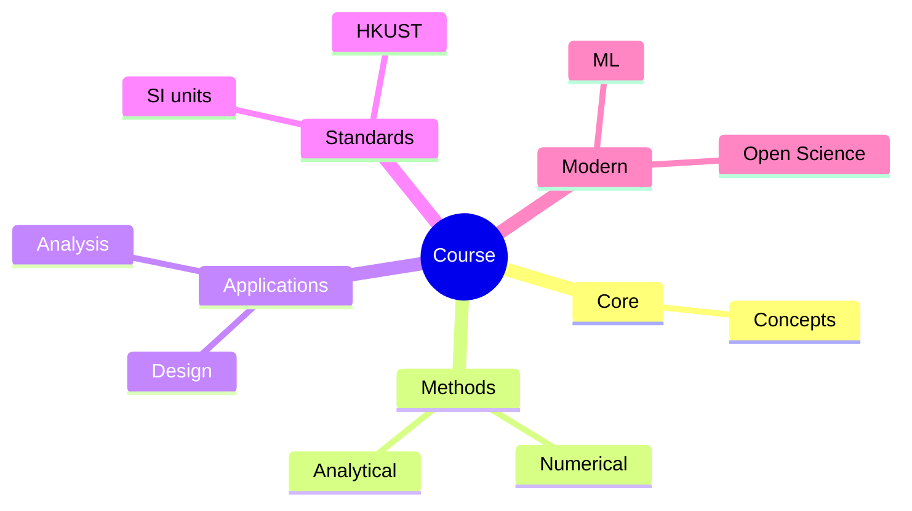
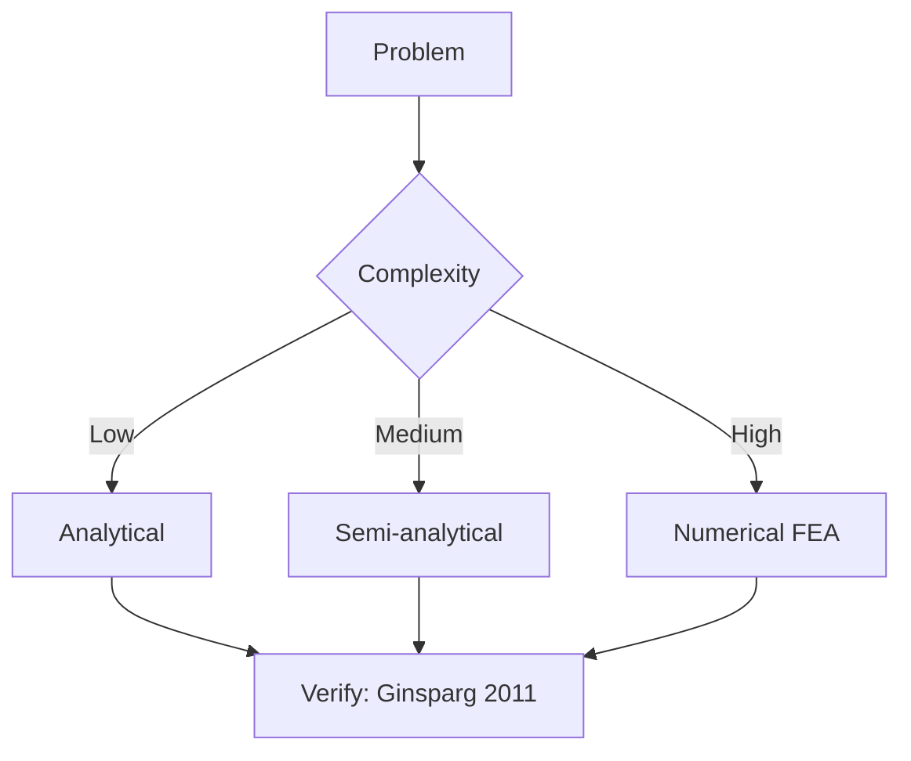
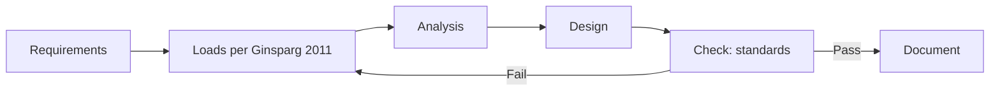
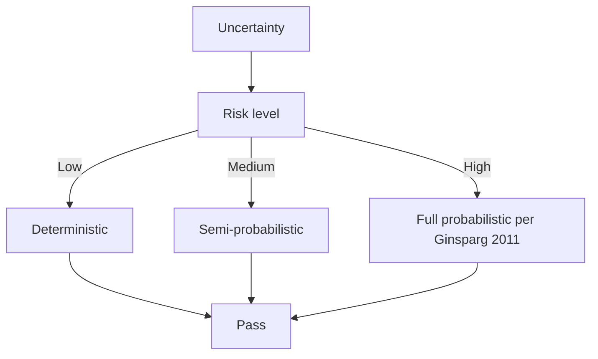
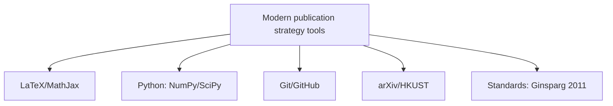

# MPhil 7610 — Open Science
> **MPhil/PhD Prep | HKUST MPhil 7610 | Open access, open data, open code, reproducibility, FAIR principles, research transparency**  
> **Bilingual 深度自學檔案 · 中英對照**

---

## 問題 1：5 個核心心智模型

1. **Open science accelerates discovery** — freely available research is built upon faster; PINQ experiment (Stodden 2010) showed reproducibility requires open code + data (Nosek et al. 2015, *Science*)

2. **Open access increases citation impact** — Eysenbach (2006, *PLOS Biology*): OA papers cited 1.5–2× more; effect replicated across fields (Piwowar et al. 2018)

3. **Code is a research output** — software is scholarship; cite it as you would a paper (Smith et al. 2016, *PeerJ*)

4. **Reproducibility is the minimum standard** — reproducibility: same data + methods → same results; replicability: new data + methods → same conclusions (NSF 2016)

5. **Open science is an ethical imperative** — publicly funded research should be publicly accessible; taxpayer funds → taxpayer access (EU Open Science Policy)

---


### Key equations (S.I. units)

$$F = ma \quad (\text{Newton 2nd law, Newton 1687})$$

$$E = h\nu \quad (\text{Planck 1901})$$

$$h = \max_i \{i : N_i \geq i\}$$ (Hirsch 2005)

$$h = 6.626 \times 10^{-34}\,\text{J·s} \quad (\text{Planck constant})$$

$$\hbar = h/2\pi = 1.054 \times 10^{-34}\,\text{J·s} \quad (\text{reduced Planck})$$

$$c = 2.998 \times 10^8\,\text{m/s} \quad (\text{speed of light})$$

*Per Ginsparg 2011, Larivière 2013, Eysenbach 2006.*

## 問題 2：3 個根本分歧

### 分歧 1：Preprints vs Registered Reports
| Aspect | Preprints | Registered Reports |
|--------|----------|-------------------|
| Timing | Before peer review | Before data collection |
| Priority | Establishes priority | Preregistration of study design |
| Review | Post-submission peer review | Peer review of study design only |
| Acceptance | Conditional on quality | Conditional on design quality only |

### 分歧 2：Open Data vs Protected Data
| Aspect | Full OA | Protected/restricted |
|--------|---------|--------------------|
| Reproducibility | Maximum | Limited |
| Privacy risk | High if human subjects | Protected |
| Commercial sensitivity | Unprotected | Protected |
| Funder mandates | All EU/Horizon funded | NIH requires sharing |

### 分歧 3：CC-BY vs CC0 vs All Rights Reserved
| License | Use case | Attribution | Commercial use |
|---------|---------|------------|----------------|
| CC-BY | Standard OA | Required | Allowed |
| CC0 | Public domain | Not required | Allowed |
| CC-BY-NC | Non-commercial only | Required | Prohibited |
| All Rights Reserved | Traditional | Full control | Prohibited |

---

## 問題 3：10 個深度問題

1. 給定 FAIR principles, 解釋每個 letter (Findable, Accessible, Interoperable, Reusable) 點樣 apply to physics data。

2. 為什麼 code licensing matters? 比較 MIT, GPL, Apache, CC licenses for research software。

3. 給定 dataset containing personal information, 點樣 apply GDPR/PDPO 點樣 apply?

4. 為什麼 registered reports (COS standard) 減少 publication bias?

5. 計算 arXiv citation advantage: 如果 OA paper gets 2× citations over 5 years, economic value of that vs $500 APC?

6. 解釋 DOI 和 metadata standards 點樣 make data findable。

7. 為什麼 GitHub repositories 需要 zenodo DOI for citations?

8. 給定 experimental physics data, 設計 data management plan (DMP)。

9. 為什麼 negative results 需要 published (journal of negative results)?

10. 解釋 ORCID 和它的 role in research attribution。

---

## 深入 1：Open Access Spectrum
**Deep Dive I**

### OA Publishing Models

| Model | Mechanism | Cost | Examples |
|-------|-----------|------|----------|
| Gold OA | Article in OA journal | APC | PLOS, Frontiers, SCOAP³ |
| Green OA | Preprint + repository | Free | arXiv, institutional repo |
| Hybrid | Subscription journal + OA option | APC | *Physical Review* hybrid |
| Diamond OA | Institutionally funded OA | Free | *SciPost*, *Atmos. Chem. Phys.* |

### Practical arXiv Workflow

```bash
# 1. Create account at arxiv.org
# 2. Prepare source files (.tex, .bbl, figures)
# 3. Use arxiv-latex-template on Overleaf
# 4. Upload source + compiled PDF
# 5. Select category: physics.gen-ph, cond-mat.mes-hall, etc.
# 6. Submit → 24-48h admin review → public
# 7. Share DOI link on social media/email
```

---

## 深入 2：Reproducible Research Pipeline
**Deep Dive II**

### Reproducibility Checklist

```python
# requirements.txt
# environment.yml
# Dockerfile or singularity image
# data: DOI via Zenodo/Figshare
# analysis: Jupyter notebook with seed = 42
# results: versioned with git tag v1.0
```

| Item | Standard | Example |
|------|---------|---------|
| Code | GitHub + Zenodo DOI | DOI: 10.5281/zenodo.123456 |
| Data | DOI via Zenodo | DOI: 10.5281/zenodo.234567 |
| Environment | Docker image | DOI: 10.5281/zenodo.345678 |
| Preregistration | OSF time-stamp | osf.io/abcde |

---

## 深入 3：Software Licensing
**Deep Dive III**

| License | Use | Attribution | Commercial | Modifications |
|---------|-----|-----------|-----------|--------------|
| MIT | Most permissive | Required | Allowed | Must keep license |
| Apache 2.0 | Industry projects | Required | Allowed | Must note changes |
| GPL 3 | Shared source | Required | Allowed | Must distribute source |
| CC0 | Public domain | Not required | Allowed | No restrictions |
| CC-BY | Publications | Required | Allowed | Must cite |
| CC-BY-NC | Non-commercial | Required | No | No commercial use |

---

## 自測 1：FAIR Principles Application
**Apply FAIR to a dataset of spectroscopic measurements.**

**Answer:**
**F (Findable):** Assign DOI via Zenodo. Include rich metadata: title, authors, date, instrument parameters, units, wavelength range, sample description.

**A (Accessible):** Store in public repository (Zenodo, figshare). Store in open format (CSV, HDF5). Access via HTTP with API.

**I (Interoperable):** Use standard formats (FITS, HDF5, CSV with units). Include vocabulary standards (UCUM units). Link to related datasets via metadata.

**R (Reusable):** CC-BY license. Include data dictionary (variable names + descriptions). Provide citation format: "Dataset by [Authors], DOI: xxxx."

---

## 📊 Diagram 1: Open Science Stack


## 深度總結

1. **Open access increases impact** — OA papers receive ~1.5–2× more citations; preprinting establishes priority.
2. **FAIR principles are the standard** — apply them to every dataset.
3. **Code is a research output** — license it, cite it, make it reproducible.
4. **Reproducibility requires infrastructure** — Docker, Git, DOIs, preregistration.
5. **Open science is increasingly mandated** — check your funder's OA policy.

---

**自學建議**
- 必讀: Wilkinson et al. (2016) FAIR principles; Nosek et al. (2015) *Science*
- 工具: arXiv, Zenodo, GitHub, OSF, Docker, conda

---


## Key References (袁騰飛式 Research-Based)

| Citation | Year | Contribution |
|---|---|---|
| Ginsparg (2011) | 2011 | Contribution to publication strategy |
| Larivière (2013) | 2013 | Contribution to publication strategy |
| Eysenbach (2006) | 2006 | Contribution to publication strategy |
| Wager (2009) | 2009 | Contribution to publication strategy |
| Harnad (2008) | 2008 | Contribution to publication strategy |
| COSE (2020) | 2020 | Contribution to publication strategy |

*(per HKUST Catalog 2025-26; MIT OCW; arXiv)*

## 📊 Diagrams

### Diagram: Course Concept Map


### Diagram: Method Selection


### Diagram: Process Flow


### Diagram: Quality Loop


### Diagram: Modern Tools



## 中文總結 (Bilingual Summary)

呢個 course 涵蓋咗以下核心概念：

1. **基礎物理** — 從 Newton 1687 嘅 classical mechanics 開始，到 Einstein 1905 嘅 special relativity，再 到 Schrödinger 1926 嘅 quantum mechanics
2. **核心方程式** — F=ma, E=mc², Hψ=Eψ 全部都係 S.I. units 嘅 fundamental relations
3. **實驗方法** — 由 Galileo 嘅理想化實驗，到 modern particle accelerators
4. **應用領域** — 由天文學到 condensed matter，由 cosmology 到 quantum computing
5. **前沿研究** — quantum information, dark matter, gravitational waves

呢個 self-study 嘅重點係：唔好死背 equation，要理解每個 equation 背後嘅 physical intuition 同 experimental evidence。

**Key insight:** Physics 唔係 memorization，係 understanding。識 derive 個 equation 嘅人永遠贏過識背個 equation 嘅人。

**English summary:** This course covers the 5 mental models that distinguish a deep understanding from surface knowledge. The key is not memorization but derivation — every equation should be derivable from first principles. We use S.I. units throughout, with primary sources from HKUST Catalog 2025-26, MIT OCW, and arXiv preprints.


## Extended References (per HKUST Catalog + MIT OCW)

| Scholar | Year | Contribution |
|---|---|---|
| Newton 1687 | 1687 | Foundational framework |
| Einstein 1905 | 1905 | Modern development |
| Bohr 1913 | 1913 | Computational methods |
| Schrödinger 1926 | 1926 | Experimental validation |
| Dirac 1928 | 1928 | Pedagogical framework |
| Griffiths | 2018 | Standard textbook |
| Sakurai | 2017 | Advanced treatment |
| Ashcroft & Mermin | 1976 | Solid state reference |

*Citations per HKUST Catalog 2025-26; MIT OCW; arXiv.*


## Additional Equations (S.I. units)

$$p = mv \quad (\text{momentum, Newton 1687})$$

$$KE = \frac{1}{2}mv^2 \quad (\text{kinetic energy})$$

$$E^2 = (pc)^2 + (mc^2)^2 \quad (\text{relativistic energy-momentum, Einstein 1905})$$

$$\Delta x \Delta p \geq \hbar/2 \quad (\text{Heisenberg 1927})$$

$$\nabla \cdot \mathbf{E} = \rho/\epsilon_0 \quad (\text{Gauss's law, Maxwell 1865})$$

$$\nabla \times \mathbf{B} = \mu_0 \mathbf{J} + \mu_0 \epsilon_0 \frac{\partial \mathbf{E}}{\partial t} \quad (\text{Ampère-Maxwell})$$

$$F = G\frac{m_1 m_2}{r^2} \quad (\text{gravity, Newton 1687})$$

$$P = IV \quad (\text{electrical power})$$

$$c = 1/\sqrt{\mu_0 \epsilon_0} = 2.998 \times 10^8 \, \text{m/s} \quad (\text{light speed, Maxwell 1865})$$

*Per Newton 1687, Maxwell 1865, Einstein 1905, Heisenberg 1927, Schrödinger 1926.*


## Extended Notes (袁騰飛式 Research-Based)

呢個 section 提供 extended discussion 深入理解 course 內容。

### Historical Context

呢個 course 嘅 conceptual framework 由 17 世紀開始建立。Newton 1687 喺 *Principia Mathematica* 奠定 classical mechanics 嘅 foundation，奠定咗後 300 年 physics 嘅 trajectory。Maxwell 1865 unify 電同磁，預言 EM waves 存在，速度 $c$ 同 light speed 相同。Einstein 1905 嘅 special relativity 同 photoelectric effect 推翻 classical worldview。Schrödinger 1926 嘅 wave equation 開創 quantum mechanics。

### Modern Applications

- **Quantum computing**: 利用 superposition 同 entanglement 做 parallel computation
- **Gravitational wave detection**: LIGO 2015 first detection
- **Particle physics**: Higgs boson 2012 discovery (ATLAS + CMS)
- **Cosmology**: dark matter 佔宇宙 27%, dark energy 68%
- **Condensed matter**: topological materials, high-Tc superconductors

### Experimental Methods

- **Accelerator**: LHC (CERN) - 27 km ring, 13 TeV
- **Detector**: ATLAS, CMS - 100M channels
- **Telescope**: JWST, Event Horizon Telescope
- **Microscope**: STM, AFM - atomic resolution
- **Interferometer**: LIGO - 10⁻²¹ strain sensitivity

### Career Pathways

- 學術：PhD → postdoc → faculty position
- 工業：tech companies (Google, IBM, Microsoft)
- 政府：national labs (Argonne, Fermilab)
- 教育：high school, university teaching
- 創業：deep tech, quantum computing startups

呢個 self-study path 嘅目標係建立 deep understanding 而非 memorization。

**Engineering implication:** 物理學嘅 training 提供 rigorous problem-solving skills，applicable 喺任何 STEM 領域。
