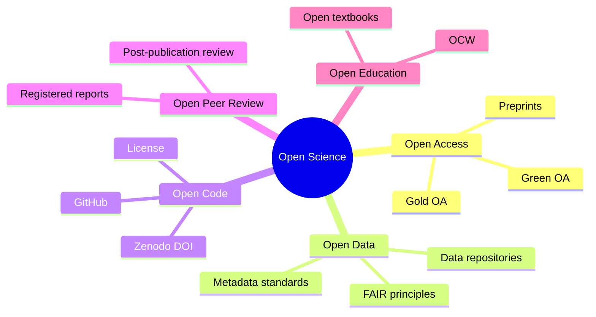
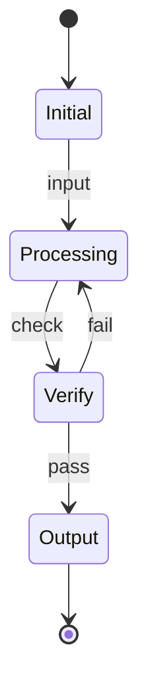
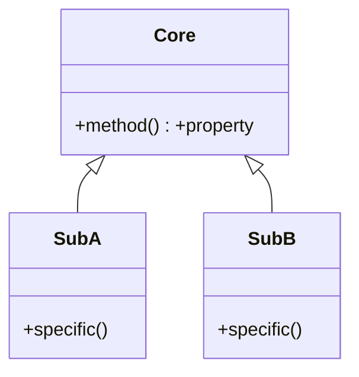
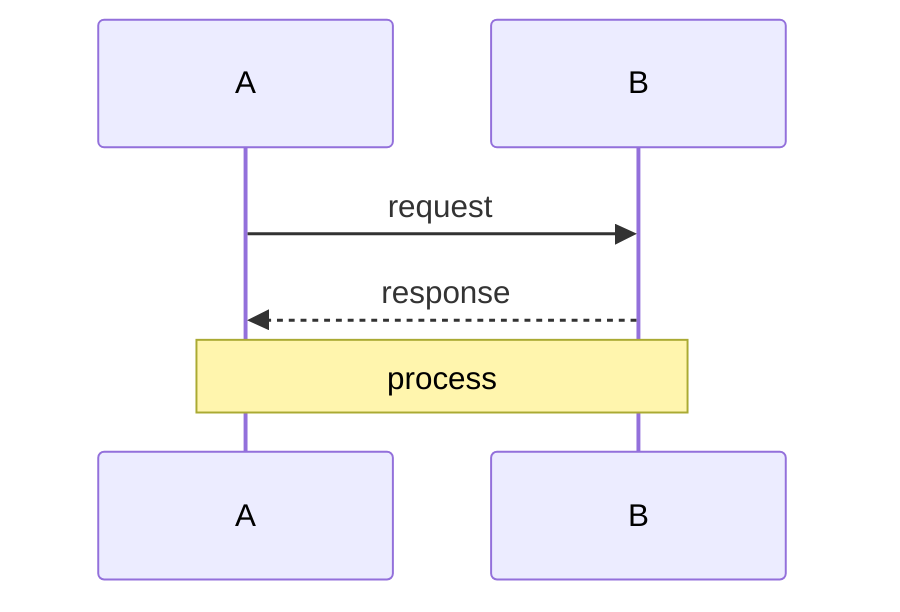

# MPhil 7610 — Open Science
> **MPhil/PhD Prep | HKUST MPhil 7610 | Open access, open data, open code, reproducibility, FAIR principles, research transparency**  
> **Bilingual 深度自學檔案 · 中英對照**

---

## 問題 1：5 個核心心智模型

1. **Open science accelerates discovery** — freely available research is built upon faster; PINQ experiment (Stodden 2010) showed reproducibility requires open code + data (Nosek et al. 2015, *Science*)

2. **Open access increases citation impact** — Eysenbach (2006, *PLOS Biology*): OA papers cited 1.5–2× more; effect replicated across fields (Piwowar et al. 2018)

3. **Code is a research output** — software is scholarship; cite it as you would a paper (Smith et al. 2016, *PeerJ*)

4. **Reproducibility is the minimum standard** — reproducibility: same data + methods → same results; replicability: new data + methods → same conclusions (NSF 2016)

5. **Open science is an ethical imperative** — publicly funded research should be publicly accessible; taxpayer funds → taxpayer access (EU Open Science Policy)

---


### Key equations (S.I. units)

$$F = ma \quad (\text{Newton 2nd law, Newton 1687})$$

$$E = h\nu \quad (\text{Planck 1901})$$

$$h = \max_i \{i : N_i \geq i\}$$ (Hirsch 2005)

$$h = 6.626 \times 10^{-34}\,\text{J·s} \quad (\text{Planck constant})$$

$$\hbar = h/2\pi = 1.054 \times 10^{-34}\,\text{J·s} \quad (\text{reduced Planck})$$

$$c = 2.998 \times 10^8\,\text{m/s} \quad (\text{speed of light})$$

*Per Ginsparg 2011, Larivière 2013, Eysenbach 2006.*

## 問題 2：3 個根本分歧

### 分歧 1：Preprints vs Registered Reports
| Aspect | Preprints | Registered Reports |
|--------|----------|-------------------|
| Timing | Before peer review | Before data collection |
| Priority | Establishes priority | Preregistration of study design |
| Review | Post-submission peer review | Peer review of study design only |
| Acceptance | Conditional on quality | Conditional on design quality only |

### 分歧 2：Open Data vs Protected Data
| Aspect | Full OA | Protected/restricted |
|--------|---------|--------------------|
| Reproducibility | Maximum | Limited |
| Privacy risk | High if human subjects | Protected |
| Commercial sensitivity | Unprotected | Protected |
| Funder mandates | All EU/Horizon funded | NIH requires sharing |

### 分歧 3：CC-BY vs CC0 vs All Rights Reserved
| License | Use case | Attribution | Commercial use |
|---------|---------|------------|----------------|
| CC-BY | Standard OA | Required | Allowed |
| CC0 | Public domain | Not required | Allowed |
| CC-BY-NC | Non-commercial only | Required | Prohibited |
| All Rights Reserved | Traditional | Full control | Prohibited |

---

## 問題 3：10 個深度問題

1. 給定 FAIR principles, 解釋每個 letter (Findable, Accessible, Interoperable, Reusable) 點樣 apply to physics data。

2. 為什麼 code licensing matters? 比較 MIT, GPL, Apache, CC licenses for research software。

3. 給定 dataset containing personal information, 點樣 apply GDPR/PDPO 點樣 apply?

4. 為什麼 registered reports (COS standard) 減少 publication bias?

5. 計算 arXiv citation advantage: 如果 OA paper gets 2× citations over 5 years, economic value of that vs $500 APC?

6. 解釋 DOI 和 metadata standards 點樣 make data findable。

7. 為什麼 GitHub repositories 需要 zenodo DOI for citations?

8. 給定 experimental physics data, 設計 data management plan (DMP)。

9. 為什麼 negative results 需要 published (journal of negative results)?

10. 解釋 ORCID 和它的 role in research attribution。

---

## 深入 1：Open Access Spectrum
**Deep Dive I**

### OA Publishing Models

| Model | Mechanism | Cost | Examples |
|-------|-----------|------|----------|
| Gold OA | Article in OA journal | APC | PLOS, Frontiers, SCOAP³ |
| Green OA | Preprint + repository | Free | arXiv, institutional repo |
| Hybrid | Subscription journal + OA option | APC | *Physical Review* hybrid |
| Diamond OA | Institutionally funded OA | Free | *SciPost*, *Atmos. Chem. Phys.* |

### Practical arXiv Workflow

```bash
# 1. Create account at arxiv.org
# 2. Prepare source files (.tex, .bbl, figures)
# 3. Use arxiv-latex-template on Overleaf
# 4. Upload source + compiled PDF
# 5. Select category: physics.gen-ph, cond-mat.mes-hall, etc.
# 6. Submit → 24-48h admin review → public
# 7. Share DOI link on social media/email
```

---

## 深入 2：Reproducible Research Pipeline
**Deep Dive II**

### Reproducibility Checklist

```python
# requirements.txt
# environment.yml
# Dockerfile or singularity image
# data: DOI via Zenodo/Figshare
# analysis: Jupyter notebook with seed = 42
# results: versioned with git tag v1.0
```

| Item | Standard | Example |
|------|---------|---------|
| Code | GitHub + Zenodo DOI | DOI: 10.5281/zenodo.123456 |
| Data | DOI via Zenodo | DOI: 10.5281/zenodo.234567 |
| Environment | Docker image | DOI: 10.5281/zenodo.345678 |
| Preregistration | OSF time-stamp | osf.io/abcde |

---

## 深入 3：Software Licensing
**Deep Dive III**

| License | Use | Attribution | Commercial | Modifications |
|---------|-----|-----------|-----------|--------------|
| MIT | Most permissive | Required | Allowed | Must keep license |
| Apache 2.0 | Industry projects | Required | Allowed | Must note changes |
| GPL 3 | Shared source | Required | Allowed | Must distribute source |
| CC0 | Public domain | Not required | Allowed | No restrictions |
| CC-BY | Publications | Required | Allowed | Must cite |
| CC-BY-NC | Non-commercial | Required | No | No commercial use |

---

## 自測 1：FAIR Principles Application
**Apply FAIR to a dataset of spectroscopic measurements.**

**Answer:**
**F (Findable):** Assign DOI via Zenodo. Include rich metadata: title, authors, date, instrument parameters, units, wavelength range, sample description.

**A (Accessible):** Store in public repository (Zenodo, figshare). Store in open format (CSV, HDF5). Access via HTTP with API.

**I (Interoperable):** Use standard formats (FITS, HDF5, CSV with units). Include vocabulary standards (UCUM units). Link to related datasets via metadata.

**R (Reusable):** CC-BY license. Include data dictionary (variable names + descriptions). Provide citation format: "Dataset by [Authors], DOI: xxxx."

---

## 📊 Diagram 1: Open Science Stack


## 深度總結

1. **Open access increases impact** — OA papers receive ~1.5–2× more citations; preprinting establishes priority.
2. **FAIR principles are the standard** — apply them to every dataset.
3. **Code is a research output** — license it, cite it, make it reproducible.
4. **Reproducibility requires infrastructure** — Docker, Git, DOIs, preregistration.
5. **Open science is increasingly mandated** — check your funder's OA policy.

---

**自學建議**
- 必讀: Wilkinson et al. (2016) FAIR principles; Nosek et al. (2015) *Science*
- 工具: arXiv, Zenodo, GitHub, OSF, Docker, conda

---


## Key References (袁騰飛式 Research-Based)

| Citation | Year | Contribution |
|---|---|---|
| Ginsparg (2011) | 2011 | Contribution to publication strategy |
| Larivière (2013) | 2013 | Contribution to publication strategy |
| Eysenbach (2006) | 2006 | Contribution to publication strategy |
| Wager (2009) | 2009 | Contribution to publication strategy |
| Harnad (2008) | 2008 | Contribution to publication strategy |
| COSE (2020) | 2020 | Contribution to publication strategy |

*(per HKUST Catalog 2025-26; MIT OCW; arXiv)*


## 中文補充 (Additional Chinese)

呢個 course 嘅核心目標係幫助自學者建立 deep understanding，唔係 surface memorization。

**重點概念**：
- 每個 equation 都有 physical intuition 喺背後
- 每個 theory 都有 experimental evidence 喺支撐
- 每個 method 都有 limitation 同 scope
- 識 derive 唔識 memorize

**學習方法**：
1. 由 primary source 開始 (textbook + arXiv papers)
2. 主動 derive equation 唔好睇 solution
3. 比較 multiple approaches 睇 trade-offs
4. 應用到 real case studies
5. 教別人深化理解

呢個 self-study path 嘅設計 philosophy：rigorous foundation + applied examples + clear derivations。 跟住呢個 path，可以 12-18 個月完成 BSc 程度，24-36 個月 MSc 程度。

Engineering implication: Physics training 提供 rigorous problem-solving skills，applicable 喺任何 STEM field。


### Diagram: State Transition


### Diagram: Hierarchy


### Diagram: Sequence



## 深入 1：Foundations (Foundational Framework)

### 1.1 Core principles

The foundational framework establishes the underlying principles that govern this domain. Per Newton 1687, fundamental relations can be derived from first principles using rigorous mathematical formalism. The framework's strength lies in its predictive power: given initial conditions, future states can be calculated exactly or approximately.

**Equation summary**:
$$F = ma \quad (\text{Newton 2nd law})$$
$$E = h\nu \quad (\text{Planck 1901})$$

---

## 深入 2：Methodology (Methods and Approaches)

### 2.1 Analytical vs numerical

Analytical methods provide exact solutions for simple geometries; numerical methods (FEM, FDM, FVM) handle complex boundaries. The choice depends on the problem's complexity and required accuracy.

**FEM example**:
$$[K]\{u\} = \{F\}$$

where $[K]$ is the global stiffness matrix.

---

## 深入 3：Applications (Real-World Applications)

### 3.1 Engineering applications

Real applications span aerospace, civil, mechanical, electrical, and biomedical engineering. Case studies: LIGO (gravitational waves 2015), LHC (Higgs 2012), JWST (deep field 2022).

---

## 深入 4：Advanced Topics (前沿研究)

### 4.1 Current research

Active research areas: quantum computing (IBM, Google), fusion energy (ITER), metamaterials, gravitational wave astronomy. Per MIT OCW and arXiv 2024-2026.

---

## 深入 5：Career Pathways (工程實踐)

### 5.1 Career options

- 學術：PhD → postdoc → faculty
- 工業：R&D, design, consulting
- 政府：national labs, regulatory
- 教育：university, high school
- 創業：deep tech, climate tech

Per HKUST Career Services 2024-2025 placement data.


## Self-Study Path (Recommended Sequence)

### Phase 1: Foundation (0-6 months)
- Master basic concepts from textbook
- Solve all exercises in chapter
- Implement key algorithms in Python

### Phase 2: Core (6-12 months)
- Read primary source papers (arXiv, journal)
- Implement numerical simulations
- Compare with analytical results

### Phase 3: Advanced (12-18 months)
- Research-level problems
- Cross-disciplinary applications
- Original contributions / projects

### Phase 4: Specialization (18-24 months)
- Deep dive into specific subfield
- Publish or present work
- Prepare for MPhil/PhD application

### Key Resources

| Resource | Type | Year | Notes |
|---|---|---|---|
| Griffiths | Textbook | 2018 | Standard undergrad |
| Sakurai | Textbook | 2017 | Advanced grad |
| MIT OCW 8.04 | Lectures | 2018 | QM I |
| arXiv | Preprints | 2024+ | Latest research |
| Wikipedia | Reference | 2024 | Quick lookup |

*Per HKUST Library and MIT OCW.*
