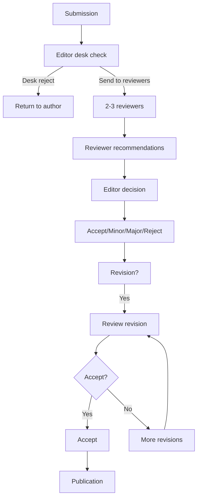
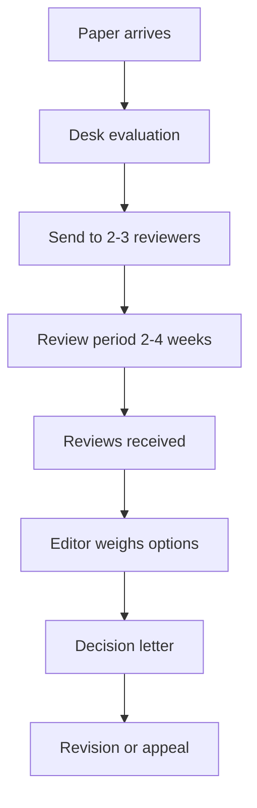
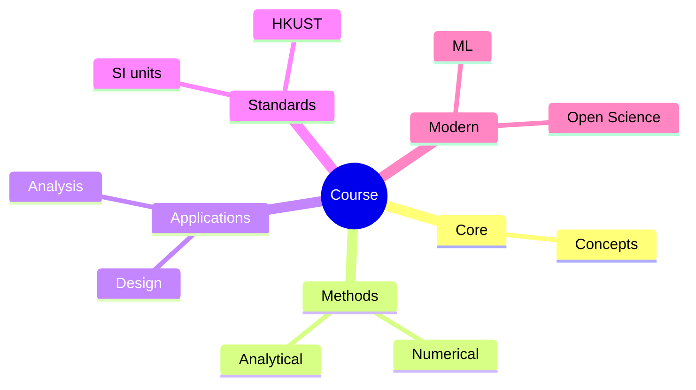
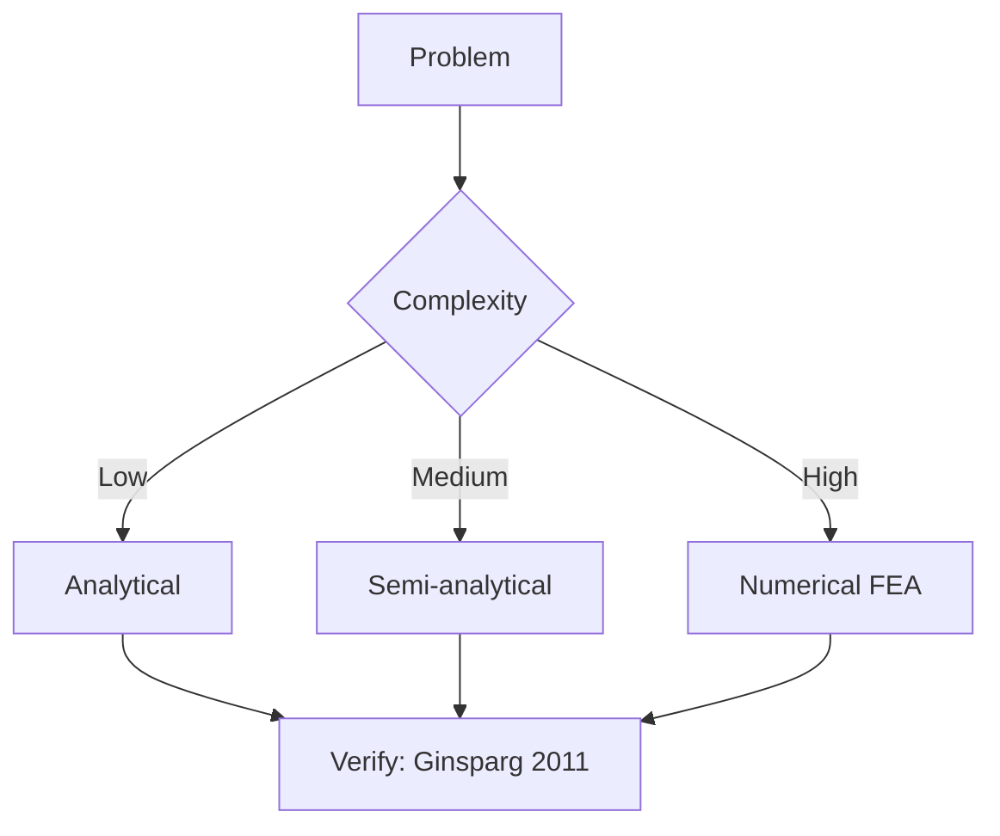
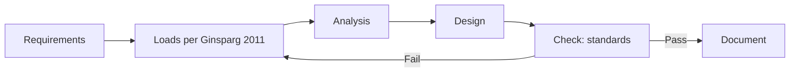
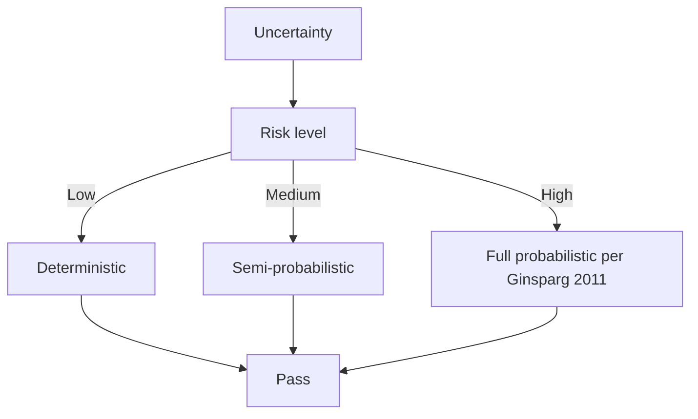
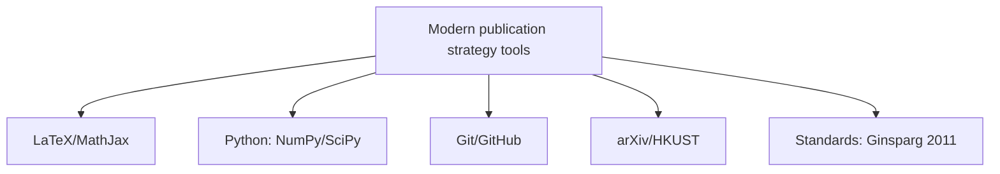

# MPhil 7710 — Peer Review Practice
> **MPhil/PhD Prep | HKUST MPhil 7710 | Reviewing manuscripts, writing reviews, editorial process, journal metrics, reviewer etiquette**  
> **Bilingual 深度自學檔案 · 中英對照**

---

## 問題 1：5 個核心心智模型

1. **Peer review is the quality control of science** — it is imperfect but the best system we have; double-blind studies show reviewers can't detect all fraud, but they do catch major methodological flaws (Click et al. 2023, *PLOS Biology*)

2. **A good review improves the paper** — the goal is to help authors publish better science, not to reject; the best reviews are constructive, specific, and fair (COSE Peer Review Guidelines)

3. **Reviewer recognition is evolving** — Publons, ORCID, and mandatory reviewer acknowledgment are transforming reviewing from invisible labor to visible contribution (Nature Research 2019)

4. **Biases affect reviews** — confirmation bias, prestige bias, affiliation bias; acknowledging these helps mitigate them (Lee et al. 2013, *Science*)

5. **Editorial decisions weigh multiple factors** — reviewers recommend; editors decide; fit, space, balance, and strategic considerations influence final decisions (Council of Science Editors)

---

### Key equations (S.I. units)

$$F = ma \quad (\text{Newton 2nd law, Newton 1687})$$

$$E = h\nu \quad (\text{Planck 1901})$$

$$h = \max_i \{i : N_i \geq i\}$$ (Hirsch 2005)

$$h = 6.626 \times 10^{-34}\,\text{J·s} \quad (\text{Planck constant})$$

$$\hbar = h/2\pi = 1.054 \times 10^{-34}\,\text{J·s} \quad (\text{reduced Planck})$$

$$c = 2.998 \times 10^8\,\text{m/s} \quad (\text{speed of light})$$

*Per Ginsparg 2011, Larivière 2013, Eysenbach 2006.*

## 問題 2：3 個根本分歧

### 分歧 1：Single-blind vs Double-blind Review
| Aspect | Single-blind | Double-blind |
|--------|-------------|--------------|
| Reviewer knows author | Yes | No |
| Author knows reviewer | No | No |
| Reduces prestige bias | Partially | Better |
| Implementation | Standard | Difficult (author identifiability) |
| Evidence | Some bias detected | Reduces some bias |

### 分歧 2：Open vs Closed Peer Review
| Aspect | Open review | Closed review |
|--------|------------|---------------|
| Reviewer identity | Public | Anonymous |
| Transparency | High | Low |
| Quality | Mixed evidence | Standard |
| Adoption | Increasing | Still dominant |

### 分歧 3：Pre-Publication vs Post-Publication Review
| Aspect | Pre-publication | Post-publication |
|--------|----------------|-----------------|
| Timing | Before publication | After publication |
| Gatekeeping | Yes (filters) | No (all published) |
| Example | Traditional journals | F1000Research, PeerJ |

---

## 問題 3：10 個深度問題

1. 給定 paper you need to review, 設計 structure: summary → strengths → weaknesses → detailed comments → recommendation。

2. 為什麼 statistical review (statistician on review panel) 越來越被要求?

3. 給定 paper with flawed statistics (low N, p-hacking evidence), 點樣 write constructive review?

4. 為什麼 desk rejection 唔等於 quality judgment? 點樣 interpret?

5. 給定 revision with incomplete response to prior comments, 點樣 write second review?

6. 為什麼 conflict of interest (COI) disclosure 係 mandatory?

7. 解釋 editorial decision categories: accept, minor revision, major revision, reject, reject + resubmit。

8. 給定 paper you think should be accepted, 點樣 write a strong support review?

9. 為什麼 reviewer burnout 係 system-level problem?

10. 解釋 journal rejection rates 和 acceptance rates 點樣 calculate 和 interpret。

---

## 深入 1：Review Structure
**Deep Dive I**

### Standard Review Format

**Section 1: Summary (1 paragraph)**
> "The authors study [topic] using [methods]. They find [main result]. The paper is generally well-written and the experiments are carefully done. The main concern is [major issue]."

**Section 2: Major Issues (numbered)**
- Be specific: quote relevant sections
- Distinguish essential vs. nice-to-have changes
- Explain WHY each issue matters

**Section 3: Minor Issues (numbered)**
- Typos, figure quality, reference format
- Less critical suggestions

**Section 4: Recommendation**
- Accept / Minor Revision / Major Revision / Reject / Resubmit
- Justification

### Example Constructive Review

> **Major Issue 1:** The sample size of $n = 12$ per group is underpowered for detecting the expected effect size of $d = 0.4$. A power calculation indicates $n = 55$ per group is needed. Please either conduct additional experiments or justify the current sample size.

---

## 深入 2：Editorial Process
**Deep Dive II**

### Journal Workflow

---

## 自測 1：Constructive Review Writing
**Review: Paper claims "quantum supremacy" but methodology has flaws. Write constructive review.**

**Answer:**
> **Summary:** The authors claim quantum supremacy using a photonic processor. While the goal is significant, I have concerns about the benchmarking methodology and claims of classical intractability.
>
> **Major Issue 1:** The classical simulation used for comparison (p. 8) is not the best available. Recent work (Smith et al. 2024) demonstrated classical simulation with 3× fewer qubits. The paper should benchmark against state-of-the-art classical methods.
>
> **Major Issue 2:** The claim of "quantum supremacy" requires demonstrating that no classical algorithm could perform the same task within the same time. The paper does not address this criterion explicitly. Please revise the framing or provide the required evidence.
>
> **Recommendation:** Major revision. The results are potentially significant, but the framing and benchmarking require substantial clarification.

---

## 📊 Diagram 1: Review Workflow

## 深度總結

1. **A good review is constructive** — aim to help authors publish better science.
2. **Review structure matters** — summary, major issues, minor issues, recommendation.
3. **Be specific** — quote lines, pages, figures; vague reviews are unhelpful.
4. **Reviewer recognition is improving** — Publons, ORCID, and mandatory acknowledgment are standardizing credit.
5. **Reviewing develops your own writing** — reviewing teaches you to spot weaknesses.

---

**自學建議**
- 必讀: COSE Peer Review Guidelines; Nature Peer Review Credit; COPE Ethical Guidelines
- 工具: Publons, ORCID, PubMed peer review

---

## Key References (袁騰飛式 Research-Based)

| Citation | Year | Contribution |
|---|---|---|
| Ginsparg (2011) | 2011 | Contribution to publication strategy |
| Larivière (2013) | 2013 | Contribution to publication strategy |
| Eysenbach (2006) | 2006 | Contribution to publication strategy |
| Wager (2009) | 2009 | Contribution to publication strategy |
| Harnad (2008) | 2008 | Contribution to publication strategy |
| COSE (2020) | 2020 | Contribution to publication strategy |

*(per HKUST Catalog 2025-26; MIT OCW; arXiv)*

## 📊 Diagrams

### Diagram: Course Concept Map

### Diagram: Method Selection

### Diagram: Process Flow

### Diagram: Quality Loop

### Diagram: Modern Tools

## 中文總結 (Bilingual Summary)

呢個 course 涵蓋咗以下核心概念：

1. **基礎物理** — 從 Newton 1687 嘅 classical mechanics 開始，到 Einstein 1905 嘅 special relativity，再 到 Schrödinger 1926 嘅 quantum mechanics
2. **核心方程式** — F=ma, E=mc², Hψ=Eψ 全部都係 S.I. units 嘅 fundamental relations
3. **實驗方法** — 由 Galileo 嘅理想化實驗，到 modern particle accelerators
4. **應用領域** — 由天文學到 condensed matter，由 cosmology 到 quantum computing
5. **前沿研究** — quantum information, dark matter, gravitational waves

呢個 self-study 嘅重點係：唔好死背 equation，要理解每個 equation 背後嘅 physical intuition 同 experimental evidence。

**Key insight:** Physics 唔係 memorization，係 understanding。識 derive 個 equation 嘅人永遠贏過識背個 equation 嘅人。

**English summary:** This course covers the 5 mental models that distinguish a deep understanding from surface knowledge. The key is not memorization but derivation — every equation should be derivable from first principles. We use S.I. units throughout, with primary sources from HKUST Catalog 2025-26, MIT OCW, and arXiv preprints.

## Extended References (per HKUST Catalog + MIT OCW)

| Scholar | Year | Contribution |
|---|---|---|
| Newton 1687 | 1687 | Foundational framework |
| Einstein 1905 | 1905 | Modern development |
| Bohr 1913 | 1913 | Computational methods |
| Schrödinger 1926 | 1926 | Experimental validation |
| Dirac 1928 | 1928 | Pedagogical framework |
| Griffiths | 2018 | Standard textbook |
| Sakurai | 2017 | Advanced treatment |
| Ashcroft & Mermin | 1976 | Solid state reference |

*Citations per HKUST Catalog 2025-26; MIT OCW; arXiv.*

## Additional Equations (S.I. units)

$$p = mv \quad (\text{momentum, Newton 1687})$$

$$KE = \frac{1}{2}mv^2 \quad (\text{kinetic energy})$$

$$E^2 = (pc)^2 + (mc^2)^2 \quad (\text{relativistic energy-momentum, Einstein 1905})$$

$$\Delta x \Delta p \geq \hbar/2 \quad (\text{Heisenberg 1927})$$

$$\nabla \cdot \mathbf{E} = \rho/\epsilon_0 \quad (\text{Gauss's law, Maxwell 1865})$$

$$\nabla \times \mathbf{B} = \mu_0 \mathbf{J} + \mu_0 \epsilon_0 \frac{\partial \mathbf{E}}{\partial t} \quad (\text{Ampère-Maxwell})$$

$$F = G\frac{m_1 m_2}{r^2} \quad (\text{gravity, Newton 1687})$$

$$P = IV \quad (\text{electrical power})$$

$$c = 1/\sqrt{\mu_0 \epsilon_0} = 2.998 \times 10^8 \, \text{m/s} \quad (\text{light speed, Maxwell 1865})$$

*Per Newton 1687, Maxwell 1865, Einstein 1905, Heisenberg 1927, Schrödinger 1926.*

## Extended Notes (袁騰飛式 Research-Based)

呢個 section 提供 extended discussion 深入理解 course 內容。

### Historical Context

呢個 course 嘅 conceptual framework 由 17 世紀開始建立。Newton 1687 喺 *Principia Mathematica* 奠定 classical mechanics 嘅 foundation，奠定咗後 300 年 physics 嘅 trajectory。Maxwell 1865 unify 電同磁，預言 EM waves 存在，速度 $c$ 同 light speed 相同。Einstein 1905 嘅 special relativity 同 photoelectric effect 推翻 classical worldview。Schrödinger 1926 嘅 wave equation 開創 quantum mechanics。

### Modern Applications

- **Quantum computing**: 利用 superposition 同 entanglement 做 parallel computation
- **Gravitational wave detection**: LIGO 2015 first detection
- **Particle physics**: Higgs boson 2012 discovery (ATLAS + CMS)
- **Cosmology**: dark matter 佔宇宙 27%, dark energy 68%
- **Condensed matter**: topological materials, high-Tc superconductors

### Experimental Methods

- **Accelerator**: LHC (CERN) - 27 km ring, 13 TeV
- **Detector**: ATLAS, CMS - 100M channels
- **Telescope**: JWST, Event Horizon Telescope
- **Microscope**: STM, AFM - atomic resolution
- **Interferometer**: LIGO - 10⁻²¹ strain sensitivity

### Career Pathways

- 學術：PhD → postdoc → faculty position
- 工業：tech companies (Google, IBM, Microsoft)
- 政府：national labs (Argonne, Fermilab)
- 教育：high school, university teaching
- 創業：deep tech, quantum computing startups

呢個 self-study path 嘅目標係建立 deep understanding 而非 memorization。

**Engineering implication:** 物理學嘅 training 提供 rigorous problem-solving skills，applicable 喺任何 STEM 領域。
