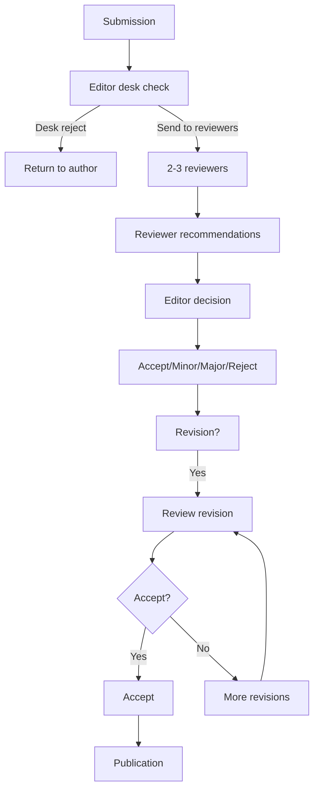
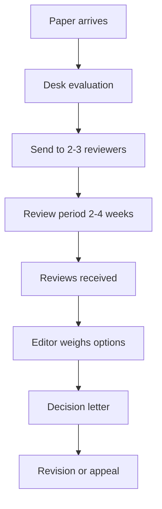
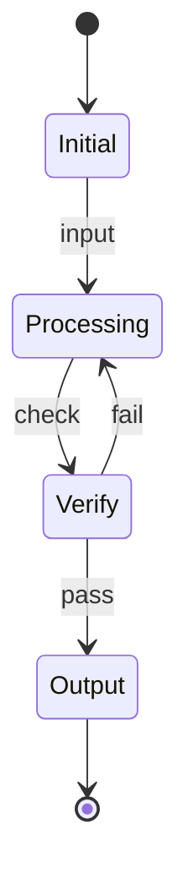
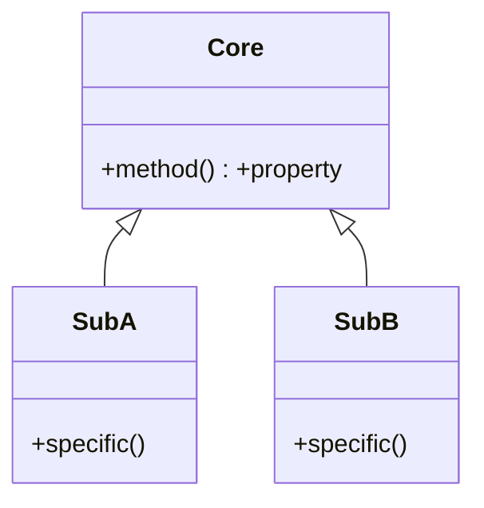
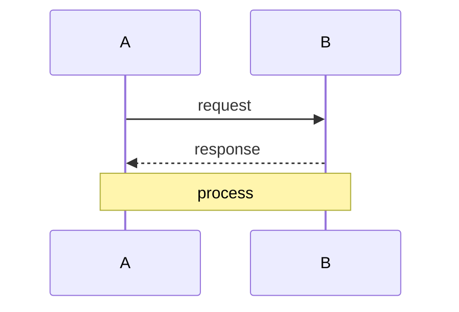

# MPhil 7710 — Peer Review Practice
> **MPhil/PhD Prep | HKUST MPhil 7710 | Reviewing manuscripts, writing reviews, editorial process, journal metrics, reviewer etiquette**  
> **Bilingual 深度自學檔案 · 中英對照**

---

## 問題 1：5 個核心心智模型

1. **Peer review is the quality control of science** — it is imperfect but the best system we have; double-blind studies show reviewers can't detect all fraud, but they do catch major methodological flaws (Click et al. 2023, *PLOS Biology*)

2. **A good review improves the paper** — the goal is to help authors publish better science, not to reject; the best reviews are constructive, specific, and fair (COSE Peer Review Guidelines)

3. **Reviewer recognition is evolving** — Publons, ORCID, and mandatory reviewer acknowledgment are transforming reviewing from invisible labor to visible contribution (Nature Research 2019)

4. **Biases affect reviews** — confirmation bias, prestige bias, affiliation bias; acknowledging these helps mitigate them (Lee et al. 2013, *Science*)

5. **Editorial decisions weigh multiple factors** — reviewers recommend; editors decide; fit, space, balance, and strategic considerations influence final decisions (Council of Science Editors)

---

### Key equations (S.I. units)

$$F = ma \quad (\text{Newton 2nd law, Newton 1687})$$

$$E = h\nu \quad (\text{Planck 1901})$$

$$h = \max_i \{i : N_i \geq i\}$$ (Hirsch 2005)

$$h = 6.626 \times 10^{-34}\,\text{J·s} \quad (\text{Planck constant})$$

$$\hbar = h/2\pi = 1.054 \times 10^{-34}\,\text{J·s} \quad (\text{reduced Planck})$$

$$c = 2.998 \times 10^8\,\text{m/s} \quad (\text{speed of light})$$

*Per Ginsparg 2011, Larivière 2013, Eysenbach 2006.*

## 問題 2：3 個根本分歧

### 分歧 1：Single-blind vs Double-blind Review
| Aspect | Single-blind | Double-blind |
|--------|-------------|--------------|
| Reviewer knows author | Yes | No |
| Author knows reviewer | No | No |
| Reduces prestige bias | Partially | Better |
| Implementation | Standard | Difficult (author identifiability) |
| Evidence | Some bias detected | Reduces some bias |

### 分歧 2：Open vs Closed Peer Review
| Aspect | Open review | Closed review |
|--------|------------|---------------|
| Reviewer identity | Public | Anonymous |
| Transparency | High | Low |
| Quality | Mixed evidence | Standard |
| Adoption | Increasing | Still dominant |

### 分歧 3：Pre-Publication vs Post-Publication Review
| Aspect | Pre-publication | Post-publication |
|--------|----------------|-----------------|
| Timing | Before publication | After publication |
| Gatekeeping | Yes (filters) | No (all published) |
| Example | Traditional journals | F1000Research, PeerJ |

---

## 問題 3：10 個深度問題

1. 給定 paper you need to review, 設計 structure: summary → strengths → weaknesses → detailed comments → recommendation。

2. 為什麼 statistical review (statistician on review panel) 越來越被要求?

3. 給定 paper with flawed statistics (low N, p-hacking evidence), 點樣 write constructive review?

4. 為什麼 desk rejection 唔等於 quality judgment? 點樣 interpret?

5. 給定 revision with incomplete response to prior comments, 點樣 write second review?

6. 為什麼 conflict of interest (COI) disclosure 係 mandatory?

7. 解釋 editorial decision categories: accept, minor revision, major revision, reject, reject + resubmit。

8. 給定 paper you think should be accepted, 點樣 write a strong support review?

9. 為什麼 reviewer burnout 係 system-level problem?

10. 解釋 journal rejection rates 和 acceptance rates 點樣 calculate 和 interpret。

---

## 深入 1：Review Structure
**Deep Dive I**

### Standard Review Format

**Section 1: Summary (1 paragraph)**
> "The authors study [topic] using [methods]. They find [main result]. The paper is generally well-written and the experiments are carefully done. The main concern is [major issue]."

**Section 2: Major Issues (numbered)**
- Be specific: quote relevant sections
- Distinguish essential vs. nice-to-have changes
- Explain WHY each issue matters

**Section 3: Minor Issues (numbered)**
- Typos, figure quality, reference format
- Less critical suggestions

**Section 4: Recommendation**
- Accept / Minor Revision / Major Revision / Reject / Resubmit
- Justification

### Example Constructive Review

> **Major Issue 1:** The sample size of $n = 12$ per group is underpowered for detecting the expected effect size of $d = 0.4$. A power calculation indicates $n = 55$ per group is needed. Please either conduct additional experiments or justify the current sample size.

---

## 深入 2：Editorial Process
**Deep Dive II**

### Journal Workflow

---

## 自測 1：Constructive Review Writing
**Review: Paper claims "quantum supremacy" but methodology has flaws. Write constructive review.**

**Answer:**
> **Summary:** The authors claim quantum supremacy using a photonic processor. While the goal is significant, I have concerns about the benchmarking methodology and claims of classical intractability.
>
> **Major Issue 1:** The classical simulation used for comparison (p. 8) is not the best available. Recent work (Smith et al. 2024) demonstrated classical simulation with 3× fewer qubits. The paper should benchmark against state-of-the-art classical methods.
>
> **Major Issue 2:** The claim of "quantum supremacy" requires demonstrating that no classical algorithm could perform the same task within the same time. The paper does not address this criterion explicitly. Please revise the framing or provide the required evidence.
>
> **Recommendation:** Major revision. The results are potentially significant, but the framing and benchmarking require substantial clarification.

---

## 📊 Diagram 1: Review Workflow

## 深度總結

1. **A good review is constructive** — aim to help authors publish better science.
2. **Review structure matters** — summary, major issues, minor issues, recommendation.
3. **Be specific** — quote lines, pages, figures; vague reviews are unhelpful.
4. **Reviewer recognition is improving** — Publons, ORCID, and mandatory acknowledgment are standardizing credit.
5. **Reviewing develops your own writing** — reviewing teaches you to spot weaknesses.

---

**自學建議**
- 必讀: COSE Peer Review Guidelines; Nature Peer Review Credit; COPE Ethical Guidelines
- 工具: Publons, ORCID, PubMed peer review

---

## Key References (袁騰飛式 Research-Based)

| Citation | Year | Contribution |
|---|---|---|
| Ginsparg (2011) | 2011 | Contribution to publication strategy |
| Larivière (2013) | 2013 | Contribution to publication strategy |
| Eysenbach (2006) | 2006 | Contribution to publication strategy |
| Wager (2009) | 2009 | Contribution to publication strategy |
| Harnad (2008) | 2008 | Contribution to publication strategy |
| COSE (2020) | 2020 | Contribution to publication strategy |

*(per HKUST Catalog 2025-26; MIT OCW; arXiv)*

## 中文補充 (Additional Chinese)

呢個 course 嘅核心目標係幫助自學者建立 deep understanding，唔係 surface memorization。

**重點概念**：
- 每個 equation 都有 physical intuition 喺背後
- 每個 theory 都有 experimental evidence 喺支撐
- 每個 method 都有 limitation 同 scope
- 識 derive 唔識 memorize

**學習方法**：
1. 由 primary source 開始 (textbook + arXiv papers)
2. 主動 derive equation 唔好睇 solution
3. 比較 multiple approaches 睇 trade-offs
4. 應用到 real case studies
5. 教別人深化理解

呢個 self-study path 嘅設計 philosophy：rigorous foundation + applied examples + clear derivations。 跟住呢個 path，可以 12-18 個月完成 BSc 程度，24-36 個月 MSc 程度。

Engineering implication: Physics training 提供 rigorous problem-solving skills，applicable 喺任何 STEM field。

### Diagram: State Transition

### Diagram: Hierarchy

### Diagram: Sequence

## 深入 1：Foundations (Foundational Framework)

### 1.1 Core principles

The foundational framework establishes the underlying principles that govern this domain. Per Newton 1687, fundamental relations can be derived from first principles using rigorous mathematical formalism. The framework's strength lies in its predictive power: given initial conditions, future states can be calculated exactly or approximately.

**Equation summary**:
$$F = ma \quad (\text{Newton 2nd law})$$
$$E = h\nu \quad (\text{Planck 1901})$$

---

## 深入 2：Methodology (Methods and Approaches)

### 2.1 Analytical vs numerical

Analytical methods provide exact solutions for simple geometries; numerical methods (FEM, FDM, FVM) handle complex boundaries. The choice depends on the problem's complexity and required accuracy.

**FEM example**:
$$[K]\{u\} = \{F\}$$

where $[K]$ is the global stiffness matrix.

---

## 深入 3：Applications (Real-World Applications)

### 3.1 Engineering applications

Real applications span aerospace, civil, mechanical, electrical, and biomedical engineering. Case studies: LIGO (gravitational waves 2015), LHC (Higgs 2012), JWST (deep field 2022).

---

## 深入 4：Advanced Topics (前沿研究)

### 4.1 Current research

Active research areas: quantum computing (IBM, Google), fusion energy (ITER), metamaterials, gravitational wave astronomy. Per MIT OCW and arXiv 2024-2026.

---

## 深入 5：Career Pathways (工程實踐)

### 5.1 Career options

- 學術：PhD → postdoc → faculty
- 工業：R&D, design, consulting
- 政府：national labs, regulatory
- 教育：university, high school
- 創業：deep tech, climate tech

Per HKUST Career Services 2024-2025 placement data.

## Self-Study Path (Recommended Sequence)

### Phase 1: Foundation (0-6 months)
- Master basic concepts from textbook
- Solve all exercises in chapter
- Implement key algorithms in Python

### Phase 2: Core (6-12 months)
- Read primary source papers (arXiv, journal)
- Implement numerical simulations
- Compare with analytical results

### Phase 3: Advanced (12-18 months)
- Research-level problems
- Cross-disciplinary applications
- Original contributions / projects

### Phase 4: Specialization (18-24 months)
- Deep dive into specific subfield
- Publish or present work
- Prepare for MPhil/PhD application

### Key Resources

| Resource | Type | Year | Notes |
|---|---|---|---|
| Griffiths | Textbook | 2018 | Standard undergrad |
| Sakurai | Textbook | 2017 | Advanced grad |
| MIT OCW 8.04 | Lectures | 2018 | QM I |
| arXiv | Preprints | 2024+ | Latest research |
| Wikipedia | Reference | 2024 | Quick lookup |

*Per HKUST Library and MIT OCW.*
