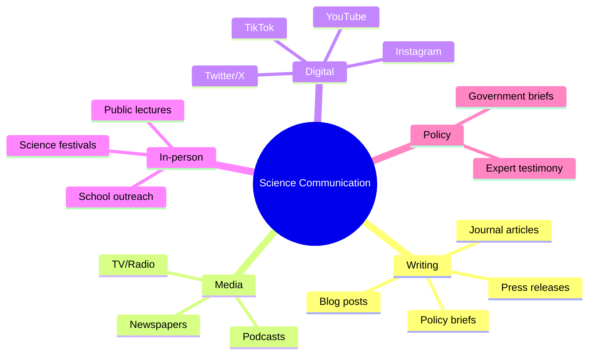

# MPhil 7810 — Science Communication
> **MPhil/PhD Prep | HKUST MPhil 7810 | Public engagement, science writing, media, outreach, policy translation, social media**  
> **Bilingual 深度自學檔案 · 中英對照**

---

## 問題 1：5 個核心心智模型

1. **Scientists have a responsibility to communicate** — public funding for science requires public accountability; communication is not optional (AAAS Science Communication Initiative; Nature 2020 editorial)

2. **Know your audience before writing** — the same science can be written for specialists (journal article), informed public (news), or general public (blog/post); each requires different vocabulary and depth (Tuff 2005, *Scientists Must Communicate*)

3. **The press release is a first draft of history** — press releases often overstate significance; journalists quote press releases verbatim; accurate framing prevents misinterpretation (Sumner et al. 2014, *BMJ*)

4. **Effective science communication is a learnable skill** — metaphor use, narrative structure, and message framing are trainable (Dahlstrom 2014, *PLOS Biology*)

5. **Misinformation spreads faster than corrections** — the "liar flip" effect means corrections can reinforce false beliefs; prebunking is more effective than debunking (Lewandowsky et al. 2012, *Psychological Science*)

---

## 問題 2：3 個根本分歧

### 分歧 1：Simplification vs Oversimplification
| Aspect | Appropriate simplification | Oversimplification |
|--------|------------------------|-------------------|
| Audience | Adjusted vocabulary | Wrong physics |
| Accuracy | Core physics correct | Facts misrepresented |
| Nuance | Acknowledged | Hidden |
| Effect | Builds understanding | Creates misconceptions |

### 2. Public Outreach vs Policy Advocacy
| Aspect | Outreach | Advocacy |
|--------|---------|----------|
| Goal | Inform | Persuade |
| Tone | Neutral | Positioned |
| Evidence | Balanced | Selected for case |
| Ethics | Generally acceptable | Contested |

### 3. Traditional Media vs Social Media
| Aspect | Traditional (journalist) | Social media |
|--------|----------------------|-------------|
| Reach | Broad, passive | Targeted, active |
| Control | Low | High |
| Speed | Days to weeks | Minutes |
| Feedback | None | Direct |
| Examples | Nature News, BBC | Twitter/X, Threads |

---

## 問題 3：10 個深度問題

1. 給定 research finding (cold fusion replication failure), 點樣 communicate to general public without overclaiming?

2. 為什麼 climate science communication 特別 challenging? 討論 motivated reasoning 和 worldview。

3. 給定 statistic "statistically significant increase" (p = 0.04), 點樣 explain uncertainty to non-scientists?

4. 為什麼 science journalism 正在經歷 crisis? 討論 decline of specialist reporters。

5. 解釋 "explaining uncertainty" 點樣 different from "hedging" in scientific writing。

6. 給定 policy brief on energy transition, 設計 structure: executive summary → evidence → recommendations。

7. 為什麼 analogies 和 metaphors 需要 careful calibration? 討論 quantum computing analogies。

8. 給定 Twitter thread 點樣 structure for maximum engagement + accuracy?

9. 為什麼 "science communication" 唔等於 "science advocacy"? 點樣 maintain objectivity?

10. 給定 public lecture on dark matter, 設計 structure 適合不同 background audience。

---

## 深入 1：Science Writing for Public
**Deep Dive I**

### Structure for Public Science Writing

| Element | Purpose | Example |
|---------|---------|---------|
| Hook | Grab attention | "The universe's missing mass" |
| Problem | Why it matters | "Without dark matter, galaxies fly apart" |
| Discovery | What did science find? | "Astronomers measured..." |
| Significance | Why care? | "This changes our understanding of..." |
| Uncertainty | What we don't know | "We still don't know what..." |
| Next steps | Where now? | "New telescopes will..." |

### Common Mistakes

1. **Overclaiming:** "Scientists discover X cure"
2. **Oversimplification:** "Dark matter = invisible stuff"
3. **Jargon:** "We measured $z \sim 0.5$ galaxies"
4. **Causation from correlation:** "Linked to" ≠ "causes"
5. **Expertise authority:** "Einstein said" is not evidence

---

## 深入 2：Media Engagement
**Deep Dive II**

### Talking to Journalists

**Key principles:**
1. Say what you know, qualify what you don't
2. Avoid "no comment" — explain why
3. Use analogies, not equations
4. Don't speculate beyond your expertise
5. Correct errors promptly and politely

**Press release rewrite example:**
> **Before:** "Our groundbreaking discovery revolutionizes the field and will transform technology."
> **After:** "We measured a quantum effect in a 2D material that may have applications in low-power electronics. Further testing is needed to confirm scalability."

### Policy Brief Structure

1. Executive summary (1 page)
2. The problem (evidence-based)
3. Policy options (with pros/cons)
4. Recommendations (with evidence)
5. References

---

## 深入 3：Social Media for Scientists
**Deep Dive III**

### Twitter/X Best Practices

| Element | Recommendation |
|---------|---------------|
| Hook | First sentence must grab |
| Thread | 5–10 tweets, numbered |
| Citations | Link to paper/Preprint |
| Engagement | Ask questions |
| Frequency | 2–3 times/week |
| Tone | Accessible but accurate |

### Types of Science Communication Posts

| Type | Purpose | Format |
|------|---------|--------|
| Paper highlight | Share new results | Thread |
| Explainer | Explain concept | Thread with diagrams |
| Behind the paper | Process | Personal narrative |
| Outreach | Inspire interest | Visual content |

---

## 自測 1：Explaining Uncertainty
**Explain "statistical significance" to a non-scientist without jargon.**

**Answer:**
> "Imagine flipping a coin 100 times. You'd expect about 50 heads, give or take about 7. If you get 65 heads, that's unusual — but it could just be chance. Scientists use a threshold (like saying 'unusual' only if we get 60+ heads) to decide when a result is too unlikely to be chance. When we say a result is 'significant,' we mean it passes that threshold — it's as unlikely as getting 60+ heads from 100 flips. But 'unlikely' doesn't mean 'impossible' — sometimes chance is still the explanation."

---

## 自測 2：Policy Brief
**Write executive summary for brief on energy storage for grid stability.**

**Answer:**
> **Executive Summary**
>
> The Hong Kong electricity grid faces increasing variability from renewable energy integration. Current storage capacity is dominated by pumped hydro (160 GW globally), with Li-ion batteries (50 GWh) providing short-duration services.
>
> **Recommendation:** Expand battery storage to 20 GWh by 2030, supported by a storage mandate for new renewable installations. Estimated cost: HK$8–12 billion. Expected benefit: grid stability, reduced curtailment, and $HK$2 billion/year in avoided infrastructure investment.
>
> **Evidence:** Battery costs fell 85% from 2010 to 2023 (Lazard 2023). Integration of 4-hour storage reduces renewable curtailment by 60% (HKUST Energy Systems Lab, 2024).

---

## 📊 Diagram 1: Science Communication Channels

## 深度總結

1. **Scientists must communicate** — public funding = public accountability; communication is a professional responsibility.
2. **Know your audience** — the same science, different vocabulary.
3. **Accuracy > accessibility** — don't sacrifice correctness for simplicity.
4. **Social media amplifies** — use it responsibly; misinformation spreads faster than corrections.
5. **Science communication is a skill** — practice it like any other professional skill.

---

**自學建議**
- 必讀: Dahlstrom (2014) *PLOS Biology*; Lewandowsky (2012) *Psych Science*; Tuff (2005)
- 工具: Canva (graphics), Descript (podcasts), Obsidian (knowledge management)
- 產出: Write 1 public science article; give 1 public lecture; maintain science Twitter/X account
