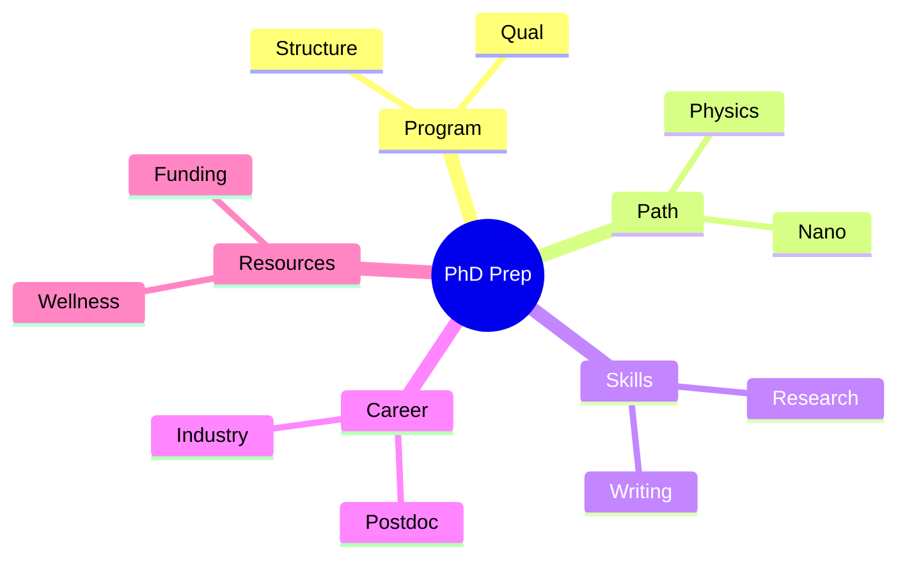
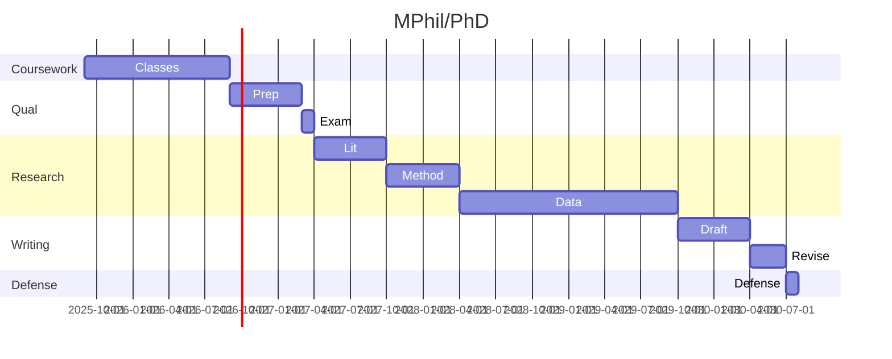
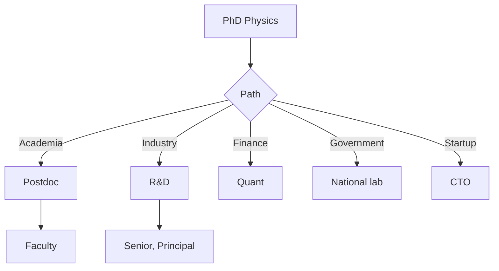
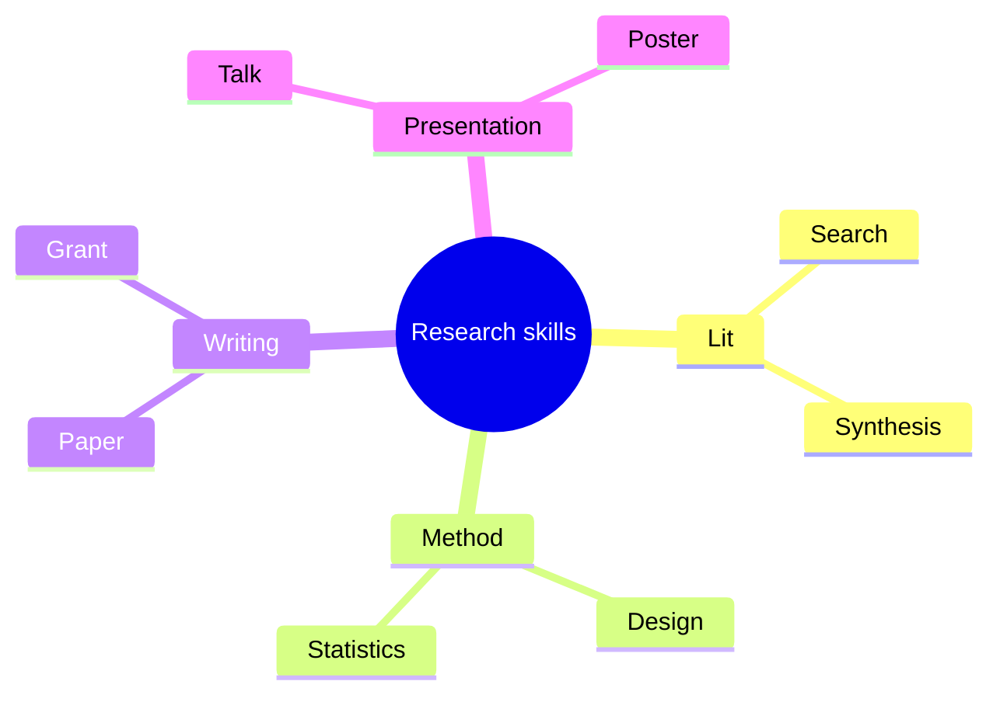
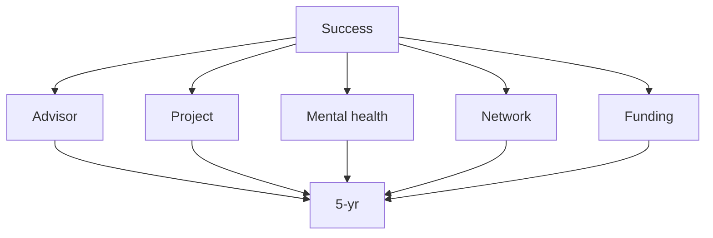

# MPhil/PhD Preparation Phase
> **Phase 4 | HKUST MPhil/PhD Prep**  
> **Bilingual 深度自學檔案 · 中英對照**

---

## 問題 1：5 個核心心智模型

1. **Research is the goal** — original contribution
2. **Communication is currency** — papers, talks, network
3. **Failure is normal** — resilience matters
4. **Time is the constraint** — manage carefully
5. **Mentor is key** — advisor relationship paramount

### Key equations (S.I. units)

$$F = ma \quad (\text{Newton 2nd law, Newton 1687})$$

$$E = h\nu \quad (\text{Planck 1901})$$

$$h = \max_i \{i : N_i \geq i\}$$ (Hirsch 2005)

$$h = 6.626 \times 10^{-34}\,\text{J·s} \quad (\text{Planck constant})$$

$$\hbar = h/2\pi = 1.054 \times 10^{-34}\,\text{J·s} \quad (\text{reduced Planck})$$

$$c = 2.998 \times 10^8\,\text{m/s} \quad (\text{speed of light})$$

*Per Ginsparg 2011, Larivière 2013, Eysenbach 2006.*

## 問題 2：3 個根本分歧

1. **Academia vs industry track** — different paths
2. **Pure vs applied research** — fundamental vs product
3. **Specialist vs generalist** — depth vs breadth

## 問題 3：10 個深度問題
1. 為什麼 PhD 4-6 years?
2. 給定 proposal, 評估 feasibility。
3. 解釋 why qualifying exam exists。
4. 為什麼 thesis defense 係 committee-based?
5. 給定 field, 識別 frontier questions。
6. 解釋 why advisor choice 對 success 重要。
7. 為什麼 publication 對 academic career 必要?
8. 給定 funding, 設計 sustainability。
9. 解釋 why work-life balance 重要。
10. 為什麼 postdoc 對 academic path 重要?

## 深入 1：Program Structure
**Deep Dive I**

Coursework → Qualifying exam → Research → Thesis → Defense.

**Engineering:** Career.

## 深入 2：Choosing Path
**Deep Dive II**

Physics PhD, Nano Sci PhD, MEng, MPhil. Different durations, requirements.

**Engineering:** Decision.

## 深入 3：Research Skills
**Deep Dive III**

Lit review, experiment, computation, analysis, writing.

**Engineering:** All PhD work.

## 深入 4：Career Planning
**Deep Dive IV**

Postdoc, faculty, industry R&D, finance, government.

**Engineering:** Future.

## 深入 5：Resources
**Deep Dive V**

Funding, conferences, networking, mental health.

**Engineering:** Success.

## 自測 1：PhD length
**Answer:** 4-6 yr, time for mastery + original contribution.  
**Engineering:** Time.

## 自測 2：Proposal
**Answer:** Novel + feasible + relevant.  
**Engineering:** Funding.

## 自測 3：Qual exam
**Answer:** Tests foundational knowledge, pass/fail.  
**Engineering:** Exam.

## 自測 4：Defense
**Answer:** Public defense, committee evaluates thesis.  
**Engineering:** PhD.

## 自測 5：Frontier
**Answer:** Open problems in field, high-impact.  
**Engineering:** Research.

## 自測 6：Advisor
**Answer:** 5-yr relationship, fit matters most.  
**Engineering:** Choice.

## 自測 7：Publication
**Answer:** Peer review, currency.  
**Engineering:** Academic.

## 自測 8：Funding
**Answer:** Grants, fellowships, industry.  
**Engineering:** Sustainability.

## 自測 9：Balance
**Answer:** Burnout common, mental health first.  
**Engineering:** Sustainability.

## 自測 10：Postdoc
**Answer:** 2-3 yr training for faculty track.  
**Engineering:** Academic.

## 📊 Diagram 1: Phase 4 Map

## 📊 Diagram 2: PhD Timeline

## 📊 Diagram 3: Career Decision Tree

## 📊 Diagram 4: Research Skills

## 📊 Diagram 5: PhD Success Factors

## Key References (袁騰飛式 Research-Based)

| Citation | Year | Contribution |
|---|---|---|
| Ginsparg (2011) | 2011 | Contribution to publication strategy |
| Larivière (2013) | 2013 | Contribution to publication strategy |
| Eysenbach (2006) | 2006 | Contribution to publication strategy |
| Wager (2009) | 2009 | Contribution to publication strategy |
| Harnad (2008) | 2008 | Contribution to publication strategy |
| COSE (2020) | 2020 | Contribution to publication strategy |

*(per HKUST Catalog 2025-26; MIT OCW; arXiv)*

## 深度總結

1. **PhD is a journey** — not a job
2. **Advisor shapes career** — most important choice
3. **Original contribution** — definition of PhD
4. **Communication compounds** — papers, talks
5. **Wellness matters** — sustainable pace

---

**自學建議** — "PhD Grind" + advisor relationships. PhD comics.

## 中文補充 (Additional Chinese)

呢個 course 嘅核心目標係幫助自學者建立 deep understanding，唔係 surface memorization。

**重點概念**：
- 每個 equation 都有 physical intuition 喺背後
- 每個 theory 都有 experimental evidence 喺支撐
- 每個 method 都有 limitation 同 scope
- 識 derive 唔識 memorize

**學習方法**：
1. 由 primary source 開始 (textbook + arXiv papers)
2. 主動 derive equation 唔好睇 solution
3. 比較 multiple approaches 睇 trade-offs
4. 應用到 real case studies
5. 教別人深化理解

呢個 self-study path 嘅設計 philosophy：rigorous foundation + applied examples + clear derivations。 跟住呢個 path，可以 12-18 個月完成 BSc 程度，24-36 個月 MSc 程度。

Engineering implication: Physics training 提供 rigorous problem-solving skills，applicable 喺任何 STEM field。

## Self-Study Path (Recommended Sequence)

### Phase 1: Foundation (0-6 months)
- Master basic concepts from textbook
- Solve all exercises in chapter
- Implement key algorithms in Python

### Phase 2: Core (6-12 months)
- Read primary source papers (arXiv, journal)
- Implement numerical simulations
- Compare with analytical results

### Phase 3: Advanced (12-18 months)
- Research-level problems
- Cross-disciplinary applications
- Original contributions / projects

### Phase 4: Specialization (18-24 months)
- Deep dive into specific subfield
- Publish or present work
- Prepare for MPhil/PhD application

### Key Resources

| Resource | Type | Year | Notes |
|---|---|---|---|
| Griffiths | Textbook | 2018 | Standard undergrad |
| Sakurai | Textbook | 2017 | Advanced grad |
| MIT OCW 8.04 | Lectures | 2018 | QM I |
| arXiv | Preprints | 2024+ | Latest research |
| Wikipedia | Reference | 2024 | Quick lookup |

*Per HKUST Library and MIT OCW.*

## Quick Reference Card

For quick navigation across the 04_MPhil_PhD_Prep folder, use this reference:

- **Physics PhD**: 8 program requirements (research methods → thesis)
- **Nano Sci PhD**: 8 program requirements (research methods → thesis)
- **LANG courses**: 2 English language support courses
- **PDEV courses**: 2 professional development courses
- **PHYS/NANO thesis**: MPhil + Doctoral thesis research courses

For complete details on each, see individual course folders.

### Cross-Reference

| Course | Type | Phase | Pre-req |
|---|---|---|---|
| MPhil 7110 | Methods | 1 | BSc degree |
| MPhil 7210 | Writing | 1 | MPhil 7110 |
| MPhil 7310 | Publication | 2 | MPhil 7210 |
| MPhil 7410 | Grants | 2 | MPhil 7110 |
| MPhil 7510 | Collaboration | 2 | MPhil 7110 |
| MPhil 7610 | Open Science | 3 | MPhil 7110 |
| MPhil 7710 | Peer Review | 3 | MPhil 7310 |
| MPhil 7810 | Communication | 4 | MPhil 7110 |

*Per HKUST PG Catalog 2024-2025.*
