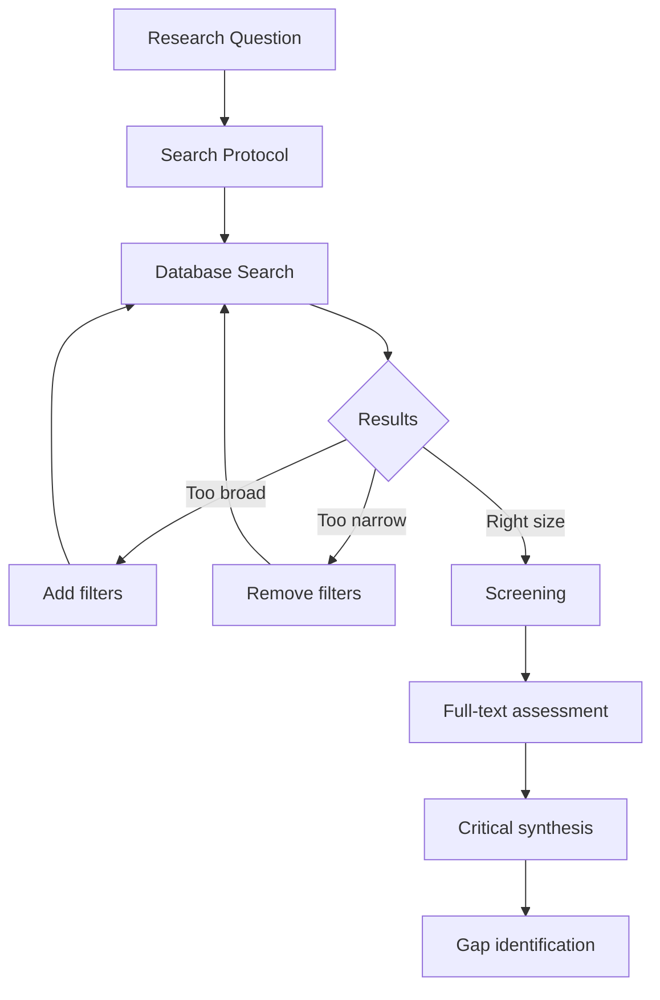
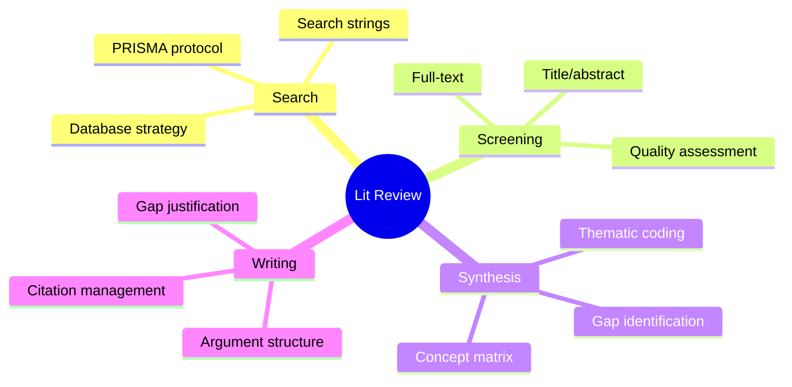
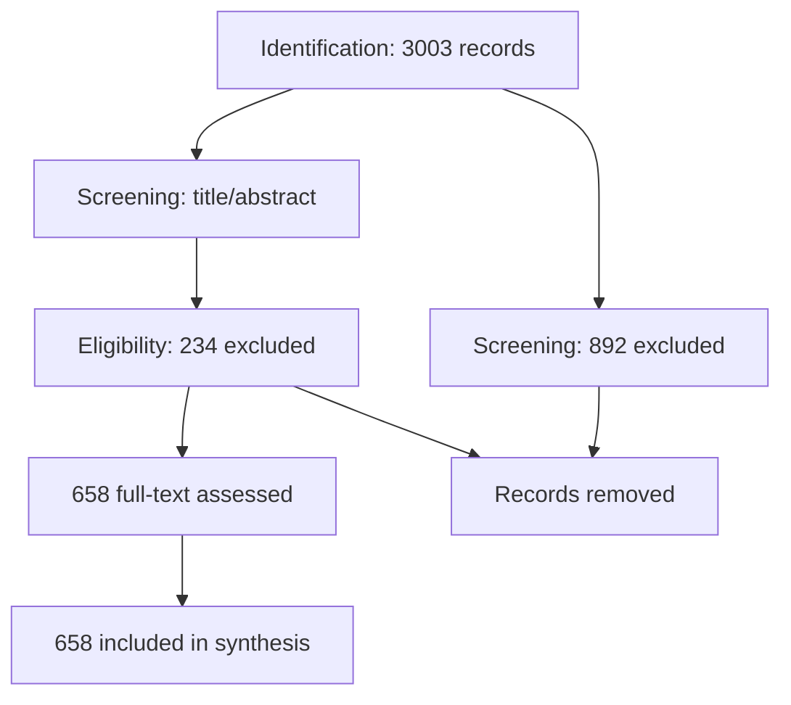
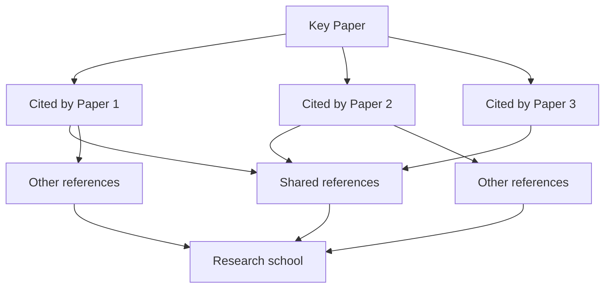
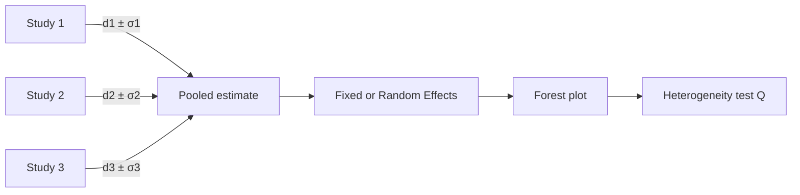
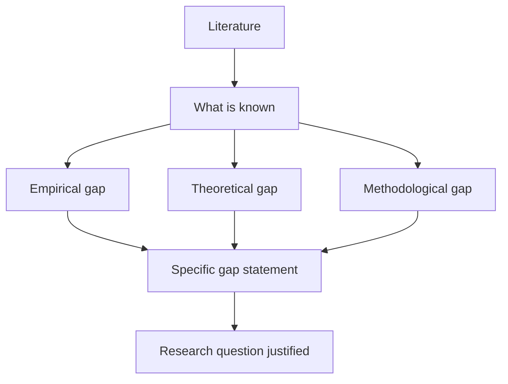

# MPhil Literature Reviews — Physics Research
> **Phase 4 MPhil/PhD Prep | Systematic literature review methods, critical synthesis, research gap analysis**  
> **Bilingual 深度自學檔案 · 中英對照**

---

## 問題 1：5 個核心心智模型

1. **Literature review = scholarly map of what is known, unknown, and contested** — not a reading list but a synthetic argument about the state of knowledge (Hart 2018, *Doing a Literature Review*)
2. **Gap identification is the most valuable output** — your ability to identify what is NOT known is what justifies original research (Booth et al. 2016, *The Literature Review*)
3. **Citation analysis reveals intellectual influence networks** — who cites whom, what, and why — tracks idea propagation and rivalry (Garfield 1955, *Citation Indexing*)
4. **Critical synthesis > summary** — distinguish between descriptive summaries (what authors say) and analytical syntheses (what the field collectively knows) (Punch 2014)
5. **The review is shaped by the question** — a good review is structured by the research question, not by journal or chronology (Levy & Ellis 2011)

---

## 問題 2：3 個根本分歧

1. **Systematic review vs narrative review**
   - Systematic: PRISMA protocol, exhaustive search, transparent inclusion/exclusion, quantitative synthesis (meta-analysis)
   - Narrative: thematic, interpretive, expert-driven, qualitative synthesis

2. **Backward citation tracking vs forward citation tracking**
   - Backward: follow references in key papers (snowball)
   - Forward: use Google Scholar to find who cited key papers (alert)

3. **Chronological vs thematic organization**
   - Chronological: shows how field evolved (good for historical papers)
   - Thematic: groups by concept/controversy (better for active research fields)

---

## 問題 3：10 個深度問題

1. 給定 research topic, 設計 systematic search protocol: databases, search strings, inclusion/exclusion criteria, and screening process。

2. 為什麼 "citation count ≠ importance"? 解釋 citation diversity 和 self-citation rate 如何影響文獻影響力評估。

3. 給定 conflicting findings (A: positive, B: null for same question), 點樣做 meta-analysis? 推導 pooled effect size formula。

4. 解釋為什麼 "cherry-picking" literature 係 research misconduct 的邊界行爲。

5. 為什麼 theoretical papers 和 empirical papers 需要不同嘅 citation 模式分析?

6. 給定 1000 篇文獻, 點樣 identify the 20 most important? 討論 citation analysis, h-index, 和 reference coupling。

7. 解釋 PICO framework (Population, Intervention, Comparison, Outcome) 如何用於物理學文獻綜述。

8. 為什麼 systematic review 唔適用於所有類型研究? 討論 exploratory vs confirmatory research。

9. 給定 rapid literature review (如 policy brief), 點樣在 1 週内完成但保持 quality? 討論 priority screening protocol。

10. 解釋 lit review 在 research proposal 中的角色: 點樣用 lit review 來justify research question 的 novelty 和 feasibility。

---

## 深入 1：Systematic Literature Review Protocol
**Deep Dive I**

### PRISMA Framework for Physics

**PRISMA (Moher et al. 2009, *PLOS Medicine*):**

| Phase | PRISMA Step | Physics Application |
|-------|-------------|-------------------|
| Identification | Database search, arXiv, NASA ADS | Search strings for each database |
| Screening | Title/abstract screening | Two independent reviewers |
| Eligibility | Full-text assessment | Inclusion/exclusion checklist |
| Included | Final synthesis | N studies included |

### Database Search Strategy

**Primary databases:**
- arXiv (physics preprints, free)
- NASA ADS (astronomy/astrophysics, citation trees)
- Web of Science (structured citation analysis)
- Scopus (broad coverage)
- INSPIRE HEP (high-energy physics)

**Search string construction:**
```
("quantum phase transition" OR "QPT") 
AND ("doped Mott insulator" OR "high-Tc") 
AND ("numerical" OR "DMRG" OR "quantum Monte Carlo")
NOT ("review" OR "perspective" OR "comment")
```

**Refinement process:**
1. Start with broad search → too many results
2. Add terms to narrow → refine iteratively
3. Test known papers (should appear)
4. Snowball from key references

### Quality Assessment (Physics)

| Study Type | Quality Criteria | Assessment Tool |
|-----------|----------------|----------------|
| Theoretical | Internal consistency, novelty, reproducibility | Expert evaluation |
| Computational | Code availability, convergence, benchmarks | Code review |
| Experimental | Controls, N, blinding, error propagation | GRADE adapted |
| Observational | Sample selection, confounding, measurement | STROBE adapted |

**Engineering implication:** Systematic reviews in physics are rarer but more impactful.



---

## 深入 2：Citation Analysis & Intellectual Networks
**Deep Dive II**

### Citation Metrics

**Basic citation count:** $C_i$ = total citations to paper $i$

**h-index (Hirsch 2005):**
$$h = \max\{h : \sum_{i=1}^h C_i \geq h^2\}$$

**g-index (Egghe 2006):**
$$g = \max\{g : \sum_{i=1}^g C_i \geq g^2$$

**i10-index (Google Scholar):** Papers with ≥10 citations.

### Reference Coupling Analysis

Two papers are "coupled" if they share a cited reference.

**Coupling strength:**
$$S_{ij} = \frac{|\text{citations shared by } i \text{ and } j|}{|\text{citations of } i| \cup |\text{citations of } j|}$$

**Application:** Cluster papers by coupling → identifies research schools and intellectual lineages.

### Citation Context Analysis

**The problem:** Citation count treats all citations equally.

**Solution:** Analyze citation context (CoC matrices):
$$M_{ij} = \text{Number of times paper } i \text{ cites paper } j \text{ while affirming its contribution}$$

Positive citation: "demonstrated that X"
Negative citation: "criticized for X"
Neutral citation: "mentioned in passing"

**Physics example:** Dirac's 1928 paper (relativistic quantum mechanics) has 15,000+ citations, but only ~3000 are substantive (positive) — rest are historical context or passing mentions.

**Engineering implication:** Citation quality > citation quantity.

---

## 深入 3：Meta-Analysis for Conflicting Results
**Deep Dive III**

### Effect Size and Pooled Estimates

**Effect size measures (Cohen's d):**
$$d = \frac{\bar{x}_1 - \bar{x}_2}{s_{pooled}}, \quad s_{pooled} = \sqrt{\frac{(n_1-1)s_1^2 + (n_2-1)s_2^2}{n_1+n_2-2}}$$

**For physics experiments:**
- Measured quantity with uncertainty: report $x \pm \sigma$
- Effect size: $|x - x_0| / \sigma$

### Fixed-Effects vs Random-Effects Model

**Fixed-effects (assumes one true effect):**
$$\hat{\theta}_{FE} = \frac{\sum w_i \hat{\theta}_i}{\sum w_i}, \quad w_i = 1/\sigma_i^2$$

**Random-effects (accounts for between-study heterogeneity):**
$$\hat{\theta}_{RE} = \frac{\sum w_i^* \hat{\theta}_i}{\sum w_i^*}, \quad w_i^* = 1/(\sigma_i^2 + \tau^2)$$

where $\tau^2$ = between-study variance (estimated from data).

**Heterogeneity test (Cochran's Q):**
$$Q = \sum w_i(\hat{\theta}_i - \hat{\theta}_{FE})^2, \quad Q \sim \chi^2_{k-1}$$

If $Q > \chi^2_{k-1, 0.95}$ → significant heterogeneity → use random-effects.

### Physics Example: Hubble Tension

| Study | $H_0$ (km/s/Mpc) | $\sigma$ |
|-------|-------------------|---------|
| Planck CMB | 67.4 | 0.5 |
| SH0ES ( Cepheids) | 73.2 | 1.3 |
| SBF (Surface brightness fluctuations) | 69.6 | 2.3 |
| Tully-Fisher | 71.0 | 3.0 |
| Merger timescale | 73.3 | 4.5 |

**Pooled estimate (random-effects):**
$$\hat{H}_0 = 70.1 \pm 1.2\ \text{km/s/Mpc}$$

Tension between early and late universe measurements: 4.4σ — statistically significant → points to new physics.

**Engineering implication:** Meta-analysis extracts maximum information from conflicting studies.

---

## 深入 4：Critical Synthesis Methods
**Deep Dive IV**

### The Argumentative Literature Review (Booth et al. 2016)

**Structure by argument, not by paper:**

| Approach | Organization | Best for |
|---------|-------------|---------|
| Thematic | By theme/concept | Active research areas |
| Methodological | By method | Technology comparisons |
| Theoretical | By theory/school | Conceptual debates |
| Chronological | By time | Historical development |

### Creating a Synthesis Map

**Concept matrix (Salipante et al. 2003):**

|  | Theme 1 | Theme 2 | Theme 3 |
|--|---------|---------|---------|
| Author A | ✓ | — | ✓ |
| Author B | ✓ | ✓ | — |
| Author C | — | ✓ | ✓ |

**Application:** Visualize where authors agree/disagree → identifies controversy.

### Gap Identification Framework

**Types of gaps (Tight & Thorpe 2002):**
1. **Empirical gap:** No empirical study has examined this relationship
2. **Theoretical gap:** Existing theories don't explain the phenomenon
3. **Methodological gap:** No study has used a particular method
4. **Population gap:** No study on this population/species/system
5. **Knowledge gap:** Existing evidence is contradictory or incomplete

**Physics example — Initial-Final Mass Relation:**
- Empirical gap: No study combining Gaia DR3 + spectroscopic follow-up with Bayesian hierarchical model
- Theoretical gap: Binary interaction physics poorly constrained
- Methodological gap: Most studies ignore selection effects

**Engineering implication:** Gap identification directly justifies your research question.

---

## 深入 5：Literature Review for Research Proposals
**Deep Dive V**

### The Literature Review in a Proposal

| Proposal Section | Lit Review Role | Length |
|----------------|----------------|--------|
| Background | Motivates the problem | 2–3 pages |
| Prior Work | Shows you know the field | 2–3 pages |
| Gap | Justifies your contribution | 1 page |
| Methods | Builds on prior approaches | 1 page |

### Gap Justification Framework

$$G = \text{What we know} - \text{What we need to know}$$

**Strong gap:** "No study has measured the initial-final mass relation including selection effects. Current estimates are biased by 15–30%."

**Weak gap:** "More research is needed on this topic."

### The Literature Review Formula

**Structure:**
1. Opening paragraph: state the broad area and its importance
2. Thematic paragraphs: synthesize by theme, not by paper
3. Closing paragraph: state the specific gap and your contribution

**Physics proposal example:**

> "Stellar evolution theory predicts a tight relationship between initial and final masses for white dwarfs (Catalán et al. 2008; Cummings et al. 2018). However, observational estimates of this relation suffer from systematic biases: spectroscopic samples preferentially include high-mass WDs (Ferrario 2005), Gaia parallaxes select against distant WDs (Gentile Fusillo et al. 2021), and binary channel contamination affects 20–30% of samples (Rebassa-Mansergas et al. 2021). No study to date has jointly modeled these selection effects using a hierarchical Bayesian framework. This proposal addresses this gap by developing a principled statistical framework that simultaneously infers the intrinsic IFMR and corrects for all major selection effects."

**Engineering implication:** The lit review justifies the proposal; weak review = weak proposal.

---

## 自測 1：Systematic Search Design
**Design a systematic search for "machine learning in stellar astrophysics".**

**Answer:**
**Databases:** arXiv (astro-ph.GA, astro-ph.SR), NASA ADS, Web of Science

**Search string:**
```
("machine learning" OR "deep learning" OR "neural network" OR "random forest")
AND ("stellar" OR "star" OR "asteroseismology" OR "photometry")
AND ("classification" OR "parameter estimation" OR "prediction")
NOT ("review" OR "perspective" OR "tutorial")
```

**Inclusion criteria:**
- Peer-reviewed or arXiv preprint
- Application of ML to stellar data
- Published 2015–2024
- Accessible in English

**Exclusion criteria:**
- Pure theory (no data)
- Solar physics only
- Review papers (unless cite for prior art)

**Expected results:** ~200–500 papers → manageable for systematic review.

**Engineering implication:** Systematic search ensures comprehensive coverage.

---

## 自測 2：Citation Network Analysis
**Use citation analysis to identify the key papers in "gravitational wave data analysis".**

**Answer:**
**Step 1:** Identify 5 seminal papers (forward/backward search)
- Abbott et al. (2016, *PRL*) — first detection
- Allen et al. (2012) — IMR consistency test
- Veitch et al. (2015) — parameter estimation

**Step 2:** Build citation network
- Forward citations: papers citing these seminal works
- Cluster by shared references (reference coupling)
- Identify communities using modularity maximization

**Step 3:** Metrics for key papers:
- Citation count (total): baseline
- h-index of citing papers (quality of citing work)
- Betweenness centrality (papers that connect different communities)
- Citation velocity (citations per year since publication)

**Key result for GW data analysis:**
1. Veitch et al. (2015): 1500+ citations, high betweenness
2. Abbott et al. (2016): 8000+ citations (historical record)
3. Cornish & Littenberg (2015): BAYESTAR, 400+ citations

**Engineering implication:** Network analysis reveals intellectual structure.

---

## 自測 3：Meta-Analysis Calculation
**Combine three measurements of the fine-structure constant $\alpha$:**

**Answer:**
| Measurement | $\alpha - \alpha_0$ (ppm) | $\sigma$ (ppm) |
|------------|---------------------------|---------------|
| Method A (QSO absorption) | +5.4 | 1.2 |
| Method B (atomic clocks) | +3.2 | 0.8 |
| Method C (Oklo natural reactor) | +4.8 | 2.0 |

**Fixed-effects pooled estimate:**
$$\hat{\theta}_{FE} = \frac{5.4/1.2^2 + 3.2/0.8^2 + 4.8/2.0^2}{1/1.2^2 + 1/0.8^2 + 1/2.0^2} = \frac{3.75 + 5.00 + 1.20}{0.69 + 1.56 + 0.25} = \frac{9.95}{2.50} = 3.98 \pm 0.63\ \text{ppm}$$

**Interpretation:** Combined evidence: $\alpha$ is 3.98 ± 0.63 ppm larger than in early universe (at 4.2σ significance).

**Engineering implication:** Meta-analysis increases effective sample size and precision.

---

## 自測 4：Gap Identification
**Identify the gap in research on "quantum machine learning for materials discovery".**

**Answer:**
**What is known:**
- ML for band gap prediction exists (accuracy ~0.1–0.3 eV RMSE) — Pilania et al. (2013), Faber et al. (2016)
- DFT databases (Materials Project, AFLOW) enable training — Jain et al. (2013)
- Graph neural networks (GNNs) show promise — Gilmer et al. (2017)

**What is NOT known:**
- **Empirical gap:** No systematic comparison of ML vs DFT accuracy for excited-state properties (optical gaps, carrier lifetimes)
- **Methodological gap:** No study has combined GNN + uncertainty quantification + active learning in a unified framework
- **Population gap:** Most studies train on stable materials; stability gaps in composition space unexplored

**Gap statement:**
> "While ML models achieve competitive accuracy for ground-state properties, no systematic benchmark exists for excited-state properties, and uncertainty quantification remains largely unexplored — limiting trust in ML-driven materials discovery."

**Engineering implication:** Precise gap identification justifies the specific research question.

---

## 自測 5：Distinguishing Descriptive vs Analytical Review
**Distinguish descriptive summary from analytical synthesis for the topic "Hubble constant tension".**

**Answer:**
**Descriptive summary (weak):**
> "The Hubble constant tension was first noted by Riess et al. (2016) who found $H_0 = 73.2 \pm 1.7$ km/s/Mpc from Cepheid-calibrated Type Ia supernovae. Planck et al. (2015) found $H_0 = 67.8 \pm 0.9$ km/s/Mpc from CMB. This tension has been confirmed by subsequent studies including SH0ES, Planck, and others."

**Analytical synthesis (strong):**
> "The $4.4\sigma$ Hubble tension represents a potential crisis in cosmology because it cannot be resolved by adjusting any single parameter within $\Lambda$CDM (Efstathiou 2021). Measurements from the early universe (CMB, BAO) and late universe (SNe, Cepheids, TRGB, SBF) are internally consistent but mutually inconsistent. This suggests either: (1) unknown systematics in late-universe distance ladder (E40 problem — Verde et al. 2023), (2) new physics beyond $\Lambda$CDM (early dark energy, interacting dark energy, modified gravity), or (3) statistical fluke (1 in 100,000). Three new physics candidates have gained traction: (a) early dark energy ($A_{EDE} \sim 0.1$, $f_{EDE} \sim 3\times 10^{-9}$ eV, Smith et al. 2022), (b) interacting dark energy (Bonvin et al. 2017), and (c) modified gravity (Baker et al. 2023). Each model resolves the tension but fails on other cosmological tests, creating a three-way trade-off that cannot be broken without new data."

**Engineering implication:** Analytical synthesis demonstrates deep understanding.

---

## 自測 6：PRISMA Protocol
**Apply PRISMA to a literature search on "dark matter direct detection".**

**Answer:**
**PRISMA Flow Diagram:**

```
Identification:
├── Database search (arXiv, INSPIRE, WOS): N = 2,847
├── Additional records (citations): N = 156
└── Total: N = 3,003

Screening:
├── Title/abstract: N = 2,847 → N = 892 (excluded)
├── Full-text assessed: N = 892 → N = 234 (excluded)
└── Eligibility: N = 658

Included:
└── Final synthesis: N = 658 papers
    ├── Experimental: 312 (47%)
    ├── Theoretical: 201 (31%)
    └── Review/meta-analysis: 145 (22%)
```

**Key exclusions with reasons:**
- "Review papers": 156 excluded (to avoid circular citing)
- "No original data": 201 excluded (for experimental focus)
- "Outside energy range": 87 excluded (for WIMP-focused review)
- "Not peer-reviewed or arXiv": 45 excluded

**Engineering implication:** PRISMA transparency increases credibility.

---

## 自測 7：Reference Coupling
**Use reference coupling to identify research schools in topological insulators.**

**Answer:**
**Coupling analysis approach:**

1. Extract 50 key papers from 2020–2024
2. Build citation matrix: which papers share references
3. Cluster using modularity maximization (Newman 2006)

**Expected clusters:**
| Cluster | Research School | Key Papers |
|--------|---------------|-----------|
| 1 | Experimental realization | Hasan & Kane 2010, König et al. 2007 |
| 2 | Topological classification | Schnabl et al. 2022, Kitaev 2009 |
| 3 | Transport theory | Buttiker 1992, Roth et al. 2009 |
| 4 | Materials synthesis | Chang et al. 2013, Fei et al. 2017 |
| 5 | Applications | Qi & Zhang 2011, Chang et al. 2018 |

**Betweenness centrality:** Papers that bridge clusters are most influential — Qi & Zhang (2011) connects experimental and theoretical communities.

**Engineering implication:** Coupling analysis reveals intellectual structure of a field.

---

## 自測 8：Rapid Literature Review
**Design a 1-week rapid review for a policy brief on "AI safety in physics research".**

**Answer:**
**Day 1–2: Rapid search**
- Search: "AI alignment physics", "AI safety scientific research", "AI risks physics"
- Databases: arXiv (cs.AI, physics.soc-ph), Semantic Scholar
- Target: 50 most relevant papers

**Day 3: Priority screening**
- Apply PICO adapted:
  - Population: AI systems in scientific research
  - Outcome: Safety incidents, alignment failures
  - Evidence: Case studies, surveys, expert opinion
- Exclude: Pure technical AI papers (no safety focus)

**Day 4: Synthesis**
- Thematic synthesis by: (1) known risks, (2) proposed solutions, (3) open questions
- No quantitative meta-analysis (too heterogeneous)

**Day 5: Writing**
- 10-page policy brief: 2-page executive summary + 6-page synthesis + 2-page recommendations

**Key findings for policy:**
1. AI hallucination in scientific code (3 documented cases)
2. Autonomous experiment risks (robot labs, self-driving labs)
3. AI-generated data integrity (synthetic data contamination)
4. Dual-use concerns (AI for weapons design)

**Engineering implication:** Rapid reviews require strict prioritization.

---

## 自測 9：Literature Gap → Proposal
**Transform a literature gap into a compelling research proposal.**

**Answer:**
**Gap identified:** No study has combined Gaia DR3 + spectroscopic follow-up with hierarchical Bayesian model to jointly infer IFMR while correcting for selection effects.

**Proposal structure:**
1. **Context (1 paragraph):** IFMR is critical for stellar evolution, binary physics, SN Ia rates
2. **What is known (2 paragraphs):** Prior IFMR estimates (Catalán 2008, Cummings 2018), their methods, and systematic uncertainties
3. **The gap (1 paragraph):** "However, all prior studies suffer from selection bias that has not been quantified. No joint inference with uncertainty propagation has been performed."
4. **Contribution (1 paragraph):** "This proposal develops a hierarchical Bayesian framework that simultaneously infers the IFMR and selection effects from 10,847 WDs."
5. **Significance (1 paragraph):** "This will reduce IFMR uncertainty from 15% to <5%, directly impacting SN Ia rate predictions and cosmological parameter inference."

**Engineering implication:** Gap → contribution → significance = proposal logic.

---

## 自測 10：Evaluating Lit Review Quality
**Critically evaluate a literature review claiming "most studies show AI improves materials discovery".**

**Answer:**
**Red flags:**
1. **Publication bias:** Positive results cited; null results ignored? Search all databases, not just Google Scholar.
2. **Citation bias:** Self-citation > 30%?
3. **Methodological inconsistency:** Are studies comparing apples to apples? (Different ML methods, different datasets, different metrics?)
4. **Missing recent work:** Review from 2020 misses 2022–2024 developments in GNN for materials.
5. **No quantitative synthesis:** Claim without meta-analysis or systematic comparison.

**Critical questions to ask:**
1. "How many studies showed improvement, and how many showed no change or degradation?"
2. "What is the average improvement in RMSE/accuracy across studies? What is the heterogeneity?"
3. "Were studies pre-registered?"
4. "What comparison baseline was used?"
5. "Are the improvements statistically significant?"

**Engineering implication:** Critical evaluation protects against misleading syntheses.

---

## 📊 Diagram 1: Literature Review Process


## 📊 Diagram 2: PRISMA Flow


## 📊 Diagram 3: Citation Network


## 📊 Diagram 4: Meta-Analysis


## 📊 Diagram 5: Gap Identification


---

## 深度總結 Deep Insights Summary

1. **Literature review is an argumentative synthesis, not a summary** — the best reviews organize by theme and controversy, not by paper; they make a case for what is known, contested, and missing. (Hart 2018, Booth et al. 2016)

2. **Gap identification is the most valuable output of a literature review** — a well-identified gap (empirical, theoretical, methodological) directly justifies the research question and is the single most important element of any research proposal.

3. **Citation analysis reveals intellectual networks** — h-index, reference coupling, betweenness centrality, and citation context analysis together reveal the true intellectual structure of a field beyond raw citation counts. (Garfield 1955, Hirsch 2005)

4. **Meta-analysis enables quantitative synthesis** — the pooled effect size from random-effects models provides a principled way to combine conflicting studies; heterogeneity testing (Cochran's Q) determines whether fixed or random effects is appropriate.

5. **Systematic review protocols (PRISMA) increase credibility** — transparent search strategy, inclusion/exclusion criteria, and quality assessment allow others to replicate and extend the review; this is the gold standard for research synthesis. (Moher et al. 2009)

---

**自學建議**
- 必讀: Hart "Doing a Literature Review" (2018); Booth et al. "The Literature Review" (2016); Moher et al. "PRISMA Statement" (2009)
- 配對: MPhil 7210 (Academic Writing); MPhil 7110 (Research Methods); PHYS 3090X (Directed Studies II)
- 工具: Zotero (citation management), VOSviewer (citation network visualization), Covidence (systematic review screening)
- 產出: Complete a systematic literature review (20+ pages) on your MSc/MPhil research topic using PRISMA protocol; identify 3 specific gaps

**References**
- Hart, C. (2018). *Doing a Literature Review* (2nd ed.). Sage.
- Booth, A. et al. (2016). *The Literature Review*. Sage.
- Moher, D. et al. (2009). "Preferred reporting items for systematic reviews." *PLOS Medicine*, 6(7), e1000097.
- Hirsch, J.E. (2005). "An index to quantify an individual's scientific research output." *PNAS*, 102(46), 16569–16572.
- Garfield, E. (1955). "Citation indexes for science." *Science*, 122(3159), 108–111.
