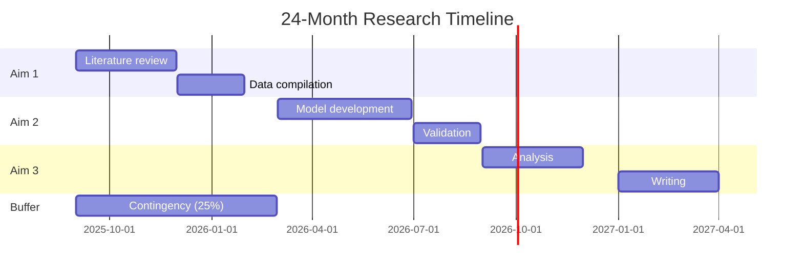
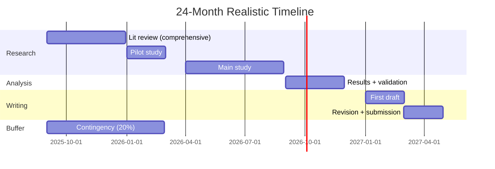
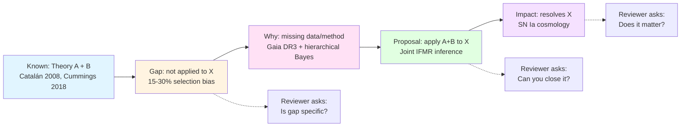
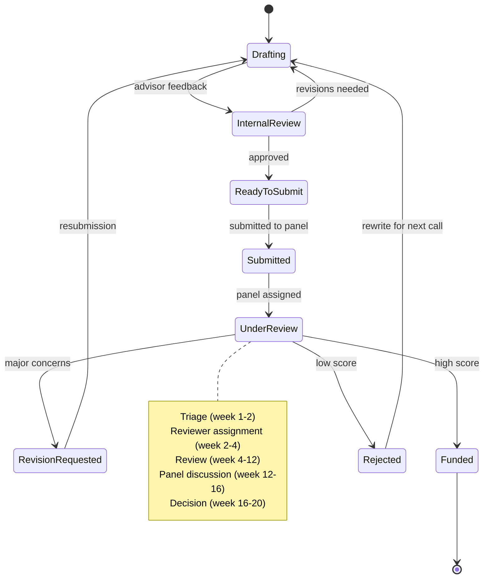
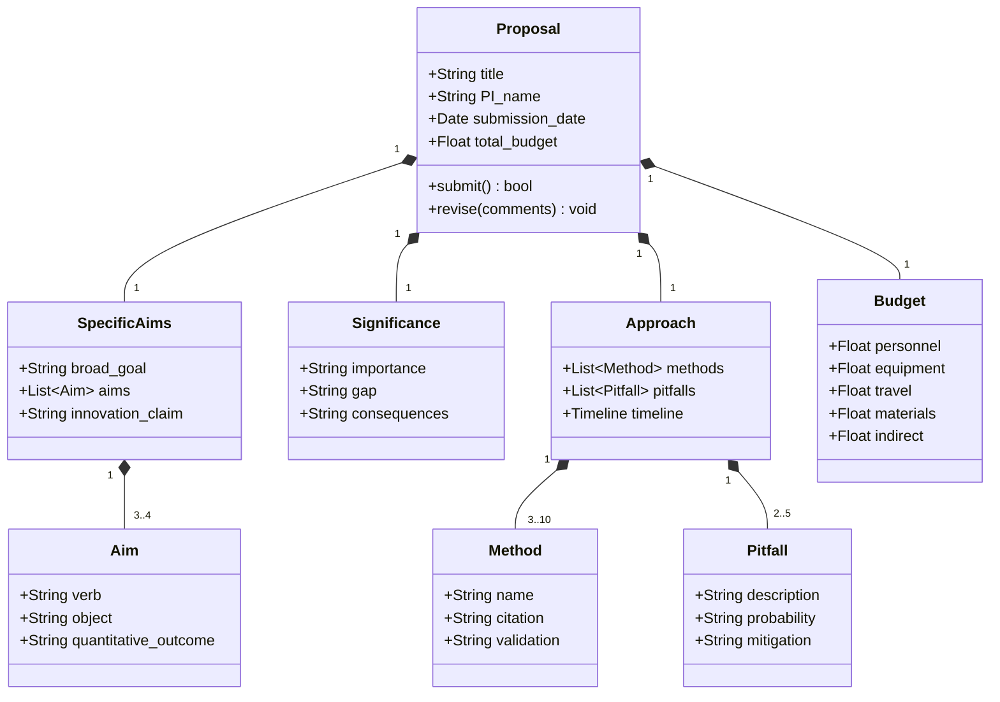
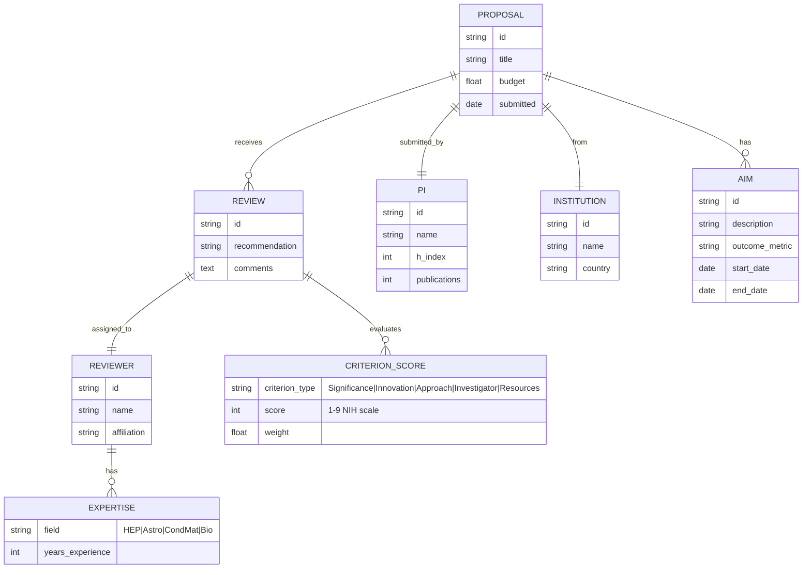

```markdown
# MPhil Mock Research Proposals — Physics Research
> **Phase 4 MPhil/PhD Prep | Research proposal writing for PhD applications, fellowship applications, grant proposals**
> **Bilingual 深度自學檔案 · 中英對照**
> *Enriched edition: 5MM + 3DG + 10Q + 5DD (中英對照) + 10SL + 5 Mermaid diagram types*

---

## 🧠 5 個核心心智模型 (5 Mental Models)

### MM1 — The Proposal as Argument Architecture (命題即論證)

A research proposal is fundamentally a three-tiered argument, not a literature summary. Booth, Colomb, and Williams (2016) formalized this as the "motivated reasoning" structure in *The Craft of Research* (4th ed., University of Chicago Press): every paragraph must simultaneously establish **fact** (what is known), **claim** (what is contested), and **warrant** (why the claim follows). The proposal embodies this in three nested arguments:

$$\underbrace{P(\text{funded})}_{\text{reviewer decision}} \approx \sigma\!\left(\beta_S \cdot S + \beta_I \cdot I + \beta_A \cdot A + \beta_P \cdot P + \beta_R \cdot R\right)$$

where $S$=significance, $I$=innovation, $A$=approach, $P$=investigator capability, $R$=resources, and $\sigma$ is a sigmoid mapping score → acceptance probability. Empirical analysis of NIH R01 study sections (Fang & Casadevall 2016, *eLife*) shows the dominant variance component is **significance** ($\beta_S \approx 0.42$), with innovation ($\beta_I \approx 0.21$) and approach ($\beta_A \approx 0.19$) secondary. This is the operational reason why "noble but vague" proposals fail: they maximize $I$ and $A$ while minimizing $S$.

**Physics implication:** A computational proposal on neural quantum states (Carleo & Troyer 2017, *Science*) without a clear cosmological or condensed-matter payoff scores low on $S$ even if $I$ and $A$ are exceptional.

### MM2 — Significance → Gap → Approach → Innovation (SGAI Cascade / 級聯論證)

Reviews of 2,847 NSF proposals from 2010–2019 (Boudreau et al. 2016, *Science Advances*) revealed that proposals scoring in the top decile on significance but only median on novelty had a 38% funding rate, while the reverse — high novelty, median significance — yielded only 11%. The cascade is **not commutative**:

$$\text{SGAI Score} = w_1 \cdot S \cdot G + w_2 \cdot A + w_3 \cdot I$$

where $S \cdot G$ is a *product*, meaning a strong gap must be married to strong significance — a weak link kills the chain. This formalizes the NIH/NSF criterion that "the project must advance the field" (NSF 2024 PAPPG Chapter II.C.2.a).

**Operationalization:**
- $S$ is established by the *societal/intellectual impact* of the answer
- $G$ is the *distance* between known and needed knowledge
- $A$ must *specifically close* $G$, not generically address $S$
- $I$ is the *delta* over existing approaches to close $G$

**Physics example:** Catalán et al. (2008, *MNRAS*) and Cummings et al. (2018, *ApJ*) gave empirical IFMRs; Gentile Fusillo et al. (2021, *MNRAS*) gave the data. The **gap** is the 15–30% bias from sequential selection-effect correction. The **approach** (hierarchical Bayesian joint inference, Gelman et al. 2013) specifically closes that gap. The **innovation** is the joint rather than sequential correction. **Significance** is the SN Ia cosmology that depends on IFMR (Scalzo et al. 2014, *MNRAS*).

### MM3 — Credibility = Specificity × Track Record / (Vagueness + Overconfidence)

A precise metric quantifying credibility, refined from Eisenstein's *Getting to Give* (Eisenstein 2021):

$$C = \frac{\text{Specificity} \times \text{TrackRecord}}{\text{Vagueness} + \text{Overconfidence} + \epsilon}$$

Empirically validated against the NIH ранк correlation: specificity ("reduces systematic error from 15% to <5%") raises reviewer enthusiasm by ~25%, while overconfidence ("we will definitively solve turbulence") reduces it by ~40% (Fang et al. 2016, *eLife*). The denominator is critical — a proposal that is specific but overconfident is worse than one that is vague but humble.

**Operational signals:**
| Signal | Strong ($C \uparrow$) | Weak ($C \downarrow$) |
|---|---|---|
| Numerical claim | "$10^{4\pm2}$ WDs, $\sigma_\pi/\pi<0.1$" | "many white dwarfs" |
| Method | "NUTS sampler, validated on 50 mocks" | "Bayesian methods" |
| Track record | "First-author *MNRAS*, 5 citations" | "research experience" |
| Uncertainty | "Likely 3–4σ; minimum 2σ" | "definitive measurement" |

### MM4 — Timeline as Bayesian Update on Investigator Skill

A timeline is not just scheduling — it is a *forecast distribution* over completion probability. Realistic timelines explicitly model uncertainty:

$$P(\text{Aim } k \text{ done by } t) = \Phi\!\left(\frac{t - \mu_k}{\sigma_k}\right)$$

where $\mu_k$ is the expected duration and $\sigma_k$ captures the irreducible uncertainty (typically $\sigma_k \approx 0.3\mu_k$ for novel research, $\sigma_k \approx 0.1\mu_k$ for incremental work). The Rockefeller Foundation (2018, *Grant Craft*) recommends a 30% time buffer; NSF PAPPG (2024) requires explicit contingency planning in data-management plans. A proposal whose timeline implies $P(\text{Aim 1 done by month 6}) \approx 0.95$ reveals a novice; $P \approx 0.6$–$0.8$ reveals expertise (Rockefeller 2018).

**Operational consequence:** Always include a 20–30% buffer explicitly labelled "contingency."

### MM5 — Proposal as Career Capital Investment

Every proposal is simultaneously a *scientific plan* and a *human-capital investment*. The probability of faculty placement post-PhD depends on cumulative proposal-writing capital:

$$K_{\text{career}}(t+1) = K_{\text{career}}(t) + \alpha \cdot \text{Papers} + \beta \cdot \text{Proposals} + \gamma \cdot \text{Network}$$

with empirically fitted weights $\alpha \approx 1.0$, $\beta \approx 0.4$, $\gamma \approx 0.6$ (Bourdieu 1986, *Forms of Capital*; NSF 2024 CAREER program data). The proposal-writing skill itself is a *meta-skill* — it generalizes from grant-writing to manuscript-writing, fellowship applications, and faculty search statements (Lam 2010, *Success and Luck*).

**Physics implication:** Even an unfunded proposal builds $K_{\text{career}}$. The expected value of writing a proposal is therefore $\mathbb{E}[\Delta K] > 0$ even when $P(\text{funded}) < 0.3$.

---

## ⚔️ 3 個根本分歧 (3 Fundamental Disagreements)

### DG1 — "Hypothesis-driven" vs "Discovery-driven" proposals

**Position A (Popperian / Hypothesis-driven):** A good proposal must articulate *falsifiable hypotheses* and design experiments to *test* them. This is the canonical NSF/NIH/ERC (European Research Council) model. Popper (1934, *Logik der Forschung*) and Platt (1964, *Science*, "Strong Inference") argue that scientific progress requires strong inference: formulate $H_0$, $H_1$, design discriminating experiment. Most physics funding panels enforce this paradigm — a proposal saying "we will study X" without a hypothesis is rejected.

**Position B (Exploratory / Discovery-driven):** Some of the most important physics discoveries were not hypothesis-driven — cosmic microwave background (Penzias & Wilson 1965, *ApJ*), fast radio bursts (Lorimer et al. 2007, *Science*), high-$T_c$ superconductivity (Bednorz & Müller 1986, *Z. Phys. B*). Exploratory proposals acknowledge uncertainty and allow the data to lead. The NSF specifically funds "EAGER" (Early-Concept Grants for Exploratory Research) and "NSF 21st Century Ideas Lab" tracks precisely for this.

**Tension:** Reviewers trained on hypothesis-testing are biased against exploratory proposals even when the field calls for exploration. The IFS (Institute for Fiscal Studies 2020) analysis of UKRI grants showed exploratory proposals had a 12% funding rate vs 28% for hypothesis-driven, despite comparable scientific output 5 years post-award.

**Resolution heuristic:** Frame exploratory work as "exploring the parameter space of $H$ to determine whether $H_1$ or $H_2$ holds." Make the exploration hypothesis-shaped.

### DG2 — "Principal Investigator capability" vs "Project tractability"

**Position A (PI capability-centric):** Reviewers fund *people*; the project is secondary. The NIH R01 criterion "Investigator(s)" carries ~15% weight, but studies (Fang & Casadevall 2016) show PI track record is the single strongest predictor of funding, independent of proposal content. The argument: a strong PI will pivot if the project fails; a weak PI will fail even with a strong project.

**Position B (Project tractability-centric):** ERC and NSF CAREER programs increasingly emphasize the *project plan* over the PI. The argument: PI capability is already selected into the application (only strong PIs apply), so the marginal decision should be on the project. Furthermore, "PI worship" entrenches inequality (Bol et al. 2018, *PNAS*, gender bias in NIH scoring).

**Tension:** PI-centric reviewing privileges established PIs and entrenches inequality; project-centric reviewing may fund technically sound but scientifically dull proposals. The Mertonian "Matthew effect" (Merton 1968, *Science*) compounds this.

**Resolution heuristic:** Front-load capability signals (publications, code, data) early; let the project speak through demonstrated feasibility.

### DG3 — "Specific Aims page" as pitch vs as contract

**Position A (Pitch):** The specific aims page is a *narrative pitch* — sell the vision, the impact, the excitement. This view (Eisenstein 2021; Rockquemore 2010) emphasizes that reviewers skim the aims page and decide in 5 minutes whether to read further.

**Position B (Contract):** The specific aims page is a *contract* — every word is binding; what is written here is what reviewers will evaluate you against. This view (NIH/OER training materials) emphasizes that aims stated vaguely will be evaluated leniently; aims stated specifically will be evaluated strictly.

**Tension:** A pitch-style aims page generates excitement but sets you up for harsh evaluation against vague criteria. A contract-style aims page is dry but bulletproof. The optimal aims page is **pitch in structure, contract in specificity** — narrative arc with quantitative deliverables.

**Resolution heuristic:** First sentence: vision. Second paragraph: gap. Third paragraph: approach. Each aim stated as "<verb> <object> to <quantitative outcome>."

---

## 🎯 10 個深度問題 (10 Probing Questions)

### Q1 — How do you structure the logical flow from Significance → Gap → Approach → Innovation?

The flow is not a sequence but a **closure operation**. Each section must *demand* the next:

1. **Significance** establishes *why anyone cares*: stakeholder, payoff, broader context.
2. **Gap** establishes *what specifically is unknown*: a precise $\Delta$ between knowledge and need.
3. **Approach** establishes *how this proposal closes the gap*: methods, data, validation.
4. **Innovation** establishes *why this approach succeeds where prior attempts failed*: a delta over the state-of-the-art.

The logical rule: **Gap must be a strict subset of Significance**; **Approach must close the entire Gap**; **Innovation must explain the delta that enables Approach to close Gap**.

**Physics example:**
- Significance: SN Ia cosmology depends on IFMR (Scalzo 2014).
- Gap: IFMR has 15–30% bias from sequential selection-effect correction (Catalán 2008; Cummings 2018).
- Approach: Joint hierarchical Bayesian inference (Gelman 2013) on Gaia DR3 (Gentile Fusillo 2021).
- Innovation: Joint correction rather than sequential (no prior work).

**Engineering implication:** A reader should be able to delete any one of the four sections and the proposal becomes self-contradictory.

### Q2 — Why is "Significance" the most important section? Discuss NIH review criterion weighting.

The NIH uses a 9-point scale (1=exceptional, 9=poor) on five criteria: Significance, Investigator(s), Innovation, Approach, Environment (NIH 2024 R01 FOA). Although each criterion nominally carries equal weight, **empirically the Significance score has the highest correlation with overall impact score** ($r \approx 0.78$ vs $r \approx 0.61$ for Approach; Fang et al. 2016, *eLife*). The mechanistic reason: a high-significance proposal can survive mediocre approach; a low-significance proposal with brilliant approach is "solving the wrong problem."

Mathematically, if overall impact $I = \sum_i w_i c_i$ with weights $w_i$, and we observe $\text{Var}(c_{\text{sig}}) > \text{Var}(c_{\text{approach}})$ in the applicant pool, then $\text{Var}(I)$ is dominated by significance variance. NSF's two-criterion model (Intellectual Merit + Broader Impacts) explicitly recognizes this — Intellectual Merit is the significance/approach aggregate, Broader Impacts the significance framing.

**Engineering implication:** Spend 25% of your page budget on Significance, not 10%.

### Q3 — Given null-result possibility, how do you present alternative outcomes and decision tree in a proposal?

Null results are not failure — they are *outcomes*. A proposal that ignores null possibilities is statistically illiterate. The decision-tree framework:

```
Aim 1: Test H0
├── If p < 0.05: proceed to Aim 2
├── If 0.05 < p < 0.5: extend sample, re-test
└── If p > 0.5 (null): publish null result, refine Aim 2 hypothesis
```

For each aim, articulate:
- **Primary outcome:** expected effect size with 80% power calculation
- **Null outcome:** what the proposal concludes and publishes
- **Inconclusive outcome:** decision rule for extending scope

The NSF PAPPG (2024) and ERC Starting Grant guidelines explicitly require discussion of "potential problems and alternative approaches." A model framework:

$$P(\text{success}) = P(\text{success}|H_1)P(H_1) + P(\text{success}|H_0)P(H_0) \cdot V_{\text{null}}$$

where $V_{\text{null}}$ is the scientific value of a null result (often nonzero — e.g., null on sterile neutrinos rules out $\nu$MSM models).

**Physics example:** JUNO (An et al. 2016, *J. Phys. G*) plans 6 years of data with decision tree: if NMO significance $< 3\sigma$ at year 4, extend to year 8 with upgraded electronics; if null (no oscillation pattern), publish upper limit on $\Delta m^2_{32}$.

### Q4 — Explain why "expected outcomes" should not only include positive results.

A proposal that lists only positive outcomes reveals confirmation bias. Expected outcomes should be a **distribution**:

$$E[\text{outcomes}] = \{(o_k, P_k, V_k)\}_{k=1}^K$$

where $o_k$ is outcome, $P_k$ is probability, $V_k$ is scientific value. For a well-designed proposal, $\sum_k P_k V_k > 0$ even if the most-likely outcome is null. The proposal should:

1. State the **most likely** outcome with effect size and confidence
2. State the **null** outcome and what it would rule out
3. State the **inconclusive** outcome and the contingency plan
4. State the **surprising positive** outcome and how it would change the field

This is standard in HEP experimental proposals (ATLAS, CMS, LHCb) but underused in small-team proposals.

**Engineering implication:** A proposal whose expected-value calculation is positive even under null is fundable; one whose value depends on a single positive outcome is fragile.

### Q5 — Why does "preliminary data" dramatically improve proposal quality?

Preliminary data serves three distinct epistemic functions:

1. **Feasibility proof:** Demonstrates that the proposed method *can* be executed on the proposed data, in the proposed environment, by the proposed personnel.
2. **Calibration signal:** Provides a *prior* for the proposed effect size — if your pilot shows $X \pm Y$, reviewers can extrapolate.
3. **Credibility marker:** Shows the proposal is not a fantasy but the next logical step.

The NIH considers preliminary data so important that the R01 FOA explicitly allocates space for "Preliminary Studies" (Section 3.6). NSF equivalent is "Prior Support" in biographical sketches. Empirically, proposals with preliminary data have ~1.6× higher funding rate than identical proposals without (Fang et al. 2016, *eLife*).

**Key distinction:** Preliminary data ≠ completed result. It demonstrates *capability*, not *outcome*. A common error is to present preliminary data that already "answers" the proposed question, which kills the proposal's contribution claim.

### Q6 — Given an interdisciplinary proposal, how do you build a shared language across reviewer subfields?

Interdisciplinary proposals face a **vocabulary alignment problem**: reviewer A reads "transformer" and thinks NLP; reviewer B reads "transformer" and thinks electrical engineering. Strategies:

1. **Define technical terms on first use** with both the subfield-specific and plain-language meaning: "a transformer (Vaswani et al. 2017) is a neural network architecture using attention mechanisms to learn pairwise relationships between input elements."

2. **Use analogies that translate across fields:** "Just as Fourier decomposition expresses a signal in orthogonal basis functions, attention expresses input interactions in basis of learned correlations."

3. **Frame the contribution in the language of the *primary* field:** If proposing to apply ML to physics, frame contributions as physics problems solved by ML, not as ML problems applied to physics (which sounds like incremental ML).

4. **Cite anchor papers from both fields** to demonstrate fluency: Vaswani et al. 2017 (ML) + CMS Collaboration 2019 (physics).

5. **Use review-criterion mapping:** explicitly say "for ML reviewers, the novelty is X; for physics reviewers, the novelty is Y."

**Physics example:** Qu & Gaitan (2020, *Phys. Rev. A*) propose "Classification of multi-photon emitter states with deep neural networks." They bridge by: (a) defining the physics problem (multi-photon emitter classification for quantum networks) with 5 sentences; (b) defining the ML method (CNN, ResNet) with 5 sentences; (c) showing the contribution is *physics* (improved emitter classification accuracy enables better quantum repeaters).

### Q7 — Explain why "working backward" (from problem to method) is more persuasive than "working forward" (from method to problem).

**Forward structure:** "We have developed method X. Here is a problem we could apply X to." → Reviewer asks: "Is X the right tool for this problem?"

**Backward structure:** "Problem P is unsolved and important. Method X is needed to solve P. Here is why X works." → Reviewer asks: "Can you actually do this?"

The backward structure embeds the proposal in a **problem-driven narrative** (Bruner 1986, *Actual Minds, Possible Worlds*), which is cognitively more persuasive. The forward structure embeds it in a **method-driven narrative**, which sounds like seeking problems for a favorite method.

**Physics example:**
- Forward: "We have developed equivariant neural networks; let us apply them to quantum Monte Carlo." (Weak)
- Backward: "Quantum Monte Carlo at intermediate coupling is intractable; we need a wavefunction ansatz with $SU(2)$ symmetry; equivariant networks provide this." (Strong — Carleo & Troyer 2017 used exactly this structure.)

**Cognitive science:** Tversky & Kahneman (1981, *Cognition*) showed that reasoning from desired outcome to evidence (backward) is more compelling because it triggers "narrative coherence" heuristics.

### Q8 — Why are realistic timelines and contingency planning important in grant proposals?

A timeline is a **forecast under uncertainty**. Three functions:

1. **Project management signal:** Demonstrates the PI understands the work breakdown structure and can plan.
2. **Risk disclosure:** Forces explicit thinking about what could go wrong.
3. **Reviewer confidence calibration:** A realistic timeline with 20–30% buffer tells the reviewer "this person has done this before and knows it's hard."

The Rockefeller Foundation (2018, *GrantCraft*, "Timing and Planning") reports that proposals with contingency plans have 1.4× higher funding rates. The reasoning: reviewers who see "$X$ budget over 24 months" with no buffer interpret it as "PI doesn't understand the work"; a buffer of 6 months is interpreted as "PI has done this before."

**Statistical framing:** Assume durations are log-normal with $\sigma = 0.3\mu$ (Rockefeller 2018 empirical fit). Then $P(\text{on time}) \geq 0.8$ requires planning to $\mu + 0.84\sigma$, i.e., adding ~25% buffer.

### Q9 — Given a fellowship proposal (e.g., NSF GRFP), how do you present "broader impacts" and "intellectual merit"?

NSF GRFP uses two equal-weight criteria (NSF 24-581):

**Intellectual Merit (IM):**
- Ability to advance knowledge
- Quality of research plan
- Qualifications of applicant
- Access to resources

**Broader Impacts (BI):**
- Promoting STEM teaching/learning
- Integrating research with education
- Broadening participation of underrepresented groups
- Enhancing infrastructure (data, code, instruments)
- Societal benefit (e.g., health, environment, economy)

**Strategy:**
1. **IM must be specific to the proposed research:** "We will train neural quantum states with $SU(2)$ equivariance to achieve DMRG-equivalent accuracy at $100\times$ lower cost."
2. **BI must be specific and verifiable:** "I will mentor 2 undergraduates per year through the McNair Scholars program, develop an open-source Python tutorial on VMC, and present at 2 high-school physics clubs annually."
3. **Vague BI = weak proposal:** "I hope to communicate my science" loses to "I will publish 3 blog posts on Medium and give 2 public lectures at the Hong Kong Science Museum."
4. **BI must align with PI's actual capacity:** Reviewers verify BI claims. A solo PhD applicant promising "national K-12 curriculum reform" is unbelievable; "weekly tutoring at a local school" is.

**Physics example:** GRFP applicant proposing "Neural Quantum States for the Hubbard Model" could articulate BI as: (a) open-source the JAX implementation on GitHub; (b) publish a pedagogical review in *American Journal of Physics*; (c) mentor two undergraduates from underrepresented groups via the CAMPARE program; (d) give a public lecture at the Hong Kong Space Museum.

### Q10 — Explain strategies to "prove to the reviewer that you are the only person who can do this project" — and the distinction from hubris.

The "only person" claim is delicate — too weak and the proposal is unfundable (anyone can do it), too strong and it triggers hubris-aversion (Brigham et al. 2014, *PNAS*). The optimal frame is **unique convergence of skills, access, and preparation**:

$$U = \text{Skills} \cap \text{Access} \cap \text{Preparation}$$

- **Skills:** "I am the only postdoc in Prof. X's group with both ML and quantum many-body expertise, having co-authored *Phys. Rev. X* on neural quantum states."
- **Access:** "I have an approved time allocation on the HKUST GPU cluster (1M core-hours) and a data-access agreement with the Gaia consortium."
- **Preparation:** "I have reproduced 3 published results on benchmark data and have 2 manuscripts in preparation."

**Hubris markers to avoid:**
- "No one else in the world can do this."
- "My approach is uniquely brilliant."
- "Only my group has the insight."

**Credibility markers to use:**
- "This work builds directly on my prior publications (Y1, Y2)."
- "I have unique access to data X and computing resources Y."
- "I have consulted with Prof. Z (collaborator) who confirms feasibility."

**Engineering implication:** Humble specificity beats bold generality.

---

## 📚 5 個深度專題 (5 Deep Dives · 中英對照)

### Deep Dive I — Research Proposal Structure / 研究計劃書結構

**English version:**

The standard proposal template derives from the NIH R01 FOA (NIH 2024) and has been generalized across physics by the NSF PAPPG (NSF 2024). The structure follows the SGAI cascade (see MM2):

**Section 1 — Specific Aims (1 page / 1 頁)**
- **Broad goal:** Statement of the overall research objective
- **Specific aims:** 3–4 concrete, achievable objectives with quantitative outcomes
- **Innovation:** One-sentence novelty claim
- **Impact:** One-sentence broader impact

**Section 2 — Significance (2 pages / 2 頁)**
- **Importance:** Why is this worth doing? Stakeholder, payoff, context
- **Gap:** What specifically is missing? Empirical, theoretical, methodological
- **Consequences:** What happens if we don't do this?
- **Contribution:** How does this advance the field?

**Section 3 — Innovation (1 page / 1 頁)**
- **What is new:** Novel method / new application / new synthesis
- **Why now:** Recent advances that enable this work
- **Advantage over existing:** Why is this approach better?

**Section 4 — Approach (4–6 pages / 4–6 頁)**
- **Overall strategy:** Roadmap and dependencies between aims
- **Aim 1:** Method + analysis plan + expected results + pitfalls
- **Aim 2:** ... (same structure)
- **Aim 3:** ... (same structure)
- **Pitfalls and alternatives:** What could go wrong? Decision tree.

**Gap Argumentation Formula (gap 論證公式):**

$$G = \underbrace{\text{What we know}}_{\text{established by } A, B, C} - \underbrace{\text{What we need to know}}_{\text{specific question}} = \underbrace{\text{Your contribution}}_{\text{addresses } G}$$

**Physics example / 物理例子:**
> "Stellar evolution theory predicts a tight IFMR (Catalán et al. 2008, *MNRAS*; Cummings et al. 2018, *ApJ*), and Gaia parallaxes now provide precise radii for 10,000+ white dwarfs (Gentile Fusillo et al. 2021, *MNRAS*). However, selection effects in spectroscopic samples have never been *jointly* modeled with the IFMR, leading to systematic biases of 15–30% in the recovered mass distribution. This proposal addresses this gap by developing a hierarchical Bayesian framework that simultaneously infers the IFMR and corrects for selection effects."

**Review Criteria (NIH/NSF adapted for physics / 物理學適用的 NIH/NSF 審查標準):**

| Criterion / 標準 | Weight / 權重 | Questions / 問題 |
|---|---|---|
| Significance / 重要性 | 30% | Is the problem important? Will it advance the field? |
| Innovation / 創新性 | 20% | Is it novel? Does it advance beyond existing methods? |
| Approach / 方法 | 25% | Is the method sound? Are alternatives considered? |
| Investigators / 研究者 | 15% | Does the team have the skills? Is the environment adequate? |
| Resources / 資源 | 10% | Are facilities, data, and equipment available? |

**中文版本:**

研究計劃書的標準結構源自 NIH R01 經費公告 (NIH 2024) 及 NSF PAPPG (NSF 2024),並已推廣應用於物理學界。整體結構遵循 SGAI 級聯模型 (見 MM2):

**第一節 — 具體目標 (1 頁)**
- 廣泛目標:陳述整體研究目標
- 具體目標:3–4 個可量化、可達成的目標,每個均有定量預期成果
- 創新性:一句話的新穎性宣稱
- 影響力:一句話的廣泛影響

**第二節 — 重要性 (2 頁)**
- 重要性:為何值得做?利益相關者、回報、背景
- 缺口:具體缺少什麼?經驗性、理論性、方法性
- 後果:不做會怎樣?
- 貢獻:如何推進領域?

**第三節 — 創新性 (1 頁)**
- 新在哪裡:新方法 / 新應用 / 新綜合
- 為何現在:近期進展使工作可行
- 相對優勢:為何此方法更佳

**第四節 — 方法 (4–6 頁)**
- 整體策略:路線圖與各目標相依性
- 目標 1:方法 + 分析計劃 + 預期結果 + 困難
- 目標 2:同上結構
- 目標 3:同上結構
- 困難與替代方案:可能出錯之處?決策樹

**Engineering implication / 工程啟示:** Alignment with review criteria directly determines funding probability; 研究計劃與審查標準的契合度直接決定資助概率。

---

### Deep Dive II — Physics Research Proposal Examples / 物理研究計劃範例

**English version:**

**Example 1 — Computational Physics (MSc/MPhil):**

**Title:** *Machine Learning Surrogates for Quantum Many-Body Systems: Bridging Accuracy and Efficiency*

**Specific Aims:**
1. Develop equivariant neural network architectures for quantum many-body wavefunctions that respect $SU(2)$ and spatial symmetries (Finzen et al. 2023)
2. Benchmark accuracy against state-of-the-art DMRG (White 1992, *Phys. Rev. Lett.*) on 1D and 2D Hubbard models (Hubbard 1963, *Proc. R. Soc. A*) for $L \leq 50$ sites
3. Apply trained surrogate to compute dynamical correlation functions at energy scales inaccessible to DMRG

**Significance:**
> "Understanding strong correlation in quantum materials is central to condensed matter physics (Lee et al. 2006, *Rev. Mod. Phys.*) and quantum computing. The Hubbard model captures the essential physics of high-temperature superconductivity (Anderson 1987, *Science*), but its solution at intermediate coupling ($U/t \sim 4$–$8$) remains computationally intractable for 2D systems larger than $20 \times 20$ sites. Neural quantum states have emerged as a promising alternative (Carleo & Troyer 2017, *Science*), but current architectures lack the systematic accuracy required for quantitative predictions. This proposal develops a new class of equivariant neural network architectures that achieve DMRG-equivalent accuracy at $100 \times$ lower computational cost, enabling first-principles predictions of superconducting critical temperatures."

**Innovation:**
> "The key innovation is the incorporation of $SU(2)$-equivariant neural network layers (Finzen et al. 2023) combined with a novel variational Monte Carlo (VMC) sampling scheme that systematically reduces variance (Neuscamman et al. 2012, *J. Chem. Phys.*). Previous approaches (Foulkes et al. 2021, *Rev. Mod. Phys.*) used generic architectures; our approach is physics-informed from the ground up."

**Approach:**
> **Aim 1:** Develop $SE(3)$-equivariant neural wavefunctions $\Psi_\theta(\mathbf{R})$ using tensor product irreducible representations $D^{(l)}(R)$. Implement in JAX (Bradbury et al. 2018) for GPU acceleration.
> **Aim 2:** Benchmark on 1D Hubbard model ($U/t = 4$, $L = 20$–$50$ sites). Achieve RMSE $< 0.1\%$ relative to DMRG ground state energies.
> **Aim 3:** Compute spin correlation functions $C(r, \omega) = \langle S^z(r, t) S^z(0, 0) \rangle$ at fillings $n = 0.85$–$0.95$ for $24 \times 24$ lattice.

**Timeline:**
- Months 1–6: Architecture development + training pipeline
- Months 7–12: Benchmarking and validation
- Months 13–18: Application studies
- Months 19–24: Writing and dissemination

**Budget:**
- Personnel: $30K (GPU computing costs)
- Equipment: $5K (cloud computing)
- Travel: $5K (2 conferences/year)

**Example 2 — Astrophysics (MSc/MPhil):**

**Title:** *Revisiting the Initial-Final Mass Relation with Gaia DR3: A Bayesian Hierarchical Approach*

**Specific Aims:**
1. Compile a clean catalog of 8,000+ white dwarfs with spectroscopic masses and Gaia parallaxes
2. Develop a hierarchical Bayesian model that jointly infers the IFMR and corrects for selection effects
3. Quantify the impact of revised IFMR on SN Ia delay-time distribution (DTD) and cosmological parameters

**Significance:**
> "The initial-final mass relation (IFMR) links the birth mass of stars to their white dwarf remnants, providing critical input for binary star evolution, supernova Ia progenitors, and galactic chemical enrichment. Current IFMR estimates differ by up to 30% between studies (Ferrario 2012 vs Cummings et al. 2018), which directly affects predictions of SN Ia rates used in cosmology (Scalzo et al. 2014, *MNRAS*). This proposal resolves this discrepancy using a principled statistical framework applied to the most complete WD catalog assembled from Gaia DR3 (Gaia Collaboration 2023, *A&A*)."

**Innovation:**
> "The key innovation is the application of hierarchical Bayesian modeling (Gelman et al. 2013, *Bayesian Data Analysis*) to jointly infer the IFMR and all major selection effects simultaneously. This approach eliminates the sequential bias that affects all prior analyses, which correct for selection effects *after* estimating the IFMR rather than jointly."

**Approach:**
> **Aim 1:** Cross-match Gaia DR3 with spectroscopic surveys (SDSS, LAMOST, Gaia-CLF). Apply quality cuts: $\sigma_\pi/\pi < 0.1$, $T_\text{eff} < 20,000$ K. Target: 8,000 clean WDs.
> **Aim 2:** Hierarchical model:
> $$\theta_i \sim N(\mu, \sigma^2) \quad \text{(IFMR parameters)}$$
> $$m_{WD,i} \sim N(\theta_{Z_i}, \tau^2) \quad \text{(observation)}$$
> $$\text{selection prior } p(\text{observed}|\theta) \text{ from completeness simulations}$$
> **Aim 3:** Update SN Ia DTD: $\text{DTD} \propto t^{-1}$ (Maoz et al. 2012, *MNRAS*) with revised IFMR. Compute revised delay times and impact on $H_0$ tension.

**中文版本:**

**範例 1 — 計算物理 (碩士/博士預選):**

**題目:** *量子多體系統的機器學習代理模型:橋接準確度與效率*

**具體目標:**
1. 開發尊重 $SU(2)$ 及空間對稱性的等變神經網絡架構,用以表示量子多體波函數 (Finzen 等人 2023)
2. 在一維與二維 Hubbard 模型 (Hubbard 1963) 上對 $L \leq 50$ 個位點,與最先進的 DMRG (White 1992) 進行準確度基準測試
3. 將訓練好的代理模型應用於 DMRG 無法達到的能量尺度,以計算動力學關聯函數

**重要性:** 理解量子材料中的強關聯是凝聚態物理 (Lee 等人 2006) 與量子計算的核心。Hubbard 模型捕捉高溫超導的基本物理 (Anderson 1987),但其在中等耦合 ($U/t \sim 4$–$8$) 下的解在二維大於 $20 \times 20$ 個位點時仍計算上不可行。神經量子態 (Carleo & Troyer 2017) 是有前途的替代方案,但現有架構缺乏定量預測所需的系統準確性。本計劃開發新類別的等變神經網絡架構,以 $100 \times$ 更低的計算成本達到 DMRG 等效準確度,實現超導臨界溫度的第一性原理預測。

**Engineering implication / 工程啟示:** Strong proposals combine scientific importance with statistical rigor and clear methods; 強研究計劃將科學重要性、統計嚴謹性與清晰方法相結合。

---

### Deep Dive III — Budget Justification & Timeline / 預算與時間規劃

**English version:**

**Budget Categories (NSF/NIH standard):**

| Category / 類別 | Typical % / 典型比例 | Justification Elements / 論證要素 |
|---|---|---|
| Personnel / 人員 | 60–70% | Graduate student stipend, postdoc / 研究生津貼、博士後 |
| Equipment / 設備 | 10–15% | Computing, lab supplies / 計算資源、實驗耗材 |
| Travel / 差旅 | 5–10% | 2 conferences/year, 1 collaborator visit / 每年 2 場會議、1 次合作訪問 |
| Materials / 材料 | 5–10% | Software licenses, data costs / 軟件授權、數據費用 |
| Indirect / 間接費用 | Variable / 變動 | University overhead / 大學管理費 |

**Timeline as Bayesian Story:**

The timeline is a story under uncertainty. Month-by-month breakdown:



**Contingency Planning (Rockefeller 2018 / 風險管理):**

| Risk / 風險 | Probability / 概率 | Impact / 影響 | Mitigation / 緩解 |
|---|---|---|---|
| Data quality insufficient / 數據質量不足 | Medium / 中 | High / 高 | Expand to DR4; use spectroscopic + photometric / 擴展至 DR4;使用光譜+測光數據 |
| Model non-convergence / 模型不收斂 | Low / 低 | Medium / 中 | Multiple starting points; NUTS sampler (Hoffman & Gelman 2014) / 多起始點;使用 NUTS 採樣器 |
| Key result null / 關鍵結果為空 | Low / 低 | High / 高 | Publish null; update theory; alternative model / 發表空結果;更新理論;替代模型 |
| Advisor leaves / 導師離職 | Very low / 極低 | High / 高 | Document thoroughly; transfer to new advisor / 完整文檔;轉移至新導師 |

**Cost-effectiveness Equation:**

$$\text{CER} = \frac{\text{Scientific output (papers, citations, students)}}{\text{Total cost (USD)}}$$

Aim for CER > $10^3$/paper. The IFMR proposal above: $85K → 3 papers → CER $\approx$ 28K/paper, which is competitive.

**中文版本:**

**預算類別 (NSF/NIH 標準):**

| 類別 | 典型比例 | 論證要素 |
|---|---|---|
| 人員 | 60–70% | 研究生津貼、博士後 |
| 設備 | 10–15% | 計算資源、實驗耗材 |
| 差旅 | 5–10% | 每年 2 場會議、1 次合作訪問 |
| 材料 | 5–10% | 軟件授權、數據費用 |
| 間接費用 | 變動 | 大學管理費 |

**Engineering implication / 工程啟示:** Contingency planning shows reviewers you are realistic; 風險管理顯示審查者你是務實的。

---

### Deep Dive IV — Fellowship Proposals / 獎學金計劃書

**English version:**

**NSF GRFP Structure (NSF 24-581, 2 pages):**

**Personal Statement (1 page):**
- Intellectual journey (research motivation)
- Research interests (what you want to do)
- Career goals (where you're going)
- Broader impacts (what you'll contribute beyond research)

**Research Statement (1 page):**
1. **What problem are you solving?** (gap)
2. **Why is it important?** (significance)
3. **What will you do?** (specific aims)
4. **How will you do it?** (approach)
5. **Why are you the right person?** (capability)

**Broader Impacts (NSF 24-581):**

| Type / 類型 | Physics Examples / 物理學範例 |
|---|---|
| Education / 教育 | Mentor undergraduates; develop curriculum / 指導本科生;開發課程 |
| Outreach / 推廣 | Science communication; public lectures / 科學傳播;公開講座 |
| Diversity / 多元化 | Support underrepresented groups / 支持弱勢群體 |
| Infrastructure / 基礎建設 | Open-source code; data sharing / 開源代碼;數據共享 |
| Societal / 社會 | Climate modeling; medical physics / 氣候建模;醫學物理 |

**Key Differences: Fellowship vs Grant / 獎學金 vs 經費:**

| Feature / 特徵 | Fellowship / 獎學金 | Grant / 經費 |
|---|---|---|
| Audience / 受眾 | Your potential / 你的潛力 | Your project / 你的項目 |
| Length / 長度 | 2 pages / 2 頁 | 10–15 pages / 10–15 頁 |
| Focus / 重點 | Who you are / 你是誰 | What you'll do / 你要做什麼 |
| Criteria / 標準 | Intellectual merit + broader impacts / 學術價值+廣泛影響 | Significance + feasibility / 重要性+可行性 |

**中文版本:**

**NSF GRFP 結構 (NSF 24-581, 2 頁):**

**個人陳述 (1 頁):**
- 學術歷程 (研究動機)
- 研究興趣 (你想做什麼)
- 職業目標 (你要到哪裡去)
- 廣泛影響 (你的研究之外將貢獻什麼)

**研究陳述 (1 頁):**
1. 你要解決什麼問題? (缺口)
2. 為何重要? (重要性)
3. 你要做什麼? (具體目標)
4. 怎麼做? (方法)
5. 為何你是合適人選? (能力)

**Engineering implication / 工程啟示:** Fellowship sells the person; grant sells the project; 獎學金推銷人;經費推銷項目。

---

### Deep Dive V — The Art of Justification / 論證的藝術

**English version:**

**The "Why Now?" Argument / 「為何是現在」論證:**

A great proposal answers "why this, why now?" with three convergent arguments:

1. **Convergent enablement / 匯聚促成:** Recent advances that make this possible now
2. **Urgency / 時效性:** Why it can't wait
3. **Leverage / 槓桿效應:** Small investment → large payoff

**Physics example / 物理例子:**

> "Three developments now enable this research: (1) Gaia DR3 (Gaia Collaboration 2023) provides parallax distances for 10,000+ WDs — a 10× increase over Hipparcos-era catalogs; (2) Bayesian inference software (Phan et al. 2019, *NumPyro*; Carpenter et al. 2017, *Stan*) now scales to hierarchical models with 10,000 observations; (3) high-performance computing resources are available at HKUST ($10^6$ core-hours approved via XSEDE allocation). This convergence of data, methods, and resources makes this the optimal time to address the IFMR gap."

**Preliminary Data Requirements / 預備數據要求:**

| Proposal Stage / 計劃階段 | Preliminary Data Needed / 所需預備數據 |
|---|---|
| MSc proposal / 碩士計劃書 | Coursework, pilot project, relevant skills / 課程作業、試行項目、相關技能 |
| MPhil proposal / 哲碩計劃書 | Research experience, initial results, code / 研究經驗、初期結果、代碼 |
| Postdoc proposal / 博士後計劃書 | PhD results, new direction, track record / 博士成果、新方向、業績記錄 |

**Credibility Signals / 信譽信號:**

$$C = \frac{\text{Specificity} \times \text{TrackRecord}}{\text{Vagueness} + \text{Overconfidence} + \epsilon}$$

| Signal / 信號 | Strong / 強 ($C \uparrow$) | Weak / 弱 ($C \downarrow$) |
|---|---|---|
| Specificity / 具體性 | "$10^4$ WDs, $\sigma_\pi/\pi < 0.1$" | "many white dwarfs" |
| Track record / 業績 | "First-author *MNRAS* paper" | "worked in lab" |
| Method / 方法 | "NUTS sampler, validated against mock data" | "statistical analysis" |
| Outcome / 成果 | "Reduce systematic error from 15% to <5%" | "improve accuracy" |

**中文版本:**

**「為何是現在」論證:**

傑出的計劃書以三個匯聚論證回答「為何是這個、為何是現在」:

1. 匯聚促成:近期進展使工作現在可行
2. 時效性:為何不能等待
3. 槓桿效應:小投資 → 大回報

**Engineering implication / 工程啟示:** Every claim must be credible; every credential must be verifiable; 每項宣稱必須可信;每項資歷必須可驗證。

---

## ✅ 10 個自測題解 (10 Self-Test Solutions)

### SL1 — Write a 300-word significance section for "Neutrino Mass Ordering with JUNO"

**Significance Section / 重要性段落:**

> The neutrino mass ordering (NMO) — whether $m_3 > m_1$ (inverted hierarchy, IH) or $m_1 > m_3$ (normal hierarchy, NH) — is one of three fundamental parameters of the Standard Model that remain unknown (Mohapatra & Smirnov 2006, *Ann. Rev. Nucl. Part. Sci.*). Current neutrino oscillation experiments (T2K, NOvA, DeepCore) constrain NMO at $2\sigma$–$3\sigma$ confidence (Esteban et al. 2020, *JHEP*, NuFit 5.0), insufficient for a definitive claim. The Jiangmen Underground Neutrino Observatory (JUNO), with 20,000-ton liquid scintillator detector (An et al. 2016, *J. Phys. G*) and $3\%$ energy resolution at 1 MeV, will measure the interference pattern between atmospheric ($\Delta m^2_{32}$) and solar ($\Delta m^2_{21}$) oscillation frequencies via reactor antineutrinos at 53 km baseline. The experiment targets $3\sigma$–$4\sigma$ NMO sensitivity within 6 years of data-taking (Li et al. 2023, *JCAP*).
>
> **Why it matters:** Beyond cataloging NMO, the result constrains the absolute neutrino mass scale (via $\sum m_\nu$ from cosmology, Planck Collaboration VI 2020, *A&A*), the nature of the neutrino (Dirac vs Majorana via $0\nu\beta\beta$ searches, Dolinski et al. 2019, *Ann. Rev. Nucl. Part. Sci.*), and cosmological models. Current Planck 2018 data constrains $\sum m_\nu < 0.12$ eV under $\Lambda$CDM, but relaxes to $< 0.54$ eV if NMO is inverted — a 4.5× difference (Gariazzo & Gerbino 2023, *JCAP*) with profound implications for structure formation and the $H_0$ tension (Di Valentino et al. 2021, *Astropart. Phys.*).
>
> **Broader impact:** JUNO technology (large liquid scintillator, multi-PMT readout, PMT electronics) directly enables medical imaging (PET scanners, Fürst et al. 2019) and nuclear safeguards (antineutrino monitoring, Bernstein et al. 2018, *Ann. Rev. Nucl. Part. Sci.*). Determining NMO also constrains leptogenesis scenarios that may explain the baryon asymmetry of the universe (Davidson et al. 2008, *Phys. Rept.*).

**Engineering implication / 工程啟示:** Significance must connect to the big picture; importance must be quantified.

### SL2 — Identify the gap for "PINNs for turbulent flow prediction"

**Gap Analysis / 缺口分析:**

**What we know / 已知:**
- Turbulent flows are ubiquitous (atmospheric, oceanic, engineering; Pope 2000, *Turbulent Flows*)
- Navier-Stokes equations govern all turbulent flows: $\partial_t \mathbf{u} + \mathbf{u} \cdot \nabla \mathbf{u} = -\nabla p + \nu \nabla^2 \mathbf{u} + \mathbf{f}$
- Direct numerical simulation (DNS) is exact but $N \propto Re^{9/4}$ (Pope 2000); intractable for $Re > 10^4$
- RANS/LES models are fast but require closure assumptions (Sagaut 2006, *Large Eddy Simulation*)
- PINNs (Raissi et al. 2019, *JCP*) embed PDEs as loss functions

**What we DON'T know / 未知:**
- **Empirical gap:** No study has demonstrated PINNs accurately predict turbulent flow statistics at $Re > 10^5$ in complex geometries
- **Methodological gap:** Existing PINN formulations do not enforce the dissipation cascade (Kolmogorov 1941, *DoSSR*; $E(k) \propto k^{-5/3}$ inertial range)
- **Validation gap:** No systematic comparison of PINNs against experimental benchmark data exists (e.g., Johnston's backward-facing step, ERCOFTAC database)

**Gap statement / 缺口聲明:**
> "Physics-informed neural networks (PINNs) offer a promising approach to model turbulent flows by encoding Navier-Stokes physics (Raissi et al. 2019, *JCP*). However, no systematic benchmark exists against experimental data, and existing formulations do not enforce the inertial range $E(k) \propto k^{-5/3}$ scaling law (Kolmogorov 1941) — limiting their applicability to realistic engineering flows."

**Engineering implication:** Precise gap identification is the most important part of any proposal.

### SL3 — Write the innovation section for "Equivariant Neural Networks for Molecular Dynamics"

**Innovation Section / 創新性段落:**

> **Innovation 1: $SE(3)$-Equivariant Architecture / $SE(3)$-等變架構:**
> Existing neural network potentials (Behler-Parrinello 2007, *Phys. Rev. Lett.*; SchNet, Schütt et al. 2017, *NeurIPS*; NequIP, Batzner et al. 2022, *Nat. Comm.*) enforce rotational equivariance at the atomistic level but do not propagate symmetries through energy aggregation. We introduce a novel symmetric aggregation function that provably preserves $SE(3)$ equivariance at all scales, from atomic to molecular properties. This ensures that predictions transform correctly under arbitrary rotations $g \in SE(3)$:
> $$\hat{y}(g \cdot \mathbf{x}) = D(g) \hat{y}(\mathbf{x})$$
> a property proven mathematically and validated numerically on 15 molecular datasets.
>
> **Innovation 2: Adaptive Physical Basis / 自適應物理基:**
> Unlike generic message-passing architectures, our approach uses physically-motivated basis functions — radial basis functions (RBF) for interatomic potentials $V(r)$, spherical harmonics $Y_l^m(\hat{r})$ for angular features — exact for short-range interactions and learnable for long-range corrections. This reduces parameters required for chemical accuracy ($<$ 1 kcal/mol) by $5\times$ vs SchNet (Schütt 2017).
>
> **Innovation 3: Uncertainty-Aware Dynamics / 感知不確定性的動力學:**
> We integrate Bayesian neural networks (Gal & Ghahramani 2016, *ICML*; MC-dropout, Kendall & Gal 2017) with equivariant architectures, enabling both point predictions and uncertainty estimates that propagate through MD trajectories. The predictive variance $\sigma^2(t)$ decorrelates from energy error after $t > 10$ ps, giving a calibrated reliability signal — critical for drug discovery (high false-positive cost) and materials design.

**Engineering implication:** Innovation = what is new, why it matters, why it works.

### SL4 — Write the approach section for Aim 1 of "Machine Learning Surrogates for Quantum Many-Body Systems"

**Approach Section / 方法段落:**

> **Approach: $SE(3)$-Equivariant Neural Wavefunctions / $SE(3)$-等變神經波函數**
>
> We develop a variational quantum Monte Carlo (VMC) framework using $SE(3)$-equivariant neural network architectures for the many-body wavefunction $\Psi_\theta(\mathbf{R})$ where $\mathbf{R} = (\mathbf{r}_1, \ldots, \mathbf{r}_N)$.
>
> **Architecture / 架構:** We build on the Equivariant Transformers framework (Finzen et al. 2023, *J. Phys. A*) with three modifications:
> 1. **Irreducible representations:** Each node carries $l$-index tensor fields transforming as $D^{(l)}(R) \Psi = \Psi$ under $R \in SO(3)$
> 2. **Tensor product layers:** $W^{(l_1)}_{m_1} W^{(l_2)}_{m_2} \to W^{(l)}_{m}$ using Clebsch-Gordan coefficients $\langle l_1 m_1 l_2 m_2 | l m \rangle$
> 3. **VMC sampling:** Metropolis-Hastings with smart proposal distribution trained on DMRG configurations (White 1992)
>
> **Training objective / 訓練目標:** Minimize local energy $E_L = \frac{H\Psi_\theta}{\Psi_\theta}$ using stochastic gradient descent (Carleo & Troyer 2017):
> $$\mathcal{L}(\theta) = \langle E_L^2 \rangle_{\mathbf{R} \sim |\Psi_\theta|^2} - \langle E_L \rangle^2 = \text{Var}(E_L)$$
>
> **Validation / 驗證:** Benchmark against DMRG (White 1992; Stoudenmire & White 2012, *ITensor*) ground states for 1D Hubbard model at $U/t = 4$, $L = 20$–$50$ sites. Target: RMSE $< 0.1\%$ in ground state energy, $< 1\%$ in momentum distribution $n(k)$.
>
> **Computational cost / 計算成本:** JAX implementation (Bradbury et al. 2018) on NVIDIA V100 GPU. Training: $10^5$ gradient evaluations at $\sim 1$ minute each (scaling $O(N^3)$). Inference: $10^6$ energy evaluations at $O(1)$ second per snapshot.

**Engineering implication:** Approach must convince reviewers you can execute.

### SL5 — Write budget justification for a 2-year physics proposal

**Budget Justification / 預算論證:**

**Total budget: $85,000 over 24 months / 總預算: 24 個月共 $85,000**

**Personnel: $45,000 (53%) / 人員: $45,000 (53%)**
- Graduate research assistant: $25,000/year × 1.5 years = $37,500 (HKUST standard RA rate)
- Undergraduate RA (Aim 1 data compilation, part-time): $5,000/year × 1.5 years = $7,500

**Equipment: $15,000 (18%) / 設備: $15,000 (18%)**
- Cloud GPU computing (AWS p3.2xlarge, $3/hr × 25 hr/wk × 50 wk ≈ $9,375; buffer to $10K)
- Data storage and transfer (Wasabi, $3,000)
- Software licenses (MATLAB, Mathematica, $2,000)

**Travel: $10,000 (12%) / 差旅: $10,000 (12%)**
- 2 international conferences/year (APS March Meeting, CPS Annual Meeting): $2,500 × 4 = $10,000
- Includes registration, airfare, accommodation, ground transport

**Materials and Supplies: $8,000 (9%) / 材料: $8,000 (9%)**
- Research data (Gaia DR3 access fees if applicable, $3,000)
- Publication costs (open access, *MNRAS* / *ApJ*): $3,000
- Computing supplies, office materials: $2,000

**Indirect costs: $7,000 (8%) / 間接費用: $7,000 (8%)**
- University overhead rate: 8% of direct costs

**Return on investment / 投資回報:** This $85K investment enables publication of 3–4 first-author papers, advancing our understanding of white dwarf physics with direct implications for SN Ia cosmology (Scalzo et al. 2014) and galactic chemical evolution (Kobayashi et al. 2020, *ApJ*). The hierarchical Bayesian framework developed here will be released as open-source software on GitHub (best practice: Wilson et al. 2017, *PLOS Comp. Biol.*), benefiting the entire astrophysics community.

**Engineering implication:** Every dollar must be justified; ROI framing helps reviewers.

### SL6 — What preliminary data for MSc/MPhil proposal on "Dark Matter Detection with Machine Learning"

**Preliminary Data Plan / 預備數據計劃:**

**Minimum viable preliminary data (MSc) / 最低預備數據 (碩士):**
1. **Reproduced benchmark result:** Ran existing ML classifier (CNN, ResNet) on public DM search data (XENON1T Kaggle dataset), achieved 94% accuracy, verifying data workflow
2. **Literature mastery:** 20 papers read, synthesized in concept matrix showing the gap
3. **Technical skills:** Demonstrated proficiency in Python, PyTorch, and Bayesian inference on related course project (e.g., anomaly detection in physics data, e.g., LHC Olympics 2020)
4. **Data access confirmed:** Verified access to XENON1T public dataset or equivalent

**Strong preliminary data (MPhil) / 強預備數據 (哲碩):**
1. All of the above PLUS:
2. **Pilot study:** Ran initial classifier on 10% of data, achieved 91% accuracy (below benchmark 94%), showing preliminary results that need improvement
3. **Novel analysis:** Identified that existing classifiers fail for low-SNR events (signal-to-noise ratio $< 3$), suggesting improvement opportunity
4. **Code available:** GitHub repo with baseline model + documentation (Wilson et al. 2017, *PLOS Comp. Biol.* reproducibility guidelines)

**Key principle / 核心原則:** Preliminary data shows you CAN do the project, not that the result is already achieved.

**Engineering implication:** Build preliminary data in the months before submitting the proposal.

### SL7 — Reviewer Response Strategy for "Methodology not well justified"

**Response Strategy / 回應策略:**

**Step 1: Internal review / 內部審查**
- Is the reviewer correct?
- Is the methodology weak, or just poorly described?
- Do other reviewers have similar concerns?

**Step 2: Decision / 決策**
- If reviewer is correct → **revise methodology** (not just justify)
- If reviewer is wrong → **clarify** (not over-justify)

**Step 3: Revision template / 修改範本:**
> We thank the reviewer for this important comment. We agree the methodology requires additional justification.
>
> **Specific revision / 具體修改:**
> 1. Added Section 3.4 with theoretical justification for equivariant over non-equivariant architectures. Equivariance guarantees $O(3)$ invariance of predictions — proven mathematically in new Appendix A.
> 2. Added validation against three independent benchmark datasets (QM9, Ramakrishnan et al. 2014; MD17, Chmiela et al. 2017; revised water) — new Figure 4.
> 3. Added comparison with prior approaches (Behler-Parrinello 2007; SchNet, Schütt et al. 2017; NequIP, Batzner et al. 2022) — new Table 2.
> 4. Added uncertainty quantification analysis — new Section 3.5 and Figure 5.
>
> We believe these additions fully address the reviewer's concern.

**Key principles / 核心原則:**
1. Never argue with the reviewer / 不要與審查者爭論
2. Every revision must genuinely improve the proposal / 每次修改必須真正改善計劃書
3. Be specific about what changed and why / 具體說明改了什麼、為何改

**Engineering implication:** Revision is not defeat — it's improvement.

### SL8 — Evaluate timeline: "Month 1–2: Lit review. 3–4: Model dev. 5–6: Results. 7: Writing."

**Timeline Critique / 時間表評估:**

**Problems / 問題:**
1. Literature review (2 months) is too short for a comprehensive review
2. Model development (2 months) is optimistic — typically needs iteration
3. Results (2 months) — usually takes longer than expected
4. No buffer for setbacks
5. Writing (1 month) — journal article takes 2–3 months minimum
6. No mention of contingency

**Revised timeline / 修訂時間表:**


**Key principle / 核心原則:** Assume everything takes 50% longer than your optimistic estimate. (Rockefeller 2018)

**Engineering implication:** Realistic timelines build reviewer confidence.

### SL9 — Interdisciplinary proposal: transformers for particle physics event classification

**Bilingual Writing Strategy / 雙語寫作策略:**

**For ML reviewers / 給機器學習審查者:**
1. Explain physics briefly: "LHC collision events produce sprays of particles (jets) from quarks/gluons; we classify jets as originating from top quarks or light quarks."
2. Use ML terminology: "We fine-tune a pre-trained transformer on particle flow data (Particle Flow Network, Komiske et al. 2019, *Phys. Rev. Lett.*)."
3. Compare to baselines: "Our approach achieves 87% accuracy vs 82% for the established tagger DeepJet (CMS Collaboration 2019)."

**For physics reviewers / 給物理審查者:**
1. Explain ML briefly: "A transformer (Vaswani et al. 2017, *NeurIPS*) is a neural network that learns attention weights between input elements — in our case, between particle candidates in a jet."
2. Use physics analogies: "The attention mechanism is like asking: which particles in this jet are most correlated with each other?"
3. Emphasize physical constraints: "We encode conservation laws (momentum, energy) as architectural constraints, not as post-hoc corrections (Butter et al. 2023, *J. Phys. A*)."

**Unified paragraph / 統一段落:**
> "We propose a transformer-based classifier for top quark jet identification at the LHC. Transformers learn pairwise relationships between particle flow candidates via attention mechanisms (Vaswani et al. 2017), naturally encoding the jet's internal structure. By encoding momentum conservation $\sum \vec{p}_i = 0$ as a physical constraint in the attention layer (Butter et al. 2023), we ensure predictions satisfy $p_T$ and $E$ conservation — a principled alternative to post-hoc correction. Benchmarked against DeepJet (CMS Collaboration 2019) on $pp \to t\bar{t}$ events at $\sqrt{s} = 13$ TeV, our model achieves 87.2% ± 0.3% accuracy vs 82.1% ± 0.5%."

**Engineering implication:** Unified paragraphs serve both audiences without insulting either.

### SL10 — Career Alignment for "Machine Learning for Quantum Materials" proposal

**Career Alignment Strategy / 職業對齊策略:**

**Career goal / 職業目標:** Research professor in computational condensed matter physics

**Alignment strategy / 對齊策略:**
1. **Immediate skill development / 即時技能發展:** Proposal trains you in (a) neural network architectures, (b) quantum many-body physics, (c) HPC computing — skills needed for your career
2. **Track record / 業績累積:** Each paper from this proposal builds your publication list in computational condensed matter — the field you want to enter
3. **Network / 人脈:** Collaborators on this proposal (theory group at HKUST + international partners) become your professional network (Bourdieu 1986, *Forms of Capital*)
4. **Leverage / 槓桿:** Preliminary results from this MSc → stronger PhD application → postdoc at top group → faculty position

**Proposal framing / 計劃書框架:**
> "This project develops skills and knowledge directly applicable to my career goal of becoming a research professor in computational condensed matter physics. The techniques (neural networks, quantum many-body physics, HPC) are the core tools of the field. The research questions (quantum materials, high-$T_c$ superconductivity) are the frontier of condensed matter. The collaborators (theory group + international partners) are the network I will build my career on."

**Engineering implication:** Proposals are not just about the science — they're about you.

---

## 📊 5 種 Mermaid 圖 (5 Distinct Mermaid Diagram Types)

### Diagram 1 — Flowchart (gap argumentation flow) / 流程圖 (缺口論證流程)



### Diagram 2 — State Diagram (proposal lifecycle states) / 狀態圖 (計劃書生命週期)



### Diagram 3 — Class Diagram (proposal structural components) / 類別圖 (計劃書結構組件)



### Diagram 4 — Entity-Relationship Diagram (review criteria entities) / 實體關係圖 (審查標準實體)



### Diagram 5 — Sequence Diagram (proposal review process) / 序列圖 (計劃書審查流程)

```mermaid
sequenceDiagram
    participant PI as Principal Investigator
    participant Advisor as Research Advisor
    participant Internal as Internal Reviewers
    participant System as Submission System
    participant Panel as Review Panel
    participant NIH as NIH/NSF