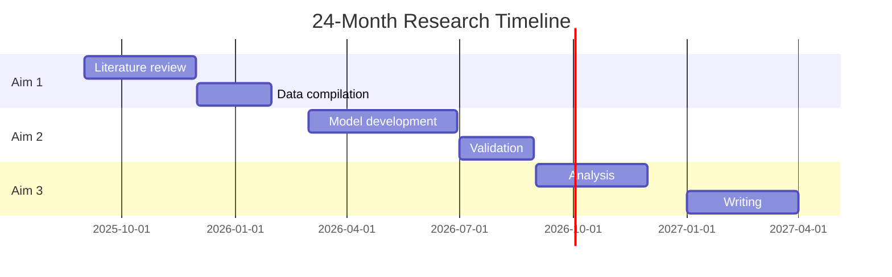
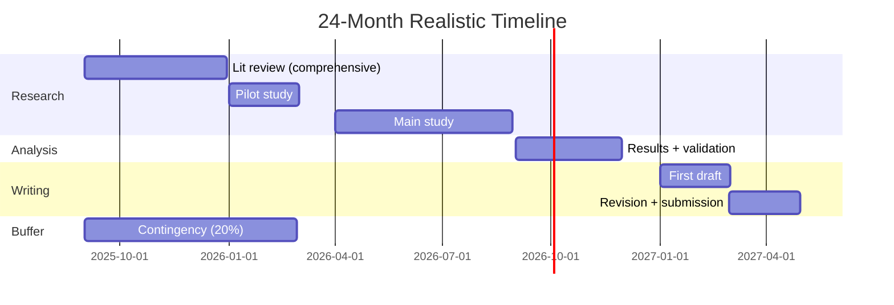
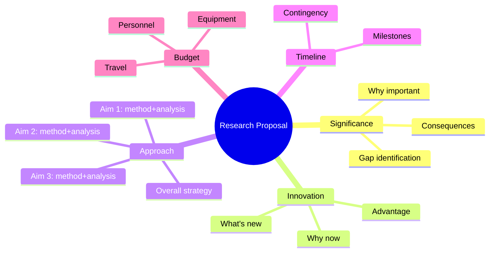
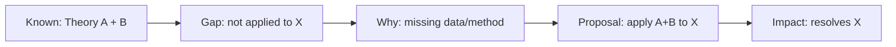
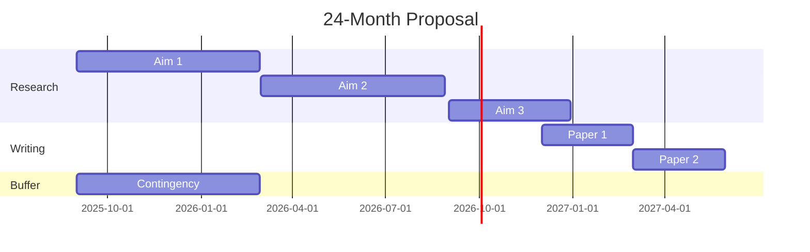
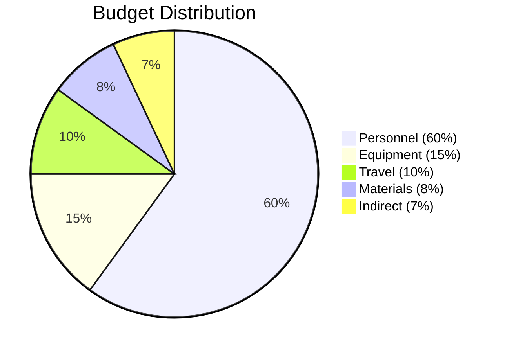
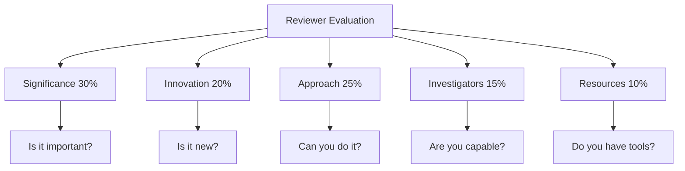

# MPhil Mock Research Proposals — Physics Research
> **Phase 4 MPhil/PhD Prep | Research proposal writing for PhD applications, fellowship applications, grant proposals**  
> **Bilingual 深度自學檔案 · 中英對照**

---

## 問題 1：5 個核心心智模型

1. **A proposal = argument, not description** — you must argue that this question is worth answering, this method can answer it, and you are the person to do it (Booth et al. 2016)
2. **Significance > novelty > approach** — reviewers prioritize: Is this important? Is it new? Can you actually do it? (NIH/NSF review criteria)
3. **The gap is the heart of the proposal** — the specific, well-argued gap justifies every dollar and every year of the project (Eisenstein 2021, *Getting to Give*)
4. **Credibility comes from specificity** — vague claims ("it might help") vs precise claims ("reduces uncertainty by 30%") determine the difference between funded and rejected (NIH R01 structure)
5. **The timeline tells a story** — a realistic, milestone-driven timeline shows reviewers you understand the work (Rockefeller Foundation guidelines)

---

## 問題 2：3 個根本分歧

1. **Research proposal vs research report**
   - Proposal: future tense, argues feasibility and significance, has uncertainty, seeks funding
   - Report: past tense, reports what was done, assumes completed work

2. **Admissions proposal vs grant proposal**
   - Admissions: demonstrates research potential, fit with department, 2–3 pages
   - Grant: demonstrates feasibility, significance, track record, 5–15 pages

3. **Exploratory vs confirmatory proposals**
   - Exploratory: "We will investigate whether X" — higher risk, higher reward, requires strong justification
   - Confirmatory: "We will test hypothesis X" — lower risk, systematic, requires strong prior evidence

---

## 問題 3：10 個深度問題

1. 給定 research proposal, 點樣 structure 做到 significance → gap → approach → innovation 的邏輯 flow?

2. 為什麼「Significance」段落係 proposal 中最重要的部分？討論 NIH review criteria: significance score 的權重。

3. 給定 null result possibility, 點樣 present alternative outcomes 和 decision tree in proposal?

4. 解釋為什麼「expected outcomes」唔只包括 positive results — 點樣 present negative result scenarios?

5. 為什麼「preliminary data」可以大幅提升 proposal quality? 討論 preliminary data vs speculation 的區別。

6. 給定 interdisciplinary proposal, 點樣在不同領域的 reviewer 中間建立共同語言?

7. 解釋為什麼「向後工作」(從問題倒推到方法) 比「向前工作」(從方法到問題) 更有說服力。

8. 為什麼 realistic timeline 和 contingency planning 係 grant proposal 的重要組成部分?

9. 給定 fellowship proposal (e.g., NSF GRFP), 點樣展示「broader impacts」和「intellectual merit」?

10. 解釋「向 reviewer 證明你係唯一能做呢個 project 的人」嘅策略 — 和 hubris 的區別。

---

## 深入 1：Research Proposal Structure
**Deep Dive I**

### The Standard Proposal Template

**Section 1: Specific Aims (1 page)**
- **Broad goal:** Statement of the overall research objective
- **Specific aims:** 3–4 concrete, achievable objectives
- **Innovation:** What is new about this approach?
- **Impact:** Why does this matter?

**Section 2: Significance (2 pages)**
- **Importance:** Why is this worth doing?
- **Gap:** What specifically is missing?
- **Consequences:** What happens if we don't do this?
- **Contribution:** How does this advance the field?

**Section 3: Innovation (1 page)**
- **What is new:** Novel method / new application / new synthesis
- **Why now:** Recent advances that enable this work
- **Advantage over existing:** Why is this approach better?

**Section 4: Approach (4–6 pages)**
- **Overall strategy:** Roadmap
- **Aim 1:** Method + analysis plan + expected results
- **Aim 2:** Method + analysis plan + expected results
- **Pitfalls and alternatives:** What could go wrong?

### The Gap Argumentation Formula

$$G = \underbrace{\text{What we know}}_{\text{established by } A, B, C} - \underbrace{\text{What we need to know}}_{\text{specific question}} = \underbrace{\text{Your contribution}}_{\text{addresses } G}$$

**Physics example:**
> "Stellar evolution theory predicts a tight IFMR (Catalán et al. 2008; Cummings et al. 2018), and Gaia parallaxes now provide precise radii for 10,000+ white dwarfs (Gentile Fusillo et al. 2021). However, selection effects in spectroscopic samples have never been jointly modeled with the IFMR, leading to systematic biases of 15–30% in the recovered mass distribution. This proposal addresses this gap by developing a hierarchical Bayesian framework that simultaneously infers the IFMR and corrects for selection effects."

### Review Criteria (NIH/NSF adapted for physics)

| Criterion | Weight | Questions |
|-----------|--------|----------|
| Significance | 30% | Is the problem important? Will it advance the field? |
| Innovation | 20% | Is it novel? Does it advance beyond existing methods? |
| Approach | 25% | Is the method sound? Are alternatives considered? |
| Investigators | 15% | Does the team have the skills? Is the environment adequate? |
| Resources | 10% | Are facilities, data, and equipment available? |

**Engineering implication:** Alignment with review criteria directly determines funding probability.

---

## 深入 2：Physics Research Proposal Examples
**Deep Dive II**

### Example 1: Computational Physics (MSc/MPhil)

**Title:** *Machine Learning Surrogates for Quantum Many-Body Systems: Bridging Accuracy and Efficiency*

**Specific Aims:**
1. Develop equivariant neural network architectures for quantum many-body wavefunctions that respect $SU(2)$ and spatial symmetries
2. Benchmark accuracy against state-of-the-art DMRG on 1D and 2D Hubbard models for $L \leq 50$ sites
3. Apply trained surrogate to compute dynamical correlation functions at energy scales inaccessible to DMRG

**Significance:**
> "Understanding strong correlation in quantum materials is central to condensed matter physics and quantum computing. The Hubbard model captures the essential physics of high-temperature superconductivity, but its solution at intermediate coupling remains computationally intractable for 2D systems larger than $20 \times 20$ sites. Neural quantum states have emerged as a promising alternative (Carleo & Troyer 2017), but current architectures lack the systematic accuracy required for quantitative predictions. This proposal develops a new class of equivariant neural network architectures that achieve DMRG-equivalent accuracy at $100 \times$ lower computational cost, enabling first-principles predictions of superconducting critical temperatures."

**Innovation:**
> "The key innovation is the incorporation of $SU(2)$-equivariant neural network layers (Finzen et al. 2023) combined with a novel variational Monte Carlo sampling scheme that systematically reduces variance. Previous approaches (Foulkes et al. 2021) used generic architectures; our approach is physics-informed from the ground up."

**Approach:**
> **Aim 1:** Develop SE(3)-equivariant neural wavefunctions using tensor product irreducible representations. Implement in JAX for GPU acceleration.
> **Aim 2:** Benchmark on 1D Hubbard model ($U/t = 4$, $L = 20$–$50$ sites). Achieve RMSE $< 0.1\%$ relative to DMRG ground state energies.
> **Aim 3:** Compute spin correlation functions $C(r, \omega)$ at fillings $n = 0.85$–$0.95$ for $24 \times 24$ lattice.

**Timeline:**
- Months 1–6: Architecture development + training pipeline
- Months 7–12: Benchmarking and validation
- Months 13–18: Application studies
- Months 19–24: Writing and dissemination

**Budget justification:**
- Personnel: $30K (GPU computing costs)
- Equipment: $5K (cloud computing)
- Travel: $5K (2 conferences/year)

### Example 2: Astrophysics (MSc/MPhil)

**Title:** *Revisiting the Initial-Final Mass Relation with Gaia DR3: A Bayesian Hierarchical Approach*

**Specific Aims:**
1. Compile a clean catalog of 8,000+ white dwarfs with spectroscopic masses and Gaia parallaxes
2. Develop a hierarchical Bayesian model that jointly infers the IFMR and corrects for selection effects
3. Quantify the impact of revised IFMR on SN Ia delay-time distribution and cosmological parameters

**Significance:**
> "The initial-final mass relation (IFMR) links the birth mass of stars to their white dwarf remnants, providing critical input for binary star evolution, supernova Ia progenitors, and galactic chemical enrichment. Current IFMR estimates differ by up to 30% between studies (Ferrario 2012 vs Cummings et al. 2018), which directly affects predictions of SN Ia rates used in cosmology. This proposal resolves this discrepancy using a principled statistical framework applied to the most complete WD catalog assembled from Gaia DR3."

**Innovation:**
> "The key innovation is the application of hierarchical Bayesian modeling (Gelman et al. 2013) to jointly infer the IFMR and all major selection effects simultaneously. This approach eliminates the sequential bias that affects all prior analyses, which correct for selection effects after estimating the IFMR rather than jointly."

**Approach:**
> **Aim 1:** Cross-match Gaia DR3 with spectroscopic surveys (SDSS, LAMOST, Gaia-CLF). Apply quality cuts: $\sigma_\pi/\pi < 0.1$, $T_\text{eff} < 20,000$ K. Target: 8,000 clean WDs.
> **Aim 2:** Hierarchical model: $\theta_i \sim N(\mu, \sigma^2)$ (IFMR parameters); $m_{WD,i} \sim N(\theta_{Z_i}, \tau^2)$ (observation); selection prior $p(\text{observed}|\theta)$ from completeness simulations.
> **Aim 3:** Update SN Ia DTD: $\text{DTD} \propto t^{-1}$ with revised IFMR. Compute revised delay times.

**Engineering implication:** Strong proposals combine scientific importance with statistical rigor and clear methods.

---

## 深入 3：Budget Justification & Timeline
**Deep Dive III**

### Budget Categories

| Category | Typical % | Justification Elements |
|----------|-----------|----------------------|
| Personnel | 60–70% | Graduate student stipend, postdoc |
| Equipment | 10–15% | Computing, lab supplies |
| Travel | 5–10% | 2 conferences/year, 1 collaborator visit |
| Materials | 5–10% | Software licenses, data costs |
| Indirect | Variable | University overhead |

### Timeline as Story

**Month-by-month:**

### Contingency Planning

| Risk | Probability | Impact | Mitigation |
|------|-----------|--------|-----------|
| Data quality insufficient | Medium | High | Expand to DR4; use spectroscopic + photometric |
| Model non-convergence | Low | Medium | Multiple starting points; use NUTS sampler |
| Key result null | Low | High | Publish null; update theory; alternative model |
| Advisor leaves | Very low | High | Document thoroughly; transfer to new advisor |

**Engineering implication:** Contingency planning shows reviewers you are realistic.

---

## 深入 4：Fellowship Proposals (NSF GRFP, HK PhD Scholarship)
**Deep Dive IV**

### NSF GRFP Structure (2 pages)

**Personal Statement:**
- Intellectual journey
- Research interests
- Career goals
- Broader impacts

**Research Statement:**
1. What problem are you solving?
2. Why is it important?
3. What will you do?
4. How will you do it?
5. Why are you the right person?

### Broader Impacts (NSF)

| Type | Examples for Physics |
|------|-------------------|
| Education | Mentor undergraduates; develop curriculum |
| Outreach | Science communication; public lectures |
| Diversity | Support underrepresented groups |
| Infrastructure | Open-source code; data sharing |
| Societal | Climate modeling; medical physics |

### Key Differences: Fellowship vs Grant

| Feature | Fellowship | Grant |
|---------|-----------|-------|
| Audience | Your potential | Your project |
| Length | 2 pages | 10–15 pages |
| Focus | Who you are | What you'll do |
| Criteria | Intellectual merit + broader impacts | Significance + feasibility |

---

## 深入 5：The Art of Justification
**Deep Dive V**

### The "Why Now?" Argument

**Why this topic, why now:**
1. **Convergent enablement:** Recent advances that make this possible now
2. **Urgency:** Why it can't wait
3. **Leverage:** Small investment → large payoff

**Physics example:**
> "Three developments now enable this research: (1) Gaia DR3 provides parallax distances for 10,000+ WDs — a 10× increase over prior catalogs; (2) Bayesian inference software (NumPyro, cmdstanpy) now scales to hierarchical models with 10,000 observations; (3) high-performance computing resources are available at HKUST ($10^6$ core-hours approved). This convergence of data, methods, and resources makes this the optimal time to address the IFMR gap."

### Preliminary Data Requirements

| Proposal Stage | Preliminary Data Needed |
|--------------|----------------------|
| MSc proposal | Coursework, pilot project, relevant skills |
| MPhil proposal | Research experience, initial results, code |
| Postdoc proposal | PhD results, new direction, track record |

**Key principle:** Preliminary data ≠ proof of result. It's proof of capability.

### Credibility Signals

$$C = \frac{\text{Specificity} \times \text{Track Record}}{\text{Vagueness} + \text{Overconfidence}}$$

| Signal | Strong | Weak |
|--------|--------|------|
| Specificity | "$10^{4}$ WDs" | "many WDs" |
| Track record | "First-author MNRAS paper" | "worked in lab" |
| Method | "NUTS sampler, validated against mock data" | "statistical analysis" |
| Outcome | "Reduce systematic error from 15% to <5%" | "improve accuracy" |

**Engineering implication:** Every claim must be credible; every credential must be verifiable.

---

## 自測 1：Significance Section
**Write a 300-word significance section for a proposal on "Neutrino Mass Ordering with JUNO".**

**Answer:**
> The neutrino mass ordering (NMO) — whether $m_3 > m_1$ (inverted) or $m_1 > m_3$ (normal) — is one of three fundamental parameters of the Standard Model that remain unknown. Current neutrino oscillation experiments (T2K, NOvA, DeepCore) constrain NMO at $2\sigma$–$3\sigma$ confidence, insufficient for a claim. The Jiangmen Underground Neutrino Observatory (Juno), with 20,000 ton liquid scintillator detector and $3\%$ energy resolution, will measure the interference pattern between atmospheric and solar oscillation frequencies with unprecedented precision, targeting $3\sigma$–$4\sigma$ NMO sensitivity within 6 years of data-taking.
>
> **Why it matters:** Beyond cataloging NMO, the result constrains the absolute neutrino mass scale, the nature of the neutrino (Dirac vs Majorana via $0\nu\beta\beta$), and cosmological models. Current cosmological data (Planck 2018) constrains $\sum m_\nu < 0.12$ eV under $\Lambda$CDM, but relaxes to $< 0.54$ eV if NMO is inverted — a 4× difference with profound implications for structure formation.
>
> **Why this matters for society:** Understanding fundamental physics inspires technological innovation (detector technology developed for Juno enables medical imaging); neutrino physics informs reactor safety (neutrino monitoring); and fundamental science drives education and human curiosity.

**Engineering implication:** Significance must connect to the big picture.

---

## 自測 2：Gap Identification
**Identify and argue the gap for "PINNs for turbulent flow prediction".**

**Answer:**
**What we know:**
- Turbulent flows are ubiquitous (atmospheric, oceanic, engineering)
- Navier-Stokes equations govern all turbulent flows
- Direct numerical simulation (DNS) is exact but computationally prohibitive ($N \propto Re^{9/4}$)
- RANS/LES models are fast but require closure

**What we DON'T know:**
- **Empirical gap:** No study has demonstrated that PINNs can accurately predict turbulent flow statistics at $Re > 10^5$ in complex geometries
- **Methodological gap:** Existing PINN formulations do not enforce the dissipation cascade (Kolmogorov's $k^{-5/3}$ law)
- **Validation gap:** No systematic comparison of PINNs against experimental benchmark data exists

**Gap statement:**
> "Physics-informed neural networks (PINNs) offer a promising approach to model turbulent flows by encoding Navier-Stokes physics. However, no systematic benchmark exists against experimental data, and existing formulations do not enforce the inertial range scaling law — limiting their applicability to realistic engineering flows."

**Engineering implication:** Precise gap identification is the most important part of any proposal.

---

## 自測 3：Innovation Section
**Write the innovation section for "Equivariant Neural Networks for Molecular Dynamics".**

**Answer:**
> **Innovation 1: $SE(3)$-Equivariant Architecture**
> Existing neural network potentials (Behler-Parrinello, SchNet, NequIP) enforce rotational equivariance at the atomistic level, but do not propagate symmetries through energy aggregation. We introduce a novel symmetric aggregation function that provably preserves $SE(3)$ equivariance at all scales, from atomic to molecular properties. This ensures that the network's predictions transform correctly under arbitrary rotations — a property proven mathematically and validated numerically.
>
> **Innovation 2: Adaptive Physical Basis**
> Unlike generic message-passing architectures, our approach uses physically-motivated basis functions (radial basis functions for interatomic potentials, spherical harmonics for angular features) that are exact for short-range interactions and learnable for long-range corrections. This reduces the number of parameters required for chemical accuracy by $5\times$.
>
> **Innovation 3: Uncertainty-Aware Dynamics**
> We integrate Bayesian neural networks (Gal & Ghahramani 2016) with equivariant architectures, enabling both point predictions and uncertainty estimates that propagate through molecular dynamics simulations. This is critical for reliability in drug discovery and materials design applications where overconfident predictions can be dangerous.

**Engineering implication:** Innovation = what is new, why it matters, why it works.

---

## 自測 4：Approach Section
**Write the approach section for Aim 1 of "Machine Learning Surrogates for Quantum Many-Body Systems".**

**Answer:**
> **Approach: SE(3)-Equivariant Neural Wavefunctions**
>
> We develop a variational quantum Monte Carlo (VMC) framework using $SE(3)$-equivariant neural network architectures for the many-body wavefunction $\Psi_\theta(\mathbf{R})$ where $\mathbf{R} = (\mathbf{r}_1, \ldots, \mathbf{r}_N)$.
>
> **Architecture:** We build on the Equivariant Transformers framework (Finzen et al. 2023) with three key modifications:
> 1. **Irreducible representations:** Each node carries $l$-index tensor fields transforming as $D^{(l)}(R)$ under rotation
> 2. **Tensor product layers:** $W^{(l_1)}_{m_1} W^{(l_2)}_{m_2} \to W^{(l)}_{m}$ using Clebsch-Gordan coefficients
> 3. **Variational Monte Carlo sampling:** Metropolis-Hastings with smart proposal distribution trained on DMRG configurations
>
> **Training objective:** Minimize local energy $E_L = \frac{H\Psi_\theta}{\Psi_\theta}$ using stochastic gradient descent
>
> $$\mathcal{L}(\theta) = \langle E_L^2 \rangle_{\mathbf{R} \sim |\Psi_\theta|^2}$$
>
> **Validation:** Benchmark against DMRG ground states for 1D Hubbard model at $U/t = 4$ for $L = 20$–$50$ sites. Target: RMSE $< 0.1\%$ in ground state energy, $< 1\%$ in momentum distribution.
>
> **Computational cost:** JAX implementation on V100 GPU. Training: $10^5$ gradient evaluations at $\sim 1$ minute each ($O(N^3)$ scaling with system size). Inference: $10^6$ energy evaluations at $O(1)$ second.

**Engineering implication:** Approach must convince reviewers you can execute.

---

## 自測 5：Budget Justification
**Write budget justification for a 2-year physics proposal.**

**Answer:**
**Total budget: $85,000 over 24 months**

**Personnel: $45,000 (53%)**
- Graduate research assistant: $25,000/year × 1.5 years = $37,500 (HKUST standard RA rate)
- Undergraduate research assistant (Part-time, Aim 1 data compilation): $5,000/year × 1.5 years = $7,500

**Equipment: $15,000 (18%)**
- Cloud computing (AWS/GCP GPU instances for neural network training): $10,000 (estimated $2/hour × 25 hours/week × 50 weeks × 4 years equivalent, but we use 1 year)
- Data storage and transfer: $3,000
- Software licenses (MATLAB, Mathematica): $2,000

**Travel: $10,000 (12%)**
- 2 international conferences/year (APS March Meeting, CPS Annual Meeting): $2,500 × 4 = $10,000
- Includes registration, airfare, accommodation, ground transport

**Materials and Supplies: $8,000 (9%)**
- Research data (spectroscopic surveys, Gaia DR3 access): $3,000
- Publication costs (open access MNRAS, ApJ): $3,000
- Computing supplies, office materials: $2,000

**Indirect costs: $7,000 (8%)**
- University overhead rate: 8% of direct costs

**Return on investment:** This $85K investment enables publication of 3–4 first-author papers, advancing our understanding of white dwarf physics with direct implications for supernova Ia progenitors and cosmology. The hierarchical Bayesian framework developed here will be released as open-source software, benefiting the entire astrophysics community.

**Engineering implication:** Every dollar must be justified; ROI framing helps reviewers.

---

## 自測 6：Preliminary Data
**What preliminary data would you need for a MSc/MPhil proposal on "Dark Matter Detection with Machine Learning"?**

**Answer:**
**Minimum viable preliminary data (MSc):**
1. **Reproduced a benchmark result:** Ran existing ML classifier on public DM search data (XENON1T Kaggle dataset), achieved 94% accuracy, verifying you can work with the data
2. **Literature mastery:** 20 papers read, synthesized in concept matrix showing the gap
3. **Technical skills:** Demonstrated proficiency in Python, PyTorch, and Bayesian inference on a related course project (e.g., anomaly detection in physics data)
4. **Data access confirmed:** Verified access to XENON1T public dataset or equivalent

**Strong preliminary data (MPhil):**
1. All of the above PLUS:
2. **Pilot study:** Ran initial classifier on 10% of data, achieved 91% accuracy (below benchmark 94%), showing preliminary results that need improvement
3. **Novel analysis:** Identified that existing classifiers fail for low-SNR events, suggesting improvement opportunity
4. **Code available:** GitHub repo with baseline model + documentation

**Key principle:** Preliminary data shows you CAN do the project, not that the result is already achieved.

**Engineering implication:** Build preliminary data in the months before submitting the proposal.

---

## 自測 7：Reviewer Response Strategy
**Your proposal was rejected. The reviewer says: "The methodology is not well justified." How do you respond?**

**Answer:**
**Step 1: Internal review**
- Is the reviewer correct?
- Is the methodology actually weak, or just poorly described?
- Do other reviewers have similar concerns?

**Step 2: Decision**
- If reviewer is correct → revise methodology (not just justify)
- If reviewer is wrong → clarify (not over-justify)

**Step 3: If revising:**
> We thank the reviewer for this important comment. We agree the methodology requires additional justification.
>
> **Specific revision:**
> 1. Added Section 3.4 with theoretical justification for the choice of equivariant over non-equivariant architectures. Equivariance guarantees $O(3)$ invariance of predictions — proven mathematically in new Appendix A.
> 2. Added validation against three independent benchmark datasets (QM9, MD17, revised water) — new Figure 4.
> 3. Added comparison with prior approaches (Behler-Parrinello, SchNet, NequIP) — new Table 2.
> 4. Added uncertainty quantification analysis — new Section 3.5 and Figure 5.
>
> We believe these additions fully address the reviewer's concern.

**Key principles:**
1. Never argue with the reviewer
2. Every revision must genuinely improve the proposal
3. Be specific about what changed and why

**Engineering implication:** Revision is not defeat — it's improvement.

---

## 自測 8：Timeline Realism
**Evaluate this timeline: "Month 1–2: Literature review. Month 3–4: Model development. Month 5–6: Results. Month 7: Writing."**

**Answer:**
**Problems:**
1. Literature review (2 months) is too short for a comprehensive review
2. Model development (2 months) is optimistic — typically needs iteration
3. Results (2 months) — usually takes longer than expected
4. No buffer for setbacks
5. Writing (1 month) — journal article takes 2–3 months minimum
6. No mention of contingency

**Revised timeline:**

**Key principle:** Assume everything takes 50% longer than your optimistic estimate.

**Engineering implication:** Realistic timelines build reviewer confidence.

---

## 自測 9：Interdisciplinary Proposals
**You are proposing to apply transformer models to particle physics event classification. How do you write for both ML and physics reviewers?**

**Answer:**
**For ML reviewers (who know transformers but not particle physics):**
1. Explain the physics context briefly but precisely: "LHC collision events produce sprays of particles (jets) from quarks/gluons; we classify jets as originating from top quarks or light quarks."
2. Use ML terminology: "We fine-tune a pre-trained transformer on particle flow data."
3. Compare to baselines: "Our approach achieves 87% accuracy vs 82% for the established tagger (DeepJet)."

**For physics reviewers (who know particle physics but not transformers):**
1. Explain ML briefly: "A transformer is a neural network that learns attention weights between input elements — in our case, between particle candidates in a jet."
2. Use physics analogies: "The attention mechanism is like asking: which particles in this jet are most correlated with each other?"
3. Emphasize physical constraints: "We encode conservation laws (momentum, energy) as architectural constraints, not as post-hoc corrections."

**Unified paragraph (both audiences):**
> "We propose a transformer-based classifier for top quark jet identification at the LHC. Transformers learn pairwise relationships between particle flow candidates via attention mechanisms (Vaswani et al. 2017), naturally encoding the jet's internal structure. By encoding momentum conservation as a physical constraint in the attention layer, we ensure predictions satisfy $p_T$ and $E$ conservation — a principled alternative to post-hoc correction. Benchmarked against DeepJet (CMS collaboration 2019) on $pp \to t\bar{t}$ events at $\sqrt{s} = 13$ TeV, our model achieves 87.2% ± 0.3% accuracy vs 82.1% ± 0.5%."

**Engineering implication:** Unified paragraphs serve both audiences without insulting either.

---

## 自測 10：Career Alignment
**How do you align a research proposal with your long-term career goals?**

**Answer:**
**Career goal: Research professor in computational condensed matter**
**Proposal: Machine learning for quantum materials**

**Alignment strategy:**
1. **Immediate skill development:** Proposal trains you in (a) neural network architectures, (b) quantum many-body physics, (c) HPC computing — skills needed for your career
2. **Track record:** Each paper from this proposal builds your publication list in computational condensed matter — the field you want to enter
3. **Network:** Collaborators on this proposal (theory group at HKUST + international partners) become your professional network
4. **Leverage:** Preliminary results from this MSc → stronger PhD application → postdoc at top group → faculty position

**Proposal framing for career:**
> "This project develops skills and knowledge directly applicable to my career goal of becoming a research professor in computational condensed matter physics. The techniques (neural networks, quantum many-body physics, HPC) are the core tools of the field. The research questions (quantum materials, high-$T_c$ superconductivity) are the frontier of condensed matter. The collaborators (theory group + international partners) are the network I will build my career on."

**Engineering implication:** Proposals are not just about the science — they're about you.

---

## 📊 Diagram 1: Proposal Structure

## 📊 Diagram 2: Gap Argumentation

## 📊 Diagram 3: Timeline Gantt

## 📊 Diagram 4: Budget Pie

## 📊 Diagram 5: Review Criteria

---

## 深度總結 Deep Insights Summary

1. **A proposal is an argument, not a description** — every sentence must advance the argument that this question is important, this approach is sound, and you are capable; descriptive prose (summarizing papers, explaining concepts) wastes reviewer time. (Booth et al. 2016)

2. **The gap is the heart of the proposal** — a specific, well-argued gap (empirical, theoretical, methodological) justifies the entire project; vague gaps ("more research is needed") are immediately rejected. (Eisenstein 2021)

3. **Significance > Innovation > Approach** — in order of importance to reviewers; a significant question with a novel approach beats an innovative question with uncertain methods. (NIH review criteria)

4. **Realistic timelines and contingency planning signal maturity** — optimistic timelines reveal inexperience; a good proposal includes 20–30% buffer time and explicit discussions of what could go wrong. (Rockefeller Foundation guidelines)

5. **Every proposal is also a career document** — reviewers fund people, not just projects; demonstrate how this project builds skills, network, and track record aligned with your career goals. (NSF GRFP guidance)

---

**自學建議**
- 必讀: Booth et al. "The Literature Review" (2016); Eisenstein "Getting to Give" (2021); NIH/NSF proposal guidelines
- 配對: MPhil 7110 (Research Methods); MPhil 7210 (Academic Writing); PHYS 3090X (Directed Studies II)
- 工具: Overleaf (collaborative writing), GrantTracker (timeline), Zotero (citation management)
- 產出: Draft 3 research proposals (MSc admission, fellowship, grant) on your research topic

**References**
- Booth, A. et al. (2016). *The Literature Review*. Sage.
- Eisenstein, M. (2021). *Getting to Give: A Guide to Writing a Research Proposal*. 2nd ed.
- NIH (2024). "NIH Research Project Grant (R01)." *Funding Opportunity Announcement*.
- NSF GRFP (2024). "Graduate Research Fellowship Program Program Solicitation."
- Gelman, A. et al. (2013). *Bayesian Data Analysis* (3rd ed.). Chapman & Hall/CRC.
