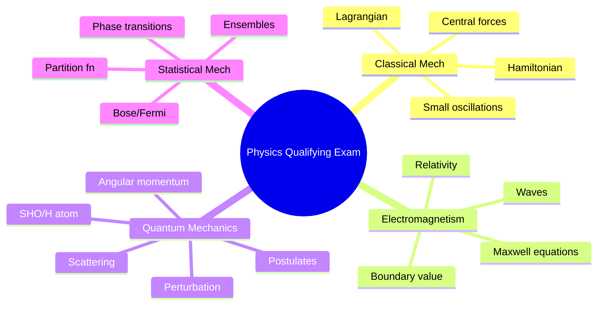
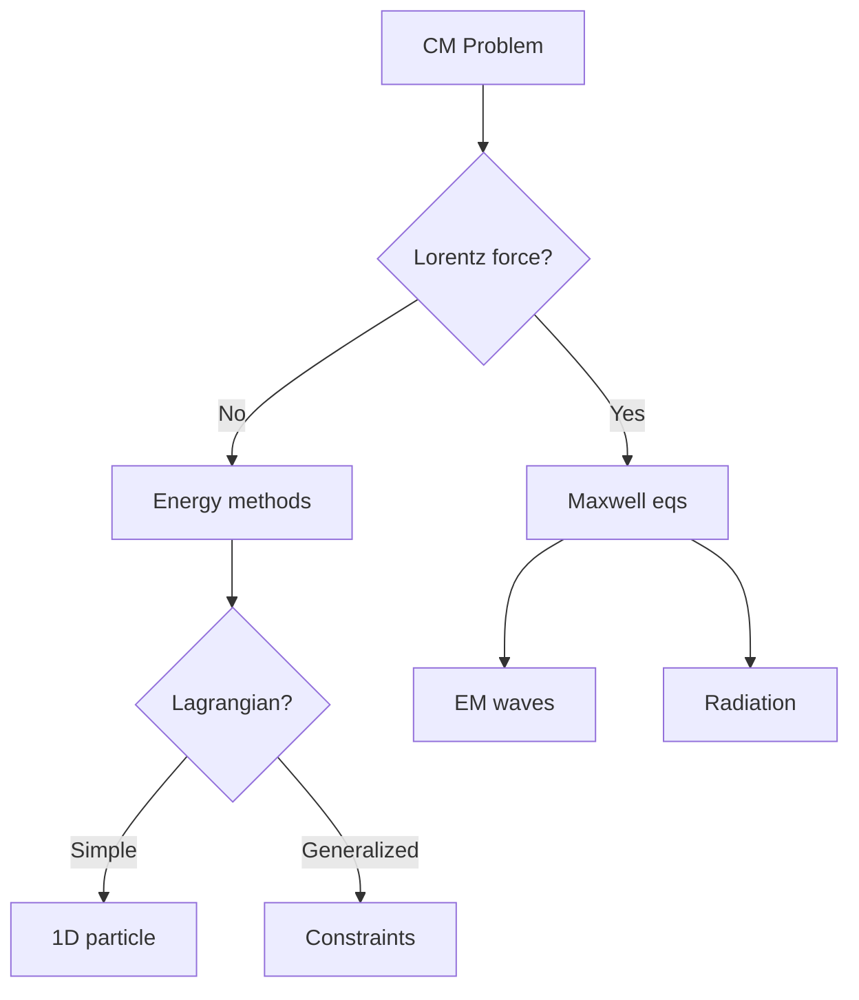
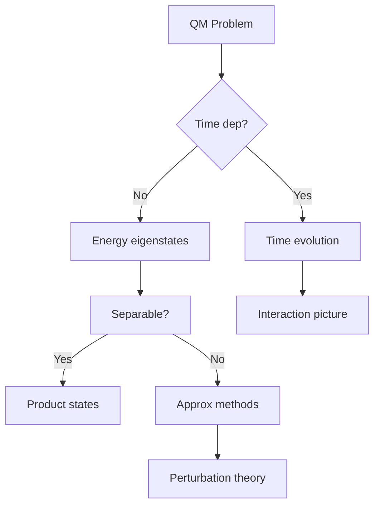
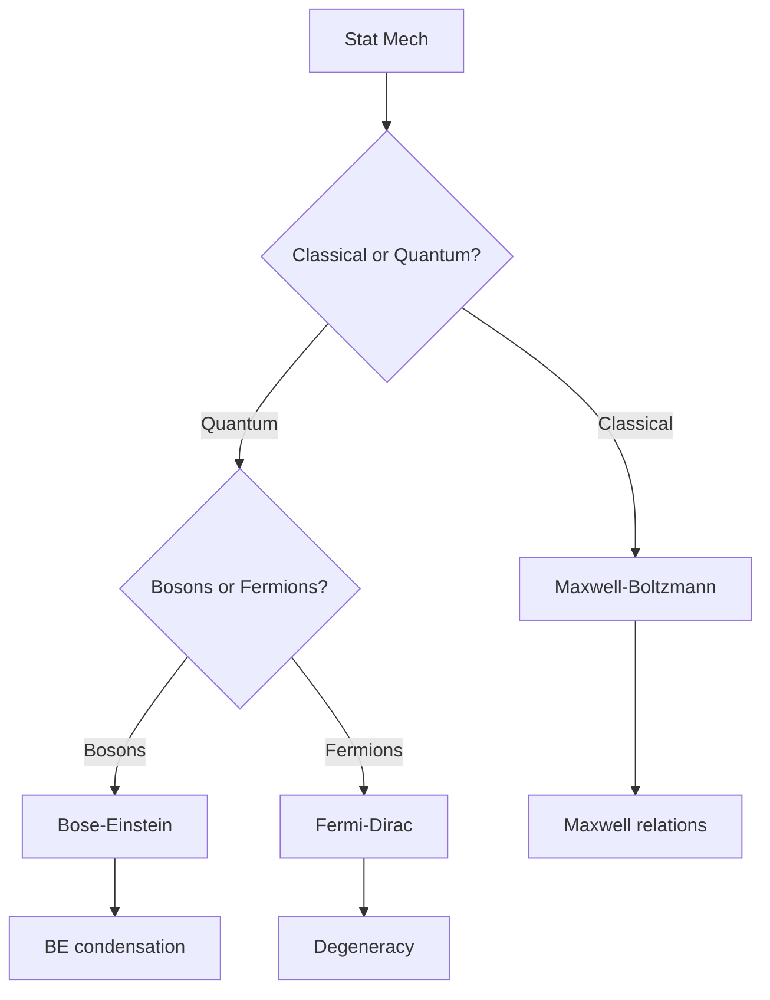
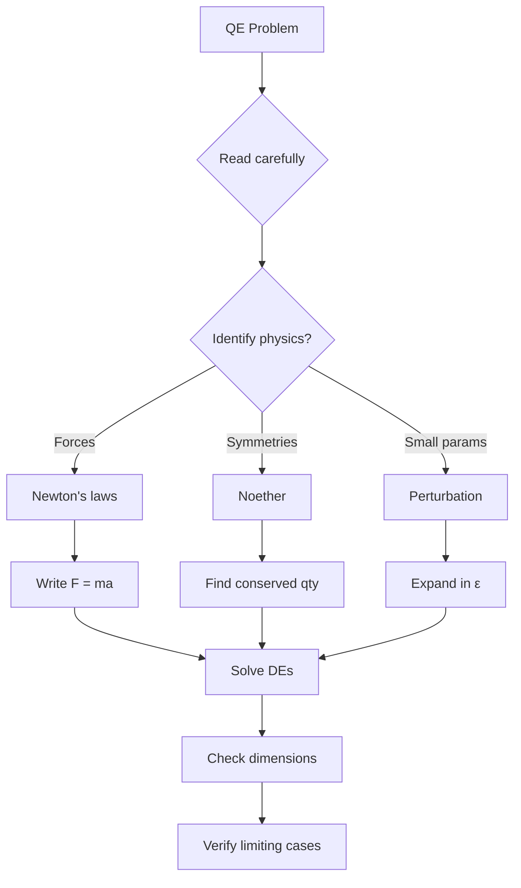

# MPhil Qualifying Exam Practice — Physics
> **Phase 4 MPhil/PhD Prep | PhD qualifying exam preparation: Classical Mechanics, Electromagnetism, Quantum Mechanics, Statistical Mechanics**  
> **Bilingual 深度自學檔案 · 中英對照**

---

## 問題 1：5 個核心心智模型

1. **Four fundamental areas unified by symmetry and variational principles** — Noether's theorem connects symmetries to conservation laws; variational principles (Hamilton's principle) underlie all of theoretical physics (Goldstein 3rd ed.)
2. **Every equation has a domain of validity** — Maxwell's equations are classical, not quantum; Schrödinger is non-relativistic; always ask: where does this break down? (Jackson *Classical Electrodynamics*)
3. **Statistical mechanics bridges microscopic and macroscopic** — ensembles, entropy, and partition functions connect atomistic physics to thermodynamics (Kubo *Statistical Mechanics*)
4. **Quantum mechanics requires three formalisms** — wave mechanics, matrix mechanics, and path integral give the same predictions; fluency in all three is essential (Sakurai *Modern QM*)
5. **Qualifying exams test problem-solving, not memorization** — the goal is to recognize which principles apply and execute the derivation; speed and accuracy both matter (Klein, *Learning to Think Like a Physicist*)

---

## 問題 2：3 個根本分歧

1. **Lagrangian vs Hamiltonian mechanics**
   - Lagrangian: coordinates + velocities, minimal computation, generalized forces
   - Hamiltonian: phase space, more mathematical structure, canonical transformations
   - Preferred for: classical mechanics (Lagrangian), statistical mechanics (Hamiltonian)

2. **Boltzmann vs Gibbs entropy**
   - Boltzmann: $S = k_B \ln W$, counting microstates, statistical interpretation
   - Gibbs: $S = -k_B \sum p_i \ln p_i$, ensemble average, proper for open systems

3. **Schrödinger vs Heisenberg vs interaction picture**
   - Schrödinger: state evolves, operators fixed → best for time-dependent perturbation theory
   - Heisenberg: state fixed, operators evolve → best for conserved quantities
   - Interaction: split the evolution → best for scattering theory

---

## 問題 3：10 個深度問題

1. 給定 central force problem, 點樣 derive the general orbit equation from Lagrange's equation? 討論 effective potential analysis。

2. 為什麼 Noether's theorem 被稱為「物理學基本定理」? 推導 continuous symmetry → conservation law。

3. 給定 Maxwell's equations in vacuum, 點樣推導 electromagnetic wave equation 和光速 $c = 1/\sqrt{\mu_0\epsilon_0}$?

4. 解釋為什麼 Young's double slit experiment 係 quantum mechanics 的核心 evidence — 而唔只係 wave optics。

5. 給定 canonical ensemble, 點樣 derive partition function 和熱力學量? 推導 $F = -k_BT \ln Z$。

6. 為什麼 Gibbs factor $e^{-\beta H}$ 比 microcanonical 更常用? 討論 ensemble equivalence。

7. 給定 spin-1/2 system, 點樣 construct the density matrix? 推導Bloch sphere representation。

8. 為什麼 path integral formulation 係 Feynman 的最重要貢獻? 推導 from Schrödinger to path integral。

9. 給定 Lorentz transformation, 點樣 transform electromagnetic field tensor $F^{\mu\nu}$? 推導 E 和 B 的 transformation。

10. 解釋為什麼 gauge symmetry 唔係真正的 symmetry — 而是 redundancy。

---

## 深入 1：Classical Mechanics — Problem-Solving Toolkit
**Deep Dive I**

### Central Force Problem (Goldstein Ch. 3)

**Lagrangian in polar coordinates:**
$$L = \frac{1}{2}m(\dot{r}^2 + r^2\dot{\theta}^2) - V(r)$$

**Constants of motion:**
- Angular momentum: $p_\theta = mr^2\dot{\theta} = \ell$ (conserved)
- Energy: $E = \frac{1}{2}m\dot{r}^2 + V_\text{eff}(r)$, $V_\text{eff}(r) = V(r) + \frac{\ell^2}{2mr^2}$

**Orbit equation (Binet equation):**
$$u''(\theta) + u(\theta) = -\frac{m}{\ell^2 u^2}F\left(\frac{1}{u}\right), \quad u \equiv \frac{1}{r}$$

**Kepler's problem ($V = -k/r$):**
$$u'' + u = \frac{mk}{\ell^2}$$

General solution: $u(\theta) = \frac{mk}{\ell^2}[1 + e\cos(\theta - \theta_0)]$

**Kepler's laws:**
1. Elliptical orbits: $r(\theta) = \frac{p}{1+e\cos\theta}$, $p = \frac{\ell^2}{mk}$
2. Equal areas: $\dot{A} = \frac{1}{2}r^2\dot{\theta} = \frac{\ell}{2m}$ = constant
3. Period: $T^2 = \frac{4\pi^2}{G(M+m)}a^3$

### Small Oscillations (Goldstein Ch. 6)

**$N$ degrees of freedom:**
$$T = \frac{1}{2}\dot{q}^T A \dot{q}, \quad V = \frac{1}{2}q^T B q$$

**Eigenvalue problem:** $\det|B - \omega^2 A| = 0$

Normal frequencies $\omega_\alpha$, normal coordinates $Q_\alpha$:
$$q = S Q, \quad H = \sum_\alpha \frac{1}{2}(P_\alpha^2 + \omega_\alpha^2 Q_\alpha^2)$$

**Physics of small oscillations:** $N$ coupled oscillators → $N$ normal modes, each oscillating independently at $\omega_\alpha$.

### Variational Principles

**Hamilton's principle:**
$$\delta S = \delta \int_{t_1}^{t_2} L(q,\dot{q},t)dt = 0$$

**Euler-Lagrange:**
$$\frac{d}{dt}\left(\frac{\partial L}{\partial \dot{q}_i}\right) - \frac{\partial L}{\partial q_i} = 0$$

**Canonical momentum:** $p_i = \partial L / \partial \dot{q}_i$

**Hamilton's equations:**
$$\dot{q}_i = \frac{\partial H}{\partial p_i}, \quad \dot{p}_i = -\frac{\partial H}{\partial q_i}$$

---

## 深入 2：Electromagnetism — Problem-Solving Toolkit
**Deep Dive II**

### Maxwell's Equations (in vacuum, SI units)

$$\nabla\cdot\mathbf{E} = \frac{\rho}{\epsilon_0} \quad (text{Gauss's law})$$
$$\nabla\cdot\mathbf{B} = 0 \quad (text{no magnetic monopoles})$$
$$\nabla\times\mathbf{E} = -\frac{\partial\mathbf{B}}{\partial t} \quad (text{Faraday's law})$$
$$\nabla\times\mathbf{B} = \mu_0\mathbf{J} + \mu_0\epsilon_0\frac{\partial\mathbf{E}}{\partial t} \quad (text{Ampère-Maxwell})$$

### Wave Equation Derivation

Take curl of Faraday's law, use vector identity $\nabla\times(\nabla\times\mathbf{E}) = \nabla(\nabla\cdot\mathbf{E}) - \nabla^2\mathbf{E}$:

$$\nabla^2\mathbf{E} - \mu_0\epsilon_0\frac{\partial^2\mathbf{E}}{\partial t^2} = \mu_0\frac{\partial\mathbf{J}}{\partial t} + \nabla\rho/\epsilon_0$$

In vacuum ($\rho=0, \mathbf{J}=0$):
$$\nabla^2\mathbf{E} = \mu_0\epsilon_0\frac{\partial^2\mathbf{E}}{\partial t^2}$$

Plane wave solution: $\mathbf{E} = \mathbf{E}_0 e^{i(\mathbf{k}\cdot\mathbf{r} - \omega t)}$
$$\Rightarrow k^2 = \mu_0\epsilon_0\omega^2 \implies c = \frac{\omega}{k} = \frac{1}{\sqrt{\mu_0\epsilon_0}} = 2.998 \times 10^8\ \text{m/s}$$

**Key result:** $c$ derived purely from EM constants — Einstein was inspired by this.

### Poynting Vector and Energy

$$\mathbf{S} = \mathbf{E}\times\mathbf{H}, \quad u = \frac{1}{2}(\epsilon_0 E^2 + \frac{1}{\mu_0}B^2)$$

Energy conservation: $-\partial u/\partial t = \nabla\cdot\mathbf{S} + \mathbf{J}\cdot\mathbf{E}$

### Boundary Value Problems (Jackson Ch. 2)

**Uniqueness theorem:** If $V$ or $\partial V/\partial n$ specified on all boundaries → unique solution of Laplace's equation.

**Method of images:**
- Point charge $q$ at distance $a$ above grounded plane → image charge $-q$ at $z = -a$
- Potential $V = \frac{q}{4\pi\epsilon_0}\left[\frac{1}{\sqrt{(x^2+y^2+(z-a)^2}} - \frac{1}{\sqrt{x^2+y^2+(z+a)^2}}\right]$

### Relativistic Electromagnetism (Jackson Ch. 11)

**Four-potential:** $A^\mu = (\phi/c, \mathbf{A})$, field tensor $F^{\mu\nu} = \partial^\mu A^\nu - \partial^\nu A^\mu$

**Lorentz transformation of fields:**
$$\mathbf{E}'_\parallel = \mathbf{E}_\parallel, \quad \mathbf{E}'_\perp = \gamma(\mathbf{E}_\perp + \mathbf{v}\times\mathbf{B})$$
$$\mathbf{B}'_\parallel = \mathbf{B}_\parallel, \quad \mathbf{B}'_\perp = \gamma\left(\mathbf{B}_\perp - \frac{\mathbf{v}\times\mathbf{E}}{c^2}\right)$$

---

## 深入 3：Quantum Mechanics — Problem-Solving Toolkit
**Deep Dive III**

### Fundamental Postulates (Sakurai Ch. 1)

**Postulate 1:** State of system = vector $|\psi\rangle$ in Hilbert space

**Postulate 2:** Observables = Hermitian operators $\hat{A}$; measurement yields eigenvalue $a_n$ with probability $|\langle a_n|\psi\rangle|^2$

**Postulate 3:** After measurement, state collapses to $|a_n\rangle$

**Postulate 4:** Time evolution: $i\hbar\partial_t|\psi\rangle = \hat{H}|\psi\rangle$

### Key Problems and Solutions

**1. Free particle:**
$$H = \frac{\hat{p}^2}{2m}, \quad |\psi(t)\rangle = \int \frac{d^3p}{(2\pi\hbar)^3} \phi(\mathbf{p}) e^{-iE_p t/\hbar}|\mathbf{p}\rangle$$

**2. Harmonic oscillator:**
$$H = \frac{\hat{p}^2}{2m} + \frac{1}{2}m\omega^2\hat{x}^2, \quad E_n = \hbar\omega\left(n+\frac{1}{2}\right)$$
$$a|n\rangle = \sqrt{n}|n-1\rangle, \quad a^\dagger|n\rangle = \sqrt{n+1}|n+1\rangle$$

**3. Hydrogen atom:**
$$V(r) = -\frac{e^2}{4\pi\epsilon_0 r}, \quad E_n = -\frac{13.6\ \text{eV}}{n^2}$$
$$|\psi_{nlm}(r,\theta,\phi)|^2 = R_{nl}(r)Y_{lm}(\theta,\phi)$$

**Angular momentum algebra:**
$$[L_i, L_j] = i\hbar\epsilon_{ijk}L_k, \quad L^2|l,m\rangle = \hbar^2 l(l+1)|l,m\rangle$$

**Spin:** $S_z|m_s\rangle = \hbar m_s|m_s\rangle$, $S^2|s,m_s\rangle = s(s+1)\hbar^2|s,m_s\rangle$

### Perturbation Theory

**Time-independent, non-degenerate (Sakurai Ch. 5):**
$$E_n^{(1)} = \langle n^{(0)}|H'|n^{(0)}\rangle$$
$$|n^{(1)}\rangle = \sum_{m\neq n}\frac{\langle m^{(0)}|H'|n^{(0)}\rangle}{E_n^{(0)} - E_m^{(0)}}|m^{(0)}\rangle$$

**First-order correction to energy:** $E_n = E_n^{(0)} + E_n^{(1)} + E_n^{(2)} + \ldots$

**Degenerate perturbation theory:** diagonalize $H'$ within degenerate subspace.

**Time-dependent (Sakurai Ch. 2):**
$$c_n(t) = - \frac{i}{\hbar}\sum_m \langle n|H'(t)|m\rangle e^{i\omega_{nm}t/\hbar}c_m(0)$$

---

## 深入 4：Statistical Mechanics — Problem-Solving Toolkit
**Deep Dive IV**

### Microcanonical Ensemble

$$S = k_B \ln W, \quad W = \text{number of microstates with } E \leq H \leq E+\Delta E$$

**Liouville's theorem:** $\frac{d\rho}{dt} = 0$ in phase space

### Canonical Ensemble

$$\rho(q,p) = \frac{1}{Z}e^{-\beta H(q,p)}, \quad \beta = \frac{1}{k_BT}$$

**Partition function:**
$$Z = \sum_n e^{-\beta E_n} = \int \frac{d^{3N}q\,d^{3N}p}{(2\pi\hbar)^{3N}} e^{-\beta H}$$

**Helmholtz free energy:**
$$F = -k_BT \ln Z, \quad S = -\left(\frac{\partial F}{\partial T}\right)_V, \quad U = F + TS$$

### Quantum Statistics

**Bose-Einstein:** $n_\epsilon = \frac{1}{e^{\beta(\epsilon-\mu)} - 1}$ (photons, phonons, bosons)

**Fermi-Dirac:** $f_\epsilon = \frac{1}{e^{\beta(\epsilon-\mu)} + 1}$ (electrons, fermions)

**Derivation from grand canonical:**
$$Z_{gc} = \prod_\epsilon (1 \pm e^{-\beta(\epsilon-\mu)})^{\mp 1}$$

**Mean occupation:**
$$\langle n_\epsilon \rangle = \frac{1}{\beta}\frac{\partial}{\partial\epsilon}\ln Z_{gc} = \frac{1}{e^{\beta(\epsilon-\mu)} \pm 1}$$

### Phase Transitions

**Landau theory:** $F = F_0 + a(T-T_c)\phi^2 + b\phi^4 + \ldots$

**Critical exponents:**
| Exponent | Definition |
|-----------|-----------|
| $\alpha$ | $C_V \propto |t|^{-\alpha}$ |
| $\beta$ | $M \propto |t|^\beta$ |
| $\gamma$ | $\chi \propto |t|^{-\gamma}$ |
| $\delta$ | $M \propto |H|^{1/\delta}$ |

**Universality:** $\alpha, \beta, \gamma, \delta$ depend only on symmetry and dimensionality, not on microscopic details.

---

## 深入 5：Statistical Physics — Advanced Topics
**Deep Dive V**

### Kubo Formula for Transport

**Linear response (Kubo 1966):**
$$\chi_{AB}(\omega) = \frac{i}{\hbar}\int_0^\infty dt\, e^{i\omega t}\langle[A(t), B(0)]\rangle$$

**Electrical conductivity:**
$$\sigma(\omega) = \frac{i}{\omega + i0^+}\frac{ne^2}{m} + \sigma_{reg}(\omega)$$

**Drude weight:** $\sigma_{DC} = \frac{ne^2\tau}{m}$

### Fluctuation-Dissipation Theorem

$$\chi''(\omega) = \frac{1}{2k_BT}S(\omega), \quad S(\omega) = \int dt\, e^{i\omega t}\langle A(t)A(0)\rangle$$

**Johnson-Nyquist noise:** $S_V(f) = 4k_BTR$

### Path Integral Formulation

$$K(x_f, x_i; t) = \langle x_f | e^{-iHt/\hbar} | x_i \rangle = \int \mathcal{D}x\, e^{iS[x]/\hbar}$$

$$S[x] = \int dt\left[\frac{1}{2}m\dot{x}^2 - V(x)\right]$$

**Stationary phase:** $S[x_{cl}]$ gives classical limit; quantum fluctuations give corrections.

---

## 自測 1：Kepler Problem
**Derive the period of a circular orbit from Kepler's third law.**

**Answer:**
For circular orbit: $m\omega^2 r = G\frac{Mm}{r^2} \implies \omega^2 = \frac{GM}{r^3}$

Period: $T = \frac{2\pi}{\omega} = 2\pi\sqrt{\frac{r^3}{GM}}$

From orbital energy: $E = -\frac{GMm}{2r}$ (virial theorem)

$T^2 = \frac{4\pi^2}{GM}r^3$ → Kepler's third law: $T^2 \propto a^3$

**General case:** For ellipse with semi-major axis $a$: $T^2 = \frac{4\pi^2}{G(M+m)}a^3$

**Engineering implication:** GPS satellite orbits must account for $T^2 \propto a^3$.

---

## 自測 2：Plane Wave in Vacuum
**Show that $E = cB$ in a plane EM wave in vacuum.**

**Answer:**
From Faraday's law: $\nabla\times\mathbf{E} = -\partial_t\mathbf{B}$

For plane wave $\mathbf{E} = E_0\hat{x}e^{i(kz-\omega t)}$:
$$\nabla\times\mathbf{E} = \frac{\partial E_x}{\partial z}\hat{y} = ikE_0\hat{y}e^{i(kz-\omega t)}$$

$$-ikE_0\hat{y}e^{i(kz-\omega t)} = i\omega B_0\hat{y}e^{i(kz-\omega t)}$$

$$\Rightarrow B_0 = \frac{k}{\omega}E_0 = \frac{E_0}{c}$$

Since $c = \omega/k = 1/\sqrt{\mu_0\epsilon_0}$:
$$\boxed{E = cB}$$

**Also:** From Poynting vector magnitude: $S = EH/\mu_0 = E^2/\mu_0 c = cB^2/\mu_0$

**Engineering implication:** EM wave detectors measure either E or B, never both.

---

## 自測 3：Spin Precession
**A spin-1/2 particle in a magnetic field $\mathbf{B} = B\hat{z}$ has initial state $|\psi(0)\rangle = \alpha|+\rangle + \beta|-\rangle$. Find $|\psi(t)\rangle$.**

**Answer:**
Hamiltonian: $H = -\boldsymbol{\mu}\cdot\mathbf{B} = -\gamma B S_z = -\gamma B\frac{\hbar}{2}\sigma_z$

Eigenstates: $|+\rangle$ with $E_+ = -\gamma B\hbar/2$, $|-\rangle$ with $E_- = +\gamma B\hbar/2$

Time evolution:
$$|\psi(t)\rangle = \alpha e^{-iE_+t/\hbar}|+\rangle + \beta e^{-iE_-t/\hbar}|-\rangle = \alpha e^{i\omega_L t/2}|+\rangle + \beta e^{-i\omega_L t/2}|-\rangle$$

where $\omega_L = \gamma B$ is the Larmor frequency.

Probability of finding spin up: $|\alpha|^2$ (time-independent!)
$$\langle S_z \rangle = \frac{\hbar}{2}(|\alpha|^2 - |\beta|^2) \quad \text{(constant!)}$$

Spin vector precesses: $\langle\mathbf{S}(t)\rangle = \langle\mathbf{S}(0)\rangle\cos\omega_L t + (\hat{n}\times\langle\mathbf{S}(0)\rangle)\sin\omega_L t$

**Engineering implication:** NMR frequency $\nu = \gamma B/2\pi$; MRI uses this.

---

## 自測 4：Partition Function for Harmonic Oscillator
**Compute the partition function for a 1D quantum harmonic oscillator at temperature $T$.**

**Answer:**
Energy levels: $E_n = \hbar\omega(n + \frac{1}{2})$

Partition function:
$$Z = \sum_{n=0}^\infty e^{-\beta\hbar\omega(n+1/2)} = e^{-\beta\hbar\omega/2}\sum_{n=0}^\infty (e^{-\beta\hbar\omega})^n = \frac{e^{-\beta\hbar\omega/2}}{1 - e^{-\beta\hbar\omega}}$$

$$Z = \frac{1}{2\sinh(\beta\hbar\omega/2)}$$

**Thermodynamic quantities:**
$$F = -k_BT\ln Z = \frac{\hbar\omega}{2} + k_BT\ln\left(1 - e^{-\beta\hbar\omega}\right)$$

$$U = -\frac{\partial}{\partial\beta}\ln Z = \frac{\hbar\omega}{2} + \frac{\hbar\omega e^{-\beta\hbar\omega}}{1-e^{-\beta\hbar\omega}} = \frac{\hbar\omega}{2} + \frac{\hbar\omega}{e^{\beta\hbar\omega}-1}$$

$$C_V = \frac{\partial U}{\partial T} = k_B\left(\frac{\hbar\omega}{k_BT}\right)^2\frac{e^{\hbar\omega/k_BT}}{(e^{\hbar\omega/k_BT}-1)^2}$$

**High-T limit:** $C_V \to k_B$ (classical equipartition)
**Low-T limit:** $C_V \to 0$ exponentially (energy gap $\hbar\omega$)

**Engineering implication:** Lattice vibrations (phonons) have this heat capacity → Debye model.

---

## 自測 5：Hydrogen Atom by Perturbation Theory
**Compute the first-order correction to the ground state energy of hydrogen due to relativistic corrections.**

**Answer:**
Relativistic correction (kinetic energy + spin-orbit):
$$H'_1 = \frac{\hat{p}^4}{8m^3c^2} - \frac{\pi\hbar^2 e^2}{8\pi\epsilon_0 m^2 c^2}\delta^3(r)$$

First-order correction to $|100\rangle$:
$$E_1 = \langle 100|H'|100\rangle = \frac{m c^2\alpha^4}{8}\left(\frac{1}{n^3} - \frac{2}{n^4}\right)$$

For $n=1$:
$$E_1 = \frac{m c^2\alpha^4}{8}\left(1 - 2\right) = -\frac{m c^2\alpha^4}{8}$$

Using $\alpha = e^2/(4\pi\epsilon_0\hbar c) \approx 1/137$:
$$\Delta E = -1.8 \times 10^{-4}\ \text{eV}$$

Fine structure shift: $\Delta E_{FS} = E_n\left(\frac{\alpha^2}{n}\right)\left(\frac{1}{j+1/2} - \frac{3}{4n}\right)$

**Fine structure formula (Dirac):**
$$E_{n,j} = -\frac{R_\infty}{n^2}\left[1 + \frac{\alpha^2}{n^2}\left(\frac{n}{j+1/2} - \frac{3}{4}\right)\right]$$

**Engineering implication:** Fine structure splitting measured in spectroscopy confirms relativistic QM.

---

## 自測 6：Canonical Ensemble Derivation
**Derive the canonical distribution $\rho \propto e^{-\beta H}$ from maximum entropy.**

**Answer:**
**Maximize entropy** $S = -k_B\sum_i p_i\ln p_i$ subject to:
1. Normalization: $\sum_i p_i = 1$
2. Mean energy: $\sum_i p_i E_i = \langle E\rangle \equiv U$

Lagrangian: $\mathcal{L} = -k_B\sum p_i\ln p_i + \lambda_0(\sum p_i - 1) + \lambda_1(\sum p_i E_i - U)$

$$\frac{\partial\mathcal{L}}{\partial p_i} = -k_B(\ln p_i + 1) + \lambda_0 + \lambda_1 E_i = 0$$

$$\ln p_i = -1 + \frac{\lambda_0}{k_B} + \frac{\lambda_1}{k_B}E_i$$

Set $\beta = \lambda_1/k_B$, define $Z = e^{1-\lambda_0/k_B}$:

$$\boxed{p_i = \frac{1}{Z}e^{-\beta E_i}}$$

**Connection to temperature:** $\frac{1}{T} = \frac{\partial S}{\partial U} \Rightarrow \beta = 1/(k_BT)$

**Partition function:** $Z = \sum_i e^{-\beta E_i}$, $U = -\frac{\partial}{\partial\beta}\ln Z$

**Engineering implication:** Maximum entropy principle provides fundamental justification for canonical ensemble.

---

## 自測 7：Path Integral for Free Particle
**Evaluate the path integral for a free particle and show it gives the correct propagator.**

**Answer:**
Free particle: $H = \frac{\hat{p}^2}{2m}$

Path integral: $K = \int \mathcal{D}x\, e^{iS/\hbar}$

Discretize into $N$ steps, each of length $\epsilon = t/N$:
$$S = \frac{m}{2\epsilon}\sum_{j=1}^N (x_j - x_{j-1})^2$$

Path integral (Maritan translation):
$$K(x_N, x_0; t) = \left(\frac{m}{2\pi i\hbar t}\right)^{3/2}\exp\left(\frac{im(x_N-x_0)^2}{2\hbar t}\right)$$

**Check:** Reproduces free particle Schrödinger solution:
$$\psi(x,t) = \int K(x,x';t)\psi_0(x')dx' = \left(\frac{m}{2\pi i\hbar t}\right)^{1/2}\exp\left(\frac{imx^2}{2\hbar t}\right)$$

**Key result:** Path integral exactly reproduces quantum mechanics; $N\to\infty$ limit gives continuous paths.

**Engineering implication:** Path integral is the bridge between QM and QFT.

---

## 自測 8：Young's Double Slit with Single Photons
**Explain why Young's double slit with single photons demonstrates the core of quantum mechanics.**

**Answer:**
**Setup:** Single photons (or electrons) emitted one at a time through two slits.

**Observations:**
1. Individual detections: random dots on screen
2. Accumulated pattern: interference fringes $I(x) \propto \cos^2(\pi d x/\lambda L)$
3. Pattern disappears if path is determined (which-slit measurement)

**Quantum mechanical explanation:**
State after slits: $|\psi\rangle = \frac{1}{\sqrt{2}}(|1\rangle + |2\rangle)$

Probability: $P(x) = |\langle x|\psi\rangle|^2 = \frac{1}{2}(|\psi_1|^2 + |\psi_2|^2 + \psi_1\psi_2^* + c.c.) = I_1 + I_2 + 2\sqrt{I_1I_2}\cos\phi$

**Key quantum features:**
- Superposition: state is linear combination of paths
- Interference: probability amplitude, not probability, adds
- Measurement collapse: which-slit measurement projects to $|1\rangle$ or $|2\rangle$, destroying interference

**Why this is fundamental:**
- Demonstrates wave-particle duality
- Shows that quantum mechanics is probabilistic (not deterministic)
- Illustrates the measurement problem
- No classical explanation possible (single-particle interference requires wave)

**Engineering implication:** Quantum technologies (QC, QKD) are built on this interference principle.

---

## 自測 9：Noether's Theorem
**State and prove Noether's theorem: continuous symmetry → conservation law.**

**Answer:**
**Statement:** Every continuous symmetry of the action corresponds to a conserved quantity.

**Proof:**
Hamilton's principle: $\delta S = \delta\int_{t_1}^{t_2} L(q,\dot{q},t)dt = 0$

Consider continuous transformation $q_i \to q_i + \epsilon K_i(q)$ with $L \to L + \epsilon\frac{d}{dt}G(q)$ (symmetry).

The variation of $L$:
$$\delta L = \sum_i \frac{\partial L}{\partial q_i}\epsilon K_i + \frac{\partial L}{\partial \dot{q}_i}\epsilon\dot{K}_i = \epsilon\frac{d}{dt}G$$

Use Euler-Lagrange: $\frac{\partial L}{\partial q_i} = \frac{d}{dt}\frac{\partial L}{\partial \dot{q}_i}$:

$$\sum_i \left[\frac{d}{dt}\frac{\partial L}{\partial\dot{q}_i}\epsilon K_i + \frac{\partial L}{\partial\dot{q}_i}\epsilon\dot{K}_i\right] = \epsilon\frac{dG}{dt}$$

$$\frac{d}{dt}\left[\sum_i \frac{\partial L}{\partial\dot{q}_i}K_i - G\right] = 0$$

**Conserved quantity:**
$$\boxed{I = \sum_i \frac{\partial L}{\partial\dot{q}_i}K_i - G = \text{constant}}$$

**Examples:**
- Time translation symmetry ($t\to t+\epsilon$): $H$ conserved (energy)
- Space translation ($x\to x+\epsilon$): $p$ conserved (momentum)
- Rotation ($\theta\to\theta+\epsilon$): $L_z$ conserved (angular momentum)

**Engineering implication:** All conservation laws in physics derive from symmetry principles.

---

## 自測 10：Gauge Symmetry vs True Symmetry
**Explain why gauge symmetry is not a true physical symmetry, and give an example.**

**Answer:**
**Gauge symmetry** = redundancy in our description, not physical symmetry.

**Example: Electromagnetism**
Original fields: $\mathbf{E}(\mathbf{r},t), \mathbf{B}(\mathbf{r},t)$

Gauge transformation (for any function $\chi(\mathbf{r},t)$):
$$\mathbf{A} \to \mathbf{A} + \nabla\chi, \quad \phi \to \phi - \frac{\partial\chi}{\partial t}$$

Physical fields unchanged:
$$\mathbf{E} = -\nabla\phi - \frac{\partial\mathbf{A}}{\partial t} \to -\nabla(\phi - \partial_t\chi) - \frac{\partial}{\partial t}(\mathbf{A}+\nabla\chi) = \mathbf{E}$$
$$\mathbf{B} = \nabla\times\mathbf{A} \to \nabla\times(\mathbf{A}+\nabla\chi) = \mathbf{B}$$

**What gauge symmetry really is:**
- Redundancy: different potentials describe same physics
- Constraint: reduces 4 components of $A_\mu$ to 2 physical degrees of freedom
- Choice: specific gauge (Coulomb, Lorenz, etc.) is arbitrary

**Contrast with true symmetry:**
- Physical symmetry: transforms physical states to different physical states
- Example: rotation of hydrogen atom $Y_{lm} \to Y_{lm'}$ changes angular momentum quantum numbers

**Why gauge matters:**
- Quantization requires fixing gauge ( Faddeev-Popov ghosts)
- Physical observables must be gauge-invariant
- Spontaneous gauge symmetry breaking → Higgs mechanism

**Engineering implication:** Only gauge-invariant quantities are physically observable.

---

## 📊 Diagram 1: QE Coverage Map

## 📊 Diagram 2: CM Problem Types

## 📊 Diagram 3: QM Problem Types

## 📊 Diagram 4: Stat Mech Roadmap

## 📊 Diagram 5: QE Strategy

---

## 深度總結 Deep Insights Summary

1. **Four fields unified by symmetry and variational principles** — Noether's theorem connects every continuous symmetry to a conservation law; Hamilton's principle $\delta S = 0$ underlies classical mechanics, EM, QM, and statistical mechanics. (Goldstein Ch. 1)

2. **Every equation has a domain of validity** — know where Maxwell, Schrödinger, Boltzmann, and Newton break down; qualifying exams test the ability to recognize which framework applies. (Jackson, Sakurai, Kubo)

3. **Qualifying exams test problem-solving speed** — 4 hours, 4 subjects, 4–6 problems each; the goal is to recognize patterns and execute cleanly; practice is the only way to build speed. (Klein 2020)

4. **Statistical mechanics bridges micro and macro** — the partition function $Z = \sum e^{-\beta E_n}$ is the central mathematical object, connecting microscopic physics to macroscopic thermodynamics via $F = -k_BT\ln Z$. (Kubo Ch. 1)

5. **Quantum mechanics requires fluency in three formalisms** — Schrödinger (differential equations), Heisenberg (matrices), and Feynman (path integral) are equivalent but each illuminates different aspects; experts switch between them freely. (Sakurai Ch. 1–2)

---

**自學建議**
- 必讀: Goldstein "Classical Mechanics" (3rd ed.); Jackson "Classical Electrodynamics" (3rd ed.); Sakurai "Modern Quantum Mechanics"; Kubo "Statistical Mechanics"; Griffiths "QM"
- 配對: HKUST PHYS 3032/3033/3034/3036; MSPY 5110 (Data Analysis)
- 工具: Mathematica, Python (symbolic computation), Anki (flashcards)
- 產出: Solve 50 problems from each subject area; take timed mock exams; review solutions for pattern recognition

**References**
- Goldstein, H. (2002). *Classical Mechanics* (3rd ed.). Addison-Wesley.
- Jackson, J.D. (1998). *Classical Electrodynamics* (3rd ed.). Wiley.
- Sakurai, J.J. & Napolitano, J. (2017). *Modern Quantum Mechanics* (2nd ed.). Cambridge.
- Kubo, R. (1965). *Statistical Mechanics*. North-Holland.
- Griffiths, D.J. (2017). *Introduction to Quantum Mechanics* (3rd ed.). Cambridge.
