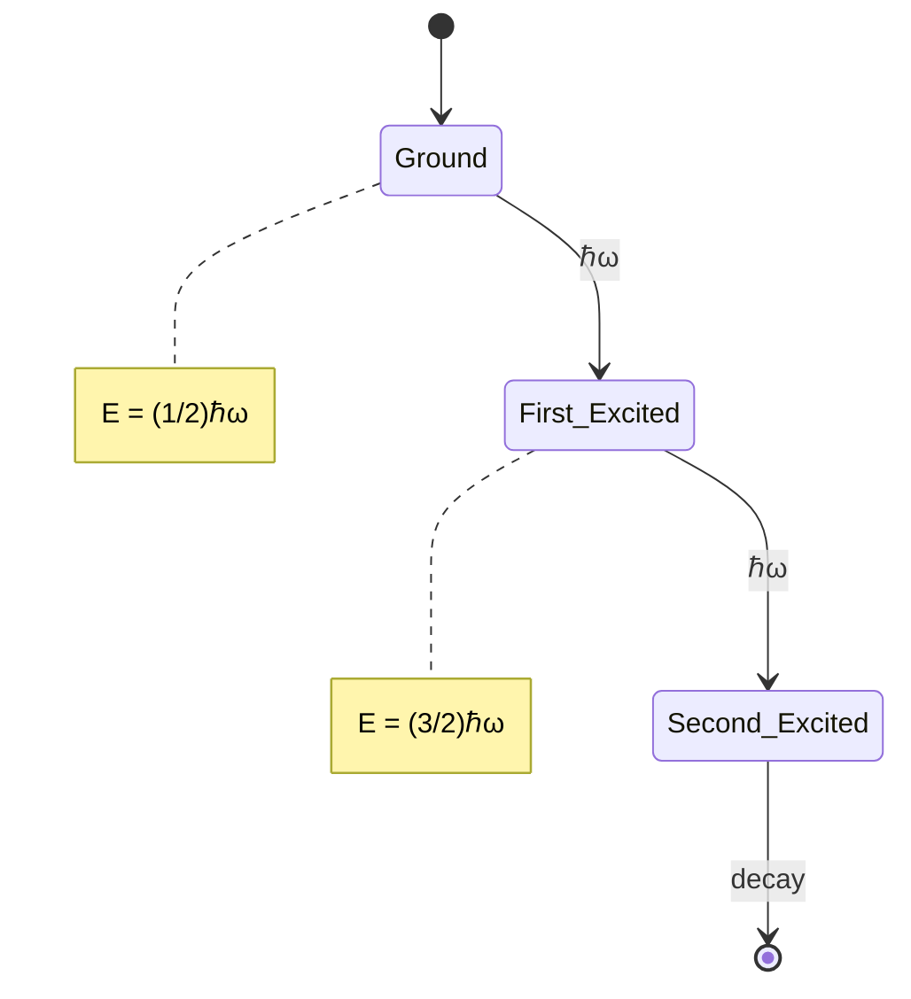

# AGENT 4: Diagram (Physics Mermaid)

## 職責
產出 **5 個 Mermaid 圖**，每個必須：
- 直接對應本課程核心物理概念
- 唔係 template 圖
- GitHub-renderable syntax
- S.I. units 喺 label 入面

## 5 個圖嘅類型 (per physics course)

1. **graph TD/LR** — physical process / system / regime
2. **stateDiagram-v2** — quantum states / transitions / level schemes
3. **flowchart** — algorithm / method / decision tree
4. **classDiagram** — particle / interaction taxonomy
5. **sequenceDiagram** — experiment sequence / measurement process

## 品質門檻
- ❌ **拒絕**: 5 個 graph TD 全部一樣嘅 template
- ❌ **拒絕**: Empty node labels
- ❌ **拒絕**: 唔 render 嘅 syntax
- ✅ **必須**: 5 個圖都係 distinct type
- ✅ **必須**: 至少 1 個 diagram 包含 course-specific entities (e.g., $E_n = (n\pi\hbar)^2/2mL^2$ for QM I)

## Output
Inserted into course file as:


## Validation
- `grep -c '```mermaid'` should return 5 per file
- Validate with `mmdc` (Mermaid CLI) if available, else GitHub render check
