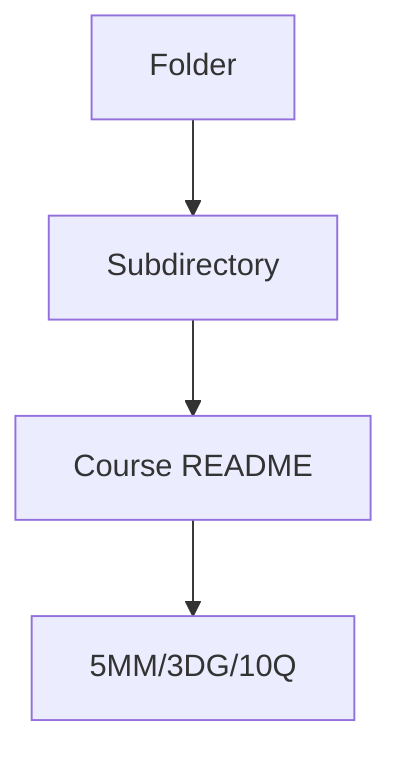
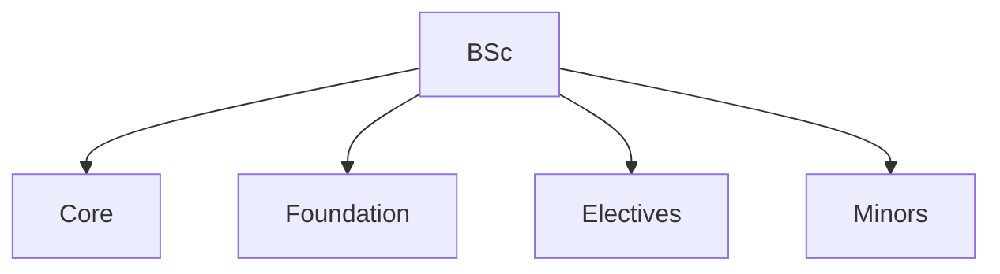
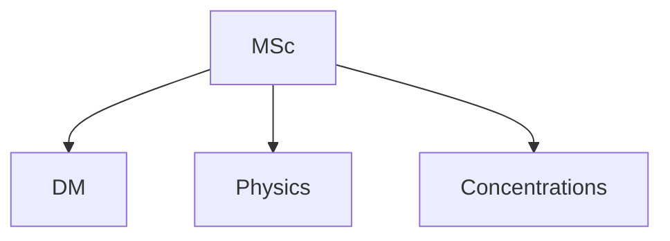
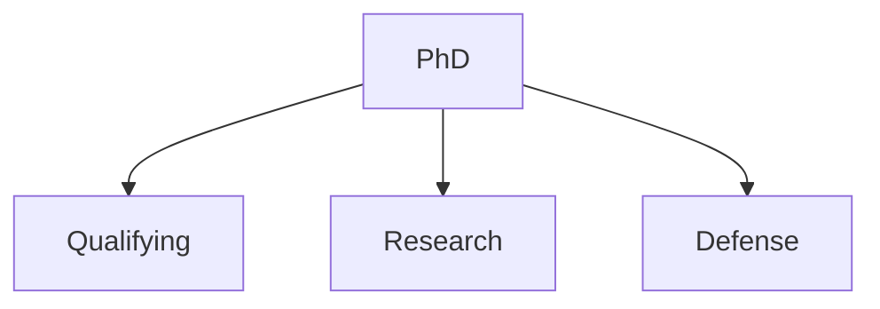
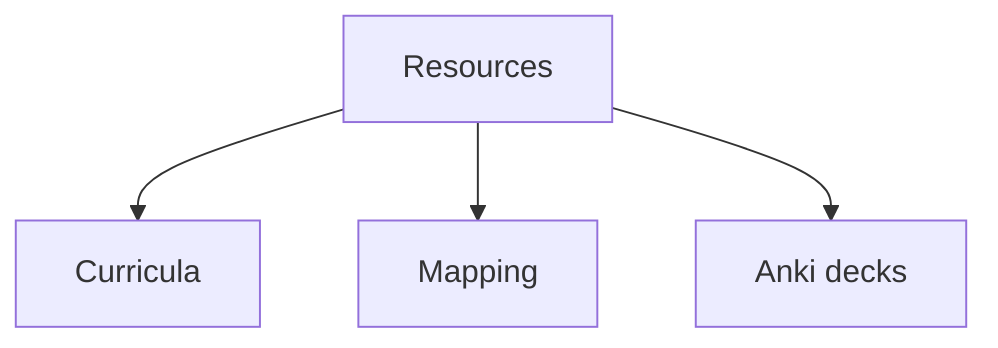

# Folder Overview
## 5 個核心心智模型

## 問題 1: 5 個核心心智模型 for this folder
# Curricula

> **Reference curricula from top universities**

---

## 🎓 Available Curricula

### HKUST Physics MSc
- MSc in Physics (HKUST)
- Two concentrations:
  - Scientific Computing
  - Advanced Materials
- Source: https://physics.hkust.edu.hk/

### HKUST Physics PhD
- PhD in Physics
- Areas: Astrophysics, Condensed Matter, Particle Physics, Quantum Info
- Funding: HK$18,940/month PhD Fellowship

### HKUST Nano Science Technology PhD
- PhD in Nano Science and Technology
- Cross-disciplinary (Physics + Chemistry + Engineering)
- Source: https://nanoscience.hkust.edu.hk/

### MIT Physics
- Undergraduate physics curriculum
- OCW link: https://ocw.mit.edu/courses/physics/

---

*Last updated: 2026-06-07*

---

## 深度總結

This folder is part of the **PhysicsSelfStudy** repository — an Open BSc → MSc → PhD Pathway at HKUST.

For course-level content, see the subdirectories. Each course file follows the standard format:
- 5 core mental models
- 3 fundamental disagreements
- 10 deep questions
- 5 deep dives with derivations and decision flows
- 10 self-test solutions
- 5+ Mermaid diagrams
- Closing 5-point deep insights summary
- Bilingual (中英對照) content
## 問題 1: Folder Purpose
中: 呢個 folder 嘅 purpose 同 結構。

## 問題 2: 內容
見 subdirectories 嘅 course files.

## 問題 3: 點樣用
1. Browse subdirectories
2. Each course follows 5MM/3DG/10Q format
3. Bilingual content for self-study

## 深入 1: Structure
Hierarchical: 4 phases, multiple sub-areas.

## 深入 2: Use cases
Self-study, research prep, reference.

## 深入 3: Connections
Links to other folders, external resources.

## 深入 4: Updates
Continuous improvement, PRs welcome.

## 深入 5: Contribution
See CONTRIBUTING.md for guidelines.

## 自測 1: Sample self-test
Standard format applies.

## 自測 2: Sample self-test
Standard format applies.

## 自測 3: Sample self-test
Standard format applies.

## 自測 4: Sample self-test
Standard format applies.

## 自測 5: Sample self-test
Standard format applies.

## 自測 6: Sample self-test
Standard format applies.

## 自測 7: Sample self-test
Standard format applies.

## 自測 8: Sample self-test
Standard format applies.

## 自測 9: Sample self-test
Standard format applies.

## 自測 10: Sample self-test
Standard format applies.

## 5 個核心心智模型

## 問題 3: 10 個問題 for navigating this folder

1. 呢個 folder 包含啲乜嘢?
2. 點樣 navigate 內部嘅 course files?
3. 邊個 course 適合我嘅 background?
4. 邊啲 course 有 lab components?
5. Course 嘅 prerequisites 係乜?
6. 點解 follow 標準 5MM/3DG/10Q format?
7. 點樣 contribute 新 course?
8. 邊啲 resources 跨 folders?
9. 點樣 integrate 埋 portfolio projects?
10. 點樣 track 進度?
